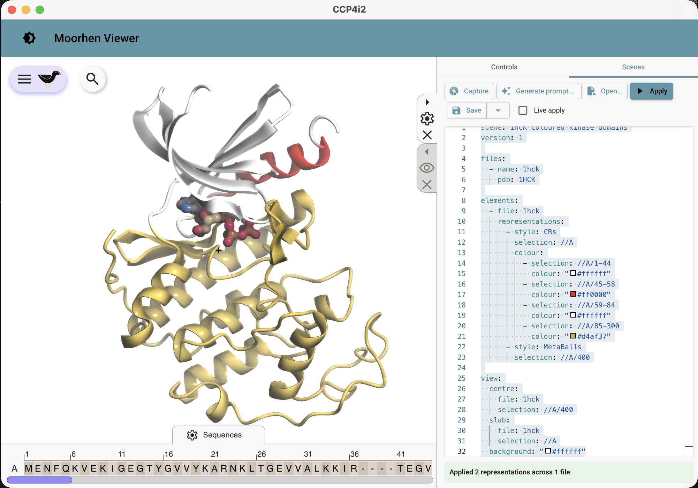

<!--
SPEAKER NOTES — break-out contribution
- Three-slide worked example for the "NL as an interface to complex capability"
  break-out. Marp deck; preview/export with "Marp for VS Code" or:
    npx @marp-team/marp-cli docs/presentations/nlp-declarative-interface-coseners-2026.md --pdf
- The claim isn't "we bolted an LLM on". It's a REUSABLE RECIPE: put a narrow,
  declarative, versioned model at the waist; let the AI emit DATA against it;
  keep all semantics deterministic on the backend. Molecular graphics is the
  proof-of-concept; crystallographic job construction is the same recipe at a
  harder point on the risk/state axis (slide 3).
- Source docs if pressed: client/renderer/MOORHEN_SCENES_SCHEMA_V1_DESIGN.md
  (esp. §3 stratification, §4 conformance rule, §7a/§12 AI authoring),
  docs/NLP_JOB_CONSTRUCTION_DISCUSSION.md.
-->

# Natural language over a declarative waist
## A worked example: teaching AIs to compose molecular graphics — and where it goes next

**Martin Noble**, Newcastle University
Break-out: *Natural language as an interface to complex capability*

<!--
30 sec. Framing line while the title is up: "The interesting bit isn't the model.
It's the SHAPE we gave the problem so a model could touch it safely — a narrow
declarative interface with all the meaning kept deterministic behind it."
-->

---

# One sentence in, a rendered scene out

<h3>1 · Plain-English prompt</h3>

"Using PDB file <b>1HCK</b>, draw <b>chain A as ribbons</b> and the <b>ATP as metaballs</b>. Residues <b>1–84</b> should be white except for the <b>C-helix (45–58)</b> which should be <b>red</b>. Residues <b>85–300</b> should be <b>golden</b>."

→

<h3>2 · Generated scene (validated YAML)</h3>
<pre><b>scene:</b> <i>1HCK coloured kinase domains</i>
<b>version:</b> 1
<b>files:</b>
  - {<b>name:</b> <i>1hck</i>, <b>pdb:</b> <i>1HCK</i>}
<b>elements:</b>
  - <b>file:</b> <i>1hck</i>
    <b>representations:</b>
      - <b>style:</b> <i>CRs</i>
        <b>selection:</b> <i>//A</i>
        <b>colour:</b>
          - {<b>selection:</b> <i>//A/1-44</i>,   <b>colour:</b> <u>"#ffffff"</u>}
          - {<b>selection:</b> <i>//A/45-58</i>,  <b>colour:</b> <u>"#ff0000"</u>}
          - {<b>selection:</b> <i>//A/59-84</i>,  <b>colour:</b> <u>"#ffffff"</u>}
          - {<b>selection:</b> <i>//A/85-300</i>, <b>colour:</b> <u>"#d4af37"</u>}
      - <b>style:</b> <i>MetaBalls</i>
        <b>selection:</b> <i>//A/400</i>
<b>view:</b>
  <b>centre:</b> {<b>file:</b> <i>1hck</i>, <b>selection:</b> <i>//A/400</i>}
  <b>slab:</b>   {<b>file:</b> <i>1hck</i>, <b>selection:</b> <i>//A</i>}
  <b>background:</b> <u>"#ffffff"</u></pre>

→

<h3>3 · Rendered in Moorhen</h3>

The model emits <b>data</b> against the schema — the deterministic resolver turns that data into the picture. No render commands cross the boundary.

<!--
1 min. Open the deck on the CONCRETE thing before any theory. Read the prompt aloud,
then: "That English becomes this YAML — and note what the YAML is: it names a PDB,
some selections, some colours. It is DATA, not instructions. The AI never told Moorhen
to draw anything; it described a state, and our resolver rendered it." Point at the
C-helix red stripe in the image as the 'it understood 45-58 is a sub-range of 1-84'
tell. This slide earns the right to the abstract 'declarative waist' framing on the
next slide — show it works, then explain why the shape matters.
-->

---

# (a) The approach: a declarative model, then two ways to teach an AI to write it

We did **not** teach an AI to *drive* Moorhen (imperative API, huge fragile surface).
We built a **tight declarative model of a scene** — *what is shown*, not *how to draw it* — and taught AIs to **emit that data**.

- **One source of truth** (a Zod schema) → *generates* every artifact, drift-tested to byte-equality:
  machine **JSON Schema** · human **grammar** · compact **LLM brief** · strict **structured-output schema**
- **Two delivery paths, one source:**
  - **Capable model** → feed the schema to the **decoder** (constrained decoding): structure *guaranteed*, ~zero prompt tokens on shape, tokens spent on *intent*
  - **Small / on-device model** → a compact in-prompt **mini-grammar** (~1k tokens)
- A **deterministic resolver** applies the scene — validate / repair / render. **The AI emits data describing a state; it never issues render commands.**

> The trust boundary is the schema + resolver, not the model.

<!--
2 min. This is the corrected version of the one-liner ("declarative model + tight
prompt"). Two refinements to land out loud:
(1) the prompt is ONE generated artifact of several — the same Zod source also
    emits the JSON Schema, the human docs and the strict structured-output schema,
    all guarded by a byte-equality drift test. Single source => they can't diverge.
(2) for capable models the schema goes to the DECODER not the prompt (constrained
    decoding) — shape is guaranteed, so the context budget buys intent, not syntax.
Declarative-not-imperative is the load-bearing choice: a scene is idempotent state
with no side effects, so a wrong scene is cheap and instantly visible. Contrast
with "AI drives the viewer", which has no ground truth and no safe undo.
-->

---

# (b) Why this shape — its strengths, and its edges

**Why we arrived here.** An imperative "AI drives the viewer" interface has no ground truth, no undo, and a boundless surface. A **declarative waist** inverts that: the model emits *verifiable data*, and every hard guarantee lives in code we own.

| Strengths | Edges / weaknesses |
|---|---|
| **Verifiable** — schema validates; bad output fails loudly, not silently | **Expressiveness ceiling** — only what the schema models; novel viz needs a schema change |
| **Model-agnostic & drift-free** — one source feeds every model | **Schema must evolve carefully** once published/upstreamed |
| **Token-economical** — shape via decoder, context spent on intent | **Constrained-decoding caps are real** — Azure's 100-property strict limit forced a pruned 83-property authoring subset |
| **Graceful degradation** — *core* must-honour vs *hints* advisory (the "wrong vs merely plainer" test) | **"Fiction" risk** — a hint that maps to nothing; we defer such fields rather than fake them |

**Desktop / laptop fit.** Compactness is a *design constraint*, not an afterthought: the core grammar is small enough to *aspire* to an **on-device model** (Apple Intelligence, Windows Copilot) — **tiered prompting** escalates only complex scenes to the cloud. Honest status: **capable-model-via-constrained-decoding is the proven path today; on-device is measured-and-plausible, not yet shipped.**

<!--
2.5 min. The conformance split (slide's "core vs hints") is the elegant bit worth
dwelling on: the dividing test is "would a renderer that ignored this produce a
WRONG image or merely a PLAINER one?" Wrong => core, must-honour, carries a unit
(Å). Plainer => hint, advisory, safely ignorable. That single rule is what lets
the same scene target a full renderer and a weak one and degrade sensibly.
On desktop suitability — be candid: the compactness work (terse keys, strong
defaults, an explicit small authoring subset) is REAL and the brief's token count
is MEASURED, so "fits on-device" is a number not a hope. But we prove it on capable
cloud models via constrained decoding; the on-device path is designed-for, not yet
demonstrated end to end. Don't oversell.
-->

---

# (c) Mapping it onto CCP4i2's crystallographic capability

The same recipe, moved to a harder point on the risk axis. A **scene is declarative state**; a **job is a plan with side effects** — so the pattern carries, but the guarantees must be stronger.

**What transfers unchanged** — LLM-as-parser (emits a structured `JobPlan`, never code, never a task name it invents) · backend owns the canonical catalogue · single-source strict schema · **confirm-before-act**.

| | Molecular graphics scene | Crystallographic job |
|---|---|---|
| AI emits | declarative **state** | a **plan / DAG** of jobs + bindings |
| Cost of being wrong | cheap, instantly visible | wasted compute, *quietly* wrong science |
| Side effects | none (idempotent) | queue, filesystem, external fetches |
| Confirmation | optional | **non-negotiable** — preview every binding, then Submit |

- **The bridge:** the LLM types the user's words (*"the last MR job's coordinates"*, *"a dictionary from SMILES c1ccccc1"*); a **deterministic resolver** maps intent → real task names, job outputs, sub-jobs — exactly as the scene resolver maps a scene to renderer calls.
- **v1 is deliberately safe:** resolver-first (slices 1–6 have *no* LLM), strict clarify over silent inference, an audit row per submission. *(docs/NLP_JOB_CONSTRUCTION_DISCUSSION.md)*

> One recipe: narrow declarative interface · backend owns the semantics · AI only parses intent · human confirms. Scenes proved it cheap; jobs apply it where it pays.

<!--
2.5 min. This is the "so what for CCP4" payoff. The key insight to voice: the scene
work isn't a one-off toy — it's the low-risk end of a SPECTRUM. Same architecture
(declarative waist, backend owns semantics, LLM parses intent, deterministic
resolver, confirm loop) reappears for job construction, where the stakes are higher
so the confirm step becomes mandatory and the resolver does more.
The worked crystallographer prompt to say aloud if there's time: "Refine the output
coordinates of the last MR job using servalcat and a dictionary made from SMILES
c1ccccc1" — that one sentence names a task, an output reference, a synthesised
sub-job (acedrg on the SMILES) and a literal; the resolver assembles the DAG and
shows it for confirmation. ~15 clicks -> one sentence + one Submit.
Close on the reusable-recipe line; that's the transferable idea the break-out is
actually about.
-->
