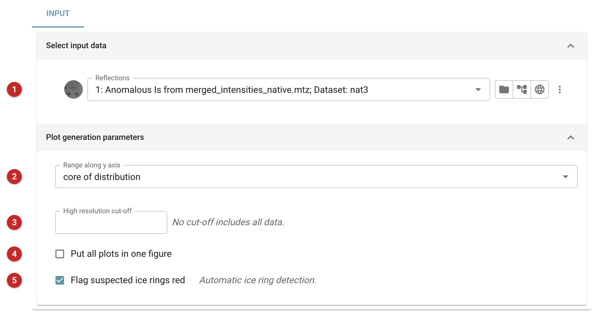
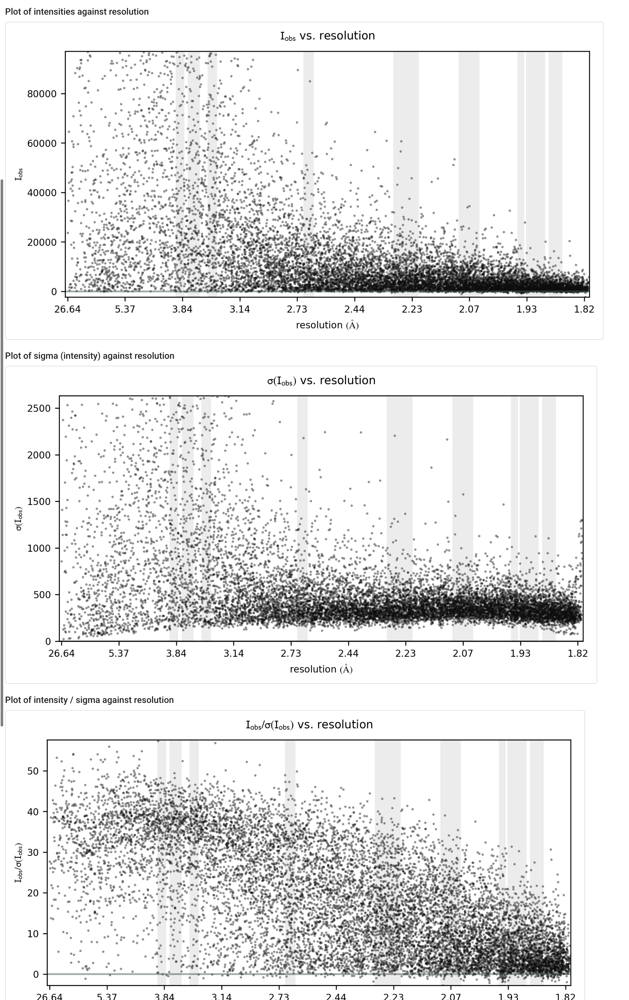

######
AUSPEX
######

AUSPEX plots the intensities and amplitudes of a reflection file against
resolution, so that you can see by eye what summary statistics hide: ice
rings, and other artefacts of the data that show up as ranges of
resolution where reflections behave differently from their neighbours.
It reads data and writes pictures; it changes nothing and its output is
not used by later tasks.

Use it on merged data before trusting a resolution cutoff or starting
molecular replacement, especially when the crystal was cryo-cooled, the
diffraction images show rings, or the statistics (R\ :sub:`merge`, I/σ(I))
look worse in a narrow shell than on either side of it. Aimless and
ctruncate (:doc:`../aimless_pipe/aimless_pipe`, :doc:`../ctruncate/index`)
report the data as numbers by shell; AUSPEX shows every reflection.

The pictures on this page come from the Gamma project: the native data
(11908 reflections, 26.6 to 1.82 Å), run through AUSPEX 1.1b.

Input
=====

   Figure 1: AUSPEX input

The reflections **(1)** may be intensities, amplitudes or both. If the
file holds intensities, AUSPEX plots intensities and amplitudes; if it
holds only amplitudes, it plots only those.

The remaining options choose how the plots look:

- **Range along y axis (2)** sets how much of the distribution is shown:
  all the data, the core of the distribution (the default), the core with
  focus on low values, or only values below the mean. Plotting all the
  data lets a few very strong reflections squash the rest against the
  axis; the default cuts them off so the bulk is readable.
- **High resolution cut-off (3)** limits the plots to reflections below
  that resolution (in Å); leave it empty to plot all the data.
- **Put all plots in one figure (4)**. By default each plot is a picture
  of its own.
- **Flag suspected ice rings red (5)**, on by default, lets AUSPEX look
  for ice rings itself and mark what it finds in red. Switch it off to see
  the plain plots.

Results
=======

AUSPEX writes no log summary of its own: the report is its pictures,
one per plot, listed under the job's output files. For intensities there
are plots of I, σ(I) and I/σ(I) against resolution; for amplitudes,
F, σ(F) and F/σ(F). Each point is one reflection.

   Figure 2: the report: I, σ(I) and I/σ(I) against resolution (the
   amplitude plots follow in the same way)

The grey vertical bands mark the resolution ranges where ice rings fall.
Read the points inside each band against the points on either side: an
ice ring is a band in which the reflections stand out from the trend
of the plot, and AUSPEX (with *Flag suspected ice rings red* on) colours
the ones it takes to be affected red. In these data nothing is flagged in
any band, and the points run through them as they do outside, so the
data show no ice-ring problem. A smooth fall of I/σ(I) with resolution,
as in the lowest plot of Figure 2, is what clean data look like; I/σ(I) here is about 40 at
low resolution and a few at the edge of the data.

If a plot does show a flagged ring, the fix belongs upstream, in data
reduction (:doc:`../aimless_pipe/aimless_pipe`): re-integrate the images
with the ring excluded, or exclude those resolution ranges when scaling
and merging, then run AUSPEX again on the new data to check it.

Further information about AUSPEX can be found at the
`AUSPEX Home Page <https://www.auspex.de/>`__; the reference is Thorn A,
Parkhurst J, Emsley P, Nicholls RA, Vollmar M, Evans G, Murshudov GN
(2017) *AUSPEX: a graphical tool for X-ray diffraction data analysis.*
Acta Crystallogr D 73, 210-217.
