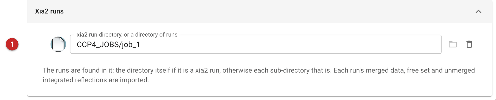
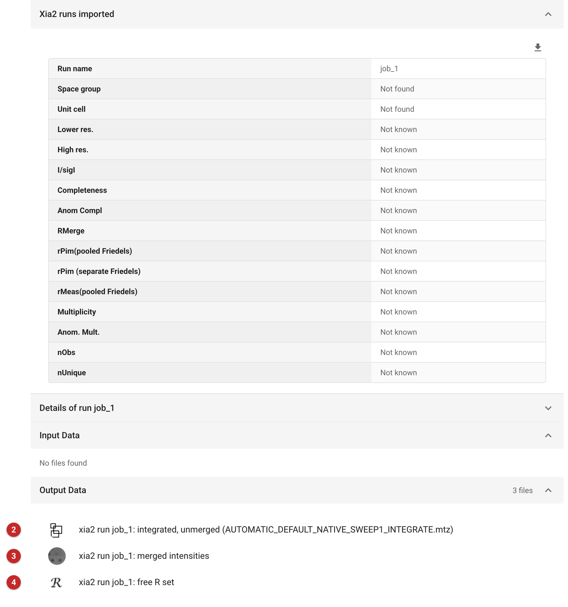

###################
Import XIA2 results
###################

Use this task to bring into a project the results of a xia2 run that was
done outside CCP4i2: at a beamline, on a cluster, or by hand. xia2 has
already integrated and scaled the data, so there is nothing to redo. The
task copies what xia2 made into the project as the three kinds of file
later tasks look for, and builds a report from xia2's own logs.

To run xia2 from CCP4i2 instead, use :doc:`../xia2_dials/index`. To bring
in merged reflection data that did not come from xia2, use
:doc:`../import_merged/index`. To process data yourself from the
unmerged reflections, start from the imported unmerged file and use
:doc:`../aimless_pipe/index`.

The pictures on this page come from a project built with thaumatin
diffraction images: xia2 was run on them (as xia2 with DIALS, in an
earlier job) and its job directory is imported here as if it had come from
elsewhere.

Input
=====

   Figure 1: Import XIA2 results input

Choose the directory of the xia2 run **(1)**, with the folder button. It
is the directory in which xia2 was run, the one holding ``DataFiles`` and
``LogFiles``. The task finds the run or runs itself:

- if the directory holds xia2's ``DataFiles``, it is imported as one run;
- otherwise each sub-directory that does is imported as a run, so a
  directory holding several runs (a beamline's ``xia2`` directory, with a
  sub-directory for each pipeline tried) imports all of them.

Nothing else needs to be filled in.

What is taken from each run
---------------------------

- **Unmerged data**: the integrated reflections, from ``DataFiles`` (or
  ``DataFiles/Integrate`` for older xia2): an ``*INTEGRATE.mtz`` file, or
  failing that an XDS ``*INTEGRATE.HKL``.
- **Merged data and free R set**: the ``*free.mtz`` file in
  ``DataFiles``. Its merged intensities (``I(+)``, ``I(-)``) and its
  ``FreeR_flag`` column are split into two files of their own, as
  CCP4i2 keeps them separately. The original is kept too, for export.
- **For the report**: xia2's ``ispyb.xml`` summary if the run has one, and
  the pointless, aimless and truncate logs found in ``LogFiles``.

A run that lacks one of these is still imported; only that output is
missing, and the job log says which.

Results
=======

   Figure 2: Import XIA2 results report

Each run gives three outputs, named after it (here, ``job_1``, the
directory's name):

- **xia2 run job_1: integrated, unmerged (...)** **(2)**: the unmerged
  integrated data, for re-scaling, or for tasks that take unmerged data;
- **xia2 run job_1: merged intensities** **(3)**: the merged intensities
  that refinement and phasing tasks use;
- **xia2 run job_1: free R set** **(4)**: the free R flags xia2 chose.
  Keep using this set for everything that follows, so R-free stays
  honest across refinements.

The table at the top compares the imported runs side by side: space
group, unit cell, resolution range, completeness, multiplicity, I/sigI,
and Rmerge, Rpim and Rmeas, each as overall (outer shell). It is filled
from the run's ``ispyb.xml``, which the run here did not have, so the
table shows "Not found" and "Not known". Where a run has one, use the table
to choose between runs: prefer the run with the usable resolution and the
better I/sigI and Rpim, and check that its space group agrees with the
others. "Details of run" holds the summaries and graphs from xia2's
pointless, aimless and truncate logs, where it has them.

Next, use the merged intensities and free R set as the data for molecular
replacement or refinement. The **Export MTZ** button offers the complete
xia2 MTZ file.
