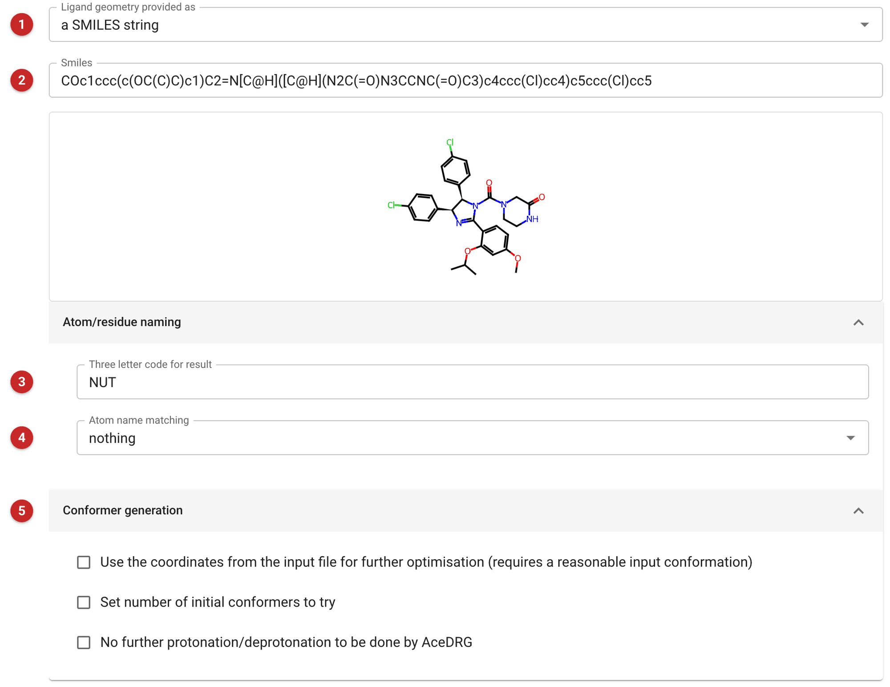
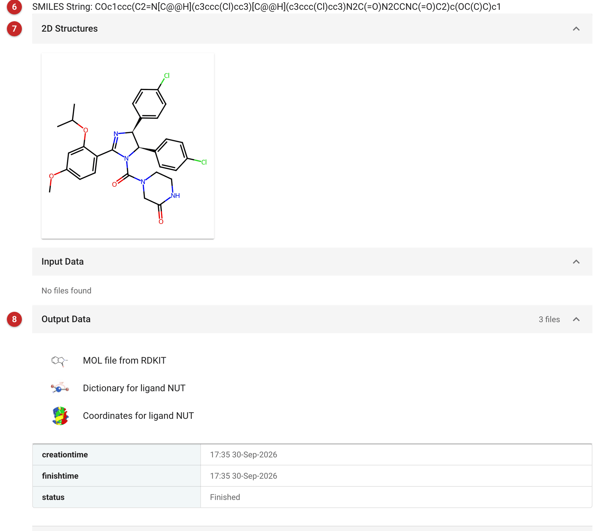

#############################################################
Make Ligand Coordinate and Restraint Dictionaries with Acedrg
#############################################################

The *Make Ligand* task uses the program
`ACEDRG <https://www2.mrc-lmb.cam.ac.uk/groups/murshudov/content/acedrg/acedrg.html>`__
to derive stereo-chemical information about monomers/ligands (or small
molecules). *ACEDRG* can derive "ideal" bond lengths and angles for an
unknown monomer/ligand. It also generates information about planar
groups and stereo-chemical properties in the monomer/ligand. The minimum
information Acedrg requires is the element types of the atoms in the
monomer/ligand, and the basic bonding pattern, such as atom connections
and bond orders.

The result is a restraint dictionary for refinement (given to the
*Refinement* task as an additional geometry dictionary), and coordinates
of the ligand in an optimised conformation, for fitting into density.

The pictures on this page make a dictionary for Nutlin-3a, the MDM2
inhibitor of the Ligand Tutorial data that comes with CCP4i2, from its
SMILES string.

Input
=====

   Figure 1: Make Ligand input

The menu **(1)** chooses how the ligand is described: *a SMILES string*
typed or pasted into the box that appears **(2)**; *a SMILES file*; *a MOL
or SDF file*; *a MOL2 file*; or *a CIF dictionary*, to regenerate or
improve the restraints of an existing dictionary (for instance one from
the PDB's Chemical Component Dictionary). A SMILES string is drawn below
the box as soon as it is entered, so that a mistake in it (a missing
stereocentre, a wrong bond order) can be seen before the job is run. Give
the stereochemistry: Nutlin-3a is the (4S,5R) enantiomer, written with
``@`` and ``@@`` in the SMILES.

*a sketch* opened Coot's Lidia sketcher in the Qt interface. Current CCP4
installations no longer include Lidia; if it is chosen where Lidia is
missing, the task says so before it is run. Draw the molecule in another
program and give its SMILES string or MOL file instead.

The three-letter code **(3)** names the monomer in the dictionary and the
coordinates, and so in the model once the ligand is fitted. It must not
clash with a code already in the model, and should not reuse a code from
the CCP4 monomer library for a different compound. (The example uses
``NUT``, the PDB's code for Nutlin-3a. The library already holds a
dictionary for it, so the refinement on the next page needs none; a new
compound would.)

Although *ACEDRG* attempts to name atoms sensibly, it is sometimes
desirable to match the atom names to those in a similar structure. For
instance, if the ligand to be generated contains a large group of atoms
in common with those of another ligand, it can be useful to make sure the
same atoms have the same names. This can be done by changing the atom
matching menu **(4)** from *nothing* to either: *a specific code*, in which
case a text box appears into which the three-letter code of the existing
reference ligand should be typed; *user dictionary*, in which case a
dictionary from the project or a file should be supplied; or *all
monomers*, in which case the whole CCP4/Refmac monomer library is searched
for a matching group of atoms.

If the monomer contains a metal atom, a *Metal coordination* section
offers to take the metal's coordination from a structure in which it is
bound.

*Conformer generation* **(5)** controls the coordinates. The task
generates a sensible conformation of the ligand as well as the restraint
dictionary, optimising the geometry with RDKit from several random
starting conformations and keeping the one of lowest energy: the more
starting conformations, the more likely the best is found. If the input
already has good coordinates (a MOL file from a structure, say), they can
be used as the starting point instead. By default ACEDRG adds or removes
hydrogens to give the protonation state expected at neutral pH; this can
be turned off, to keep the protonation as given.

Results
=======

   Figure 2: Make Ligand report

The report is simple. It gives the SMILES string of the ligand as ACEDRG
understood it **(6)** and a 2D drawing of it **(7)**: check both against
what was intended, especially the stereochemistry (the wedges) and the
charges. The output data **(8)** are the MOL file from RDKit, the
restraint dictionary, and the coordinates of the ligand in its optimised
conformation.

The dictionary is what the *Refinement* task needs for a compound not in
the monomer library (its *Additional geometry dictionaries*), and the
coordinates are the starting point for fitting the ligand into density,
in Coot or Moorhen, or automatically with *SubstituteLigand*.
