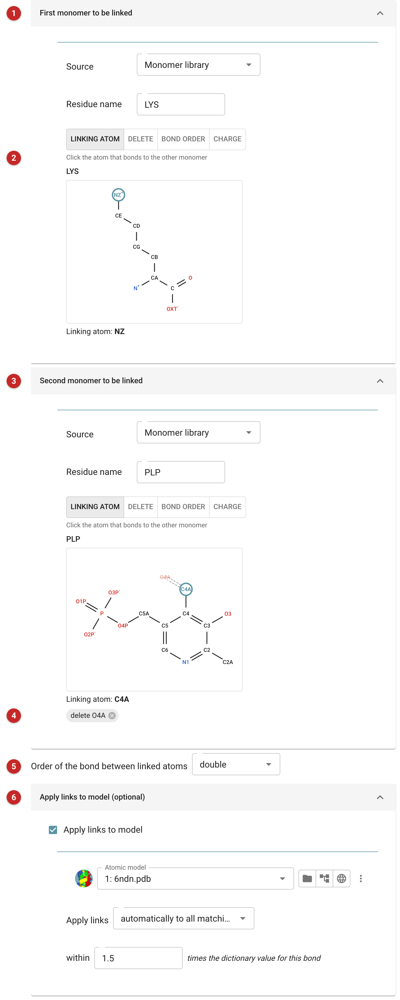
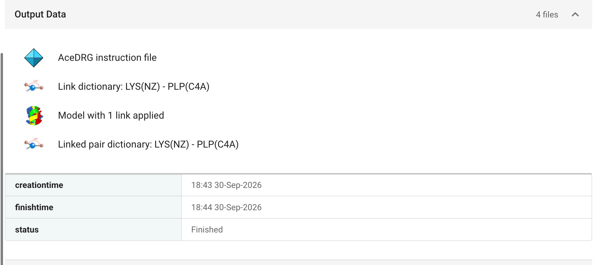

#####################################
Make Covalent Link with AceDRG
#####################################

When two residues of a model are covalently bonded in a way the monomer
library does not describe (a ligand bound to a side chain, a cross-link, a
glycosylation the library does not know), refinement needs to be told
about the bond: its length and angles, and how each monomer changes when
it forms. *Make Covalent Link* writes that description, a link dictionary,
with `ACEDRG <https://www2.mrc-lmb.cam.ac.uk/groups/murshudov/content/acedrg/acedrg.html>`__,
and can apply the link to a model.

The pictures on this page make the Schiff base between a lysine and
pyridoxal 5'-phosphate (PLP), the internal aldimine of a PLP enzyme, from
PDB entry 6ndn. The lysine's NZ bonds to PLP's C4A with a double bond, and
PLP loses its aldehyde oxygen, O4A, in the condensation.

Input
=====

   Figure 1: The two monomers, the bond, and the model

In Figure 1 each of the two monomers **(1, 3)** is given by its residue name,
from the CCP4 monomer library, or from a dictionary file (for a ligand made by
*Make Ligand*, say, with its residue name chosen from those in the file).
Once a monomer is known, its structure is drawn, with the dictionary's
atom names, and the drawing is where the link is described.

The buttons above each drawing choose what a click on it does **(2)**:

- *Linking atom*: the atom that bonds to the other monomer (NZ of the
  lysine, C4A of PLP), shown ringed.
- *Delete*: atoms that leave when the bond forms, such as a leaving
  hydroxyl or, here, PLP's aldehyde oxygen. Deleted atoms are drawn faint;
  a second click restores them.
- *Bond order*: a bond within the monomer whose order changes (a double
  bond that becomes single when an atom is added to it, say).
- *Charge*: an atom whose formal charge changes.

Every change is listed below the drawing **(4)**, and can be removed there.
If a change leaves an atom with an unusual number of bonds, a note under
the drawing says so, giving the valence the atom would have and the one
its element usually has. It is advice, counted from the bonds and
charges, not a verdict, but it usually points at a hydrogen or charge
still to be dealt with.

The order of the bond between the two linking atoms is chosen below the
monomers **(5)**: here *double*, for the C=N of the Schiff base.

*Apply links to model* **(6)**, optional, writes the link into a model as
well: automatically, to every pair of residues of the two kinds whose
linking atoms lie within the given multiple of the dictionary's bond
length (1.5 by default), or to one residue pair chosen from a list of
those close enough. The result is a model with LINK records (or
``_struct_conn`` rows in mmCIF) that refinement reads together with the
link dictionary.

The *Advanced* tab passes instructions or keywords to AceDRG directly,
for changes the drawing cannot express.

Results
=======

   Figure 2: Make Covalent Link outputs

The outputs, in Figure 2, are the link dictionary; the model with the link
applied (the report says how many links were made; one, here); the dictionary
of the two linked monomers as a single molecule, which AceDRG regularises to
check the link; and the instruction file AceDRG was given, which records
exactly what was asked of it. If AceDRG refuses a link, the report gives
its reason in its own words.

To use the link, give the link dictionary to the *Refinement* task as an
additional geometry dictionary, together with the model with the link
applied.
