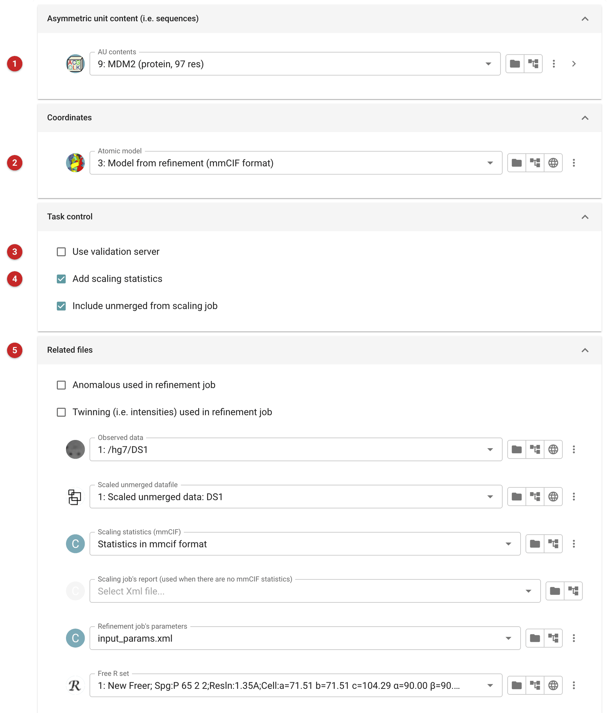
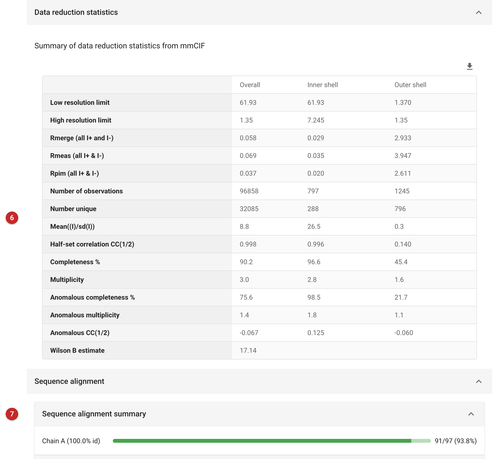

#########################################
Prepare and validate files for deposition
#########################################

The last step of a structure is depositing it in the Protein Data Bank.
The PDB takes the model and the observations as mmCIF, and wants the
model's file to say how the data were reduced and the structure refined.
This task makes those two files from the final refinement:

- the **model**, with the refinement's statistics, the sequence of every
  chain, and the data reduction statistics (resolution, completeness,
  R\ :sub:`merge`, CC\ :sub:`1/2` and so on, overall and in shells) added;
- the **reflections**, merged and, if they are in the project, the scaled
  unmerged data, with the free R flags and the map coefficients.

It can also send them to the wwPDB validation server and show the
validation report it returns. Upload the files to `OneDep
<https://deposit.wwpdb.org/>`_ to deposit.

The pictures on this page come from the MDM2 project of the refinement
route: the model refined with ProSMART restraints, prepared for
deposition with the statistics of its Aimless run.

Input
=====

   Figure 1: Prepare deposition input

The AU contents **(1)**: they must hold the complete sequence of every
chain, including any part that is in the crystal but not in the model;
the PDB records the full sequence. The refined model **(2)**: choose the
refinement's mmCIF model, which carries its statistics (a PDB-format model
is refused). Choosing it fills in the rest: the task traces the model back
to the refinement job that made it and the data reduction job before that,
and fills the related files **(5)** from them.

Whether to send the files to the wwPDB validation server **(3)**: it
takes at least five minutes and often much longer, because the task waits
for the report, and it sends your unpublished structure to an outside
service. Leave it off to prepare the files only; OneDep validates them
again when you deposit. Whether to add the data reduction statistics
**(4)**: these come from the data reduction job's mmCIF statistics, or
from Aimless's own report when there are none.

When the related files cannot be found: data reduced outside CCP4i2 or
in a different space group from the refinement's leave the data reduction
job unfound. Then either point the task at the scaling job's report, or
untick the statistics and enter them in OneDep instead.

Results
=======

   Figure 2: Prepare deposition report

The data reduction statistics that went into the model's file **(6)**,
overall and in the inner and outer shells: here to 1.35 Å, with CC\
:sub:`1/2` 0.140 and completeness 45% in the outer shell (where to cut
there is what :doc:`../pairef/index` tests). Below them, the model's chains against the
AU contents **(7)** (as :doc:`../modelASUCheck/index` reports): 91 of the
97 residues of the construct are modelled. Check that every chain
appears here at 100% identity before depositing.

The validation report, when it was asked for, follows. The files to
upload to OneDep are the outputs: *Coordinates in MMCIF format for upload*
and *Reflections in MMCIF format for upload*, with a Coot script that
tours the issues the validation report raised.
