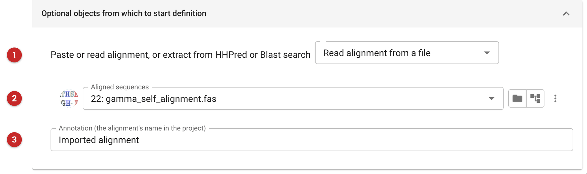
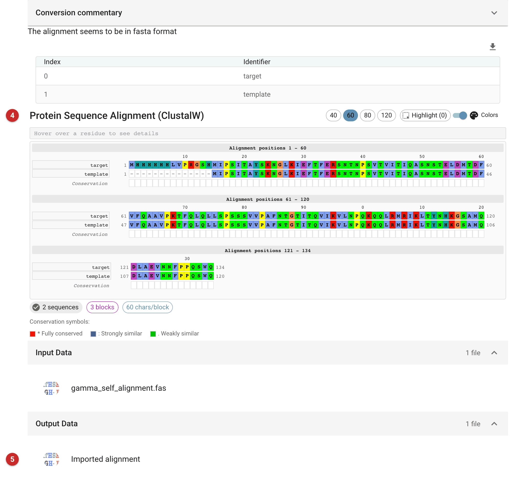

################
Import alignment
################

Import a sequence alignment that was made elsewhere, so that other tasks
can use it. The usual reason is molecular replacement: the model-editing
tasks (Chainsaw and Sculptor) and the Phaser ensembler take an alignment
of the target sequence with the search model's sequence, and this task
puts one in the project. The alignment can be pasted in, read from a file,
or taken from a search result file from an HHpred or Blast server.

Use it when you already have the alignment, from HHpred, from a program
you ran yourself, or from a colleague. If you have only sequences and want
CCP4i2 to align them, use the ClustalW task instead: it does the aligning,
and this one does not. An alignment pasted or read from a file is stored
in the project in Clustal format, whatever format it came in.

Alignment formats that can be recognised and read: clustal, pir, fasta,
stockholm and phylip. See the `Model
Data <../../general/model_data.html#alignment_files>`__ documentation for
a description of these files. **Beware** that text from word processors
or web pages may contain other formatting that makes it unreadable.

The task can also read the search result files from HHpred or Blast
servers, which usually contain several alignments, and you choose one.
Beware that only the XML Blast files can be read: the text output is too
variable. Beware too that search hits do not necessarily include the full
sequence of the target or of the hit structure: they show only the common
fragments, but these are what the model editing programs (Chainsaw and
Sculptor) need.

The pictures on this page come from the gamma demo data that comes with
CCP4i2. The alignment is a file of two sequences, ``target`` and
``template``, identical except that the target has a 14-residue
N-terminal His tag (MHHHHHHLVPRGSH) that the template lacks.

Input
=====

   Figure 1: Import alignment input

Choose how the alignment comes in **(1)**: paste an alignment, read it
from a file, or read HHpred or Blast results. Here it is read from a file,
and the file is chosen in the field below **(2)**. For "Paste an
alignment" a text box takes its place, to paste the alignment into. For an
HHpred or Blast file, the search hits are listed once the file is chosen
and you select one; holding the mouse over a hit shows its alignment.

The annotation **(3)** is the label the new alignment file carries, and
the name it shows in the file menus of the tasks that use it. It starts
as "Imported alignment": change it to say which alignment this is (the
target, and where it came from) if the project will hold several.

Results
=======

   Figure 2: Import alignment report

The report names the format it recognised, lists the sequences by index
and identifier, and shows the alignment as it was stored **(4)**. Read it
before going on: check that the sequences are the ones you meant and that
the gaps fall where you expect. The "Conversion commentary" fold shows,
format by format, what the task tried before it succeeded: here the
clustal and pir readers failed on a FASTA file and the fasta reader
succeeded. The commentary opens by itself when the task cannot read the
text.

The output is the alignment file, annotated with the text you entered
**(5)**.

What to do next
===============

Give the alignment to a model-editing task: Chainsaw or Sculptor trims
the search model to match the target using it, and the Phaser ensembler
can take it too. Choose it in their alignment field by its annotation.
