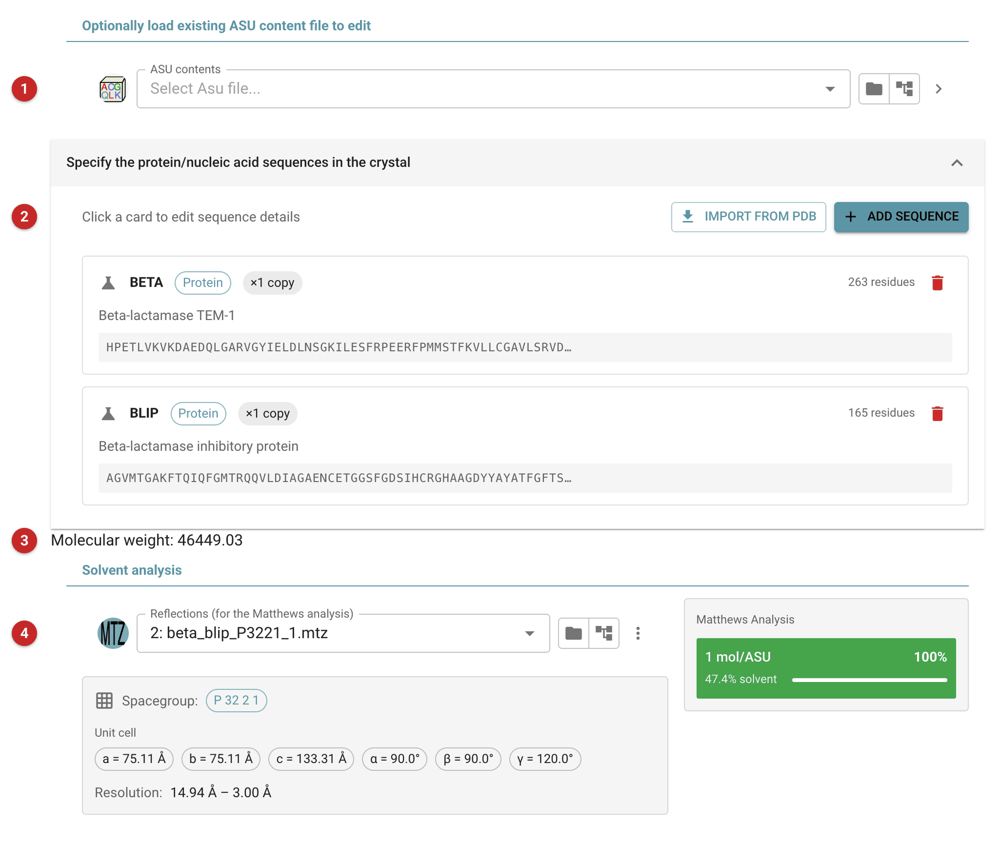
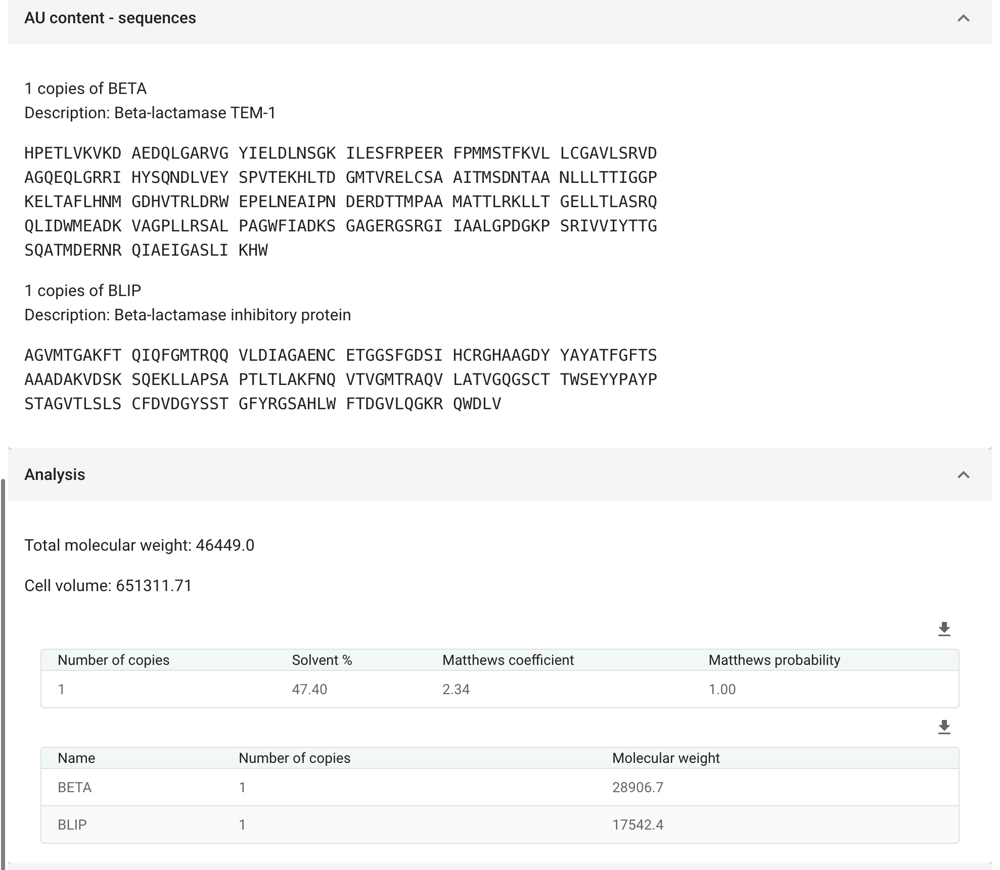

##################
Define AU contents
##################

   This task records what the asymmetric unit is expected to hold: each
   protein, DNA or RNA sequence and how many copies of it. The result, an
   *AU contents* file (``.asu.xml``), is what later tasks read when they
   need to know the composition: molecular replacement for the scattering
   content, density modification for the solvent content, model building
   for what to build. You can also use the task to edit existing AU
   contents: load them, change them and save a new version.

   The number of copies matters. Tasks estimate the solvent content from
   the whole contents, so the wrong number of copies gives the wrong
   solvent content. If you are not sure, give the task the reflection data
   and use the Matthews analysis to choose.

   The pictures on this page come from the demo data that ships with
   CCP4i2: the beta-lactamase / BLIP complex, one copy of each.

Input
=====

   |input|

   To edit AU contents you already have, load them first **(1)**; the list
   below is filled from them.

   Each sequence is a card **(2)** showing its name, polymer type, number
   of copies, length and the start of the sequence; click a card to edit
   it. *Add Sequence* adds one; *Import from PDB* fetches every polymer
   chain of a PDB entry at once, replacing the list.

   In the editor for a sequence, give the number of copies in the
   asymmetric unit, the polymer type, a name and, optionally, a
   description. Paste the sequence, or load it: from a sequence file, a
   coordinate file (choosing the chain if there are several), or fetched
   by accession code from UniProt or the PDB. Spaces and line breaks are
   removed; any other letter outside the standard residues (including X
   for an unknown residue) is flagged, because it usually means a comment
   or a modified residue has crept in.

   The molecular weight of the whole contents is shown **(3)**. Give the
   reflection data **(4)** and the task works out, from the cell, how many
   copies of these contents the asymmetric unit could hold, with the
   solvent content and probability of each, in the panel beside it; the
   most probable is highlighted. Here one copy of the complex leaves 47%
   solvent, by far the likeliest.

Results
=======

   |report|

   The report lists each sequence with its number of copies and, if the
   reflection data were given, the Matthews analysis: for each possible
   number of copies of the contents, the solvent content, the Matthews
   coefficient and its probability, with the molecular weights and the
   cell volume they were calculated from.

