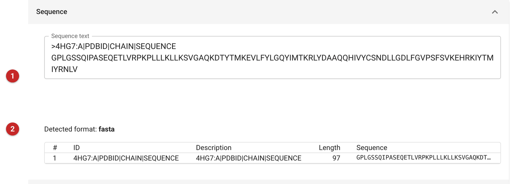
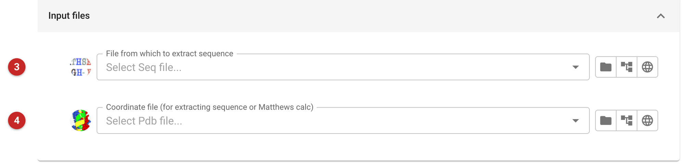
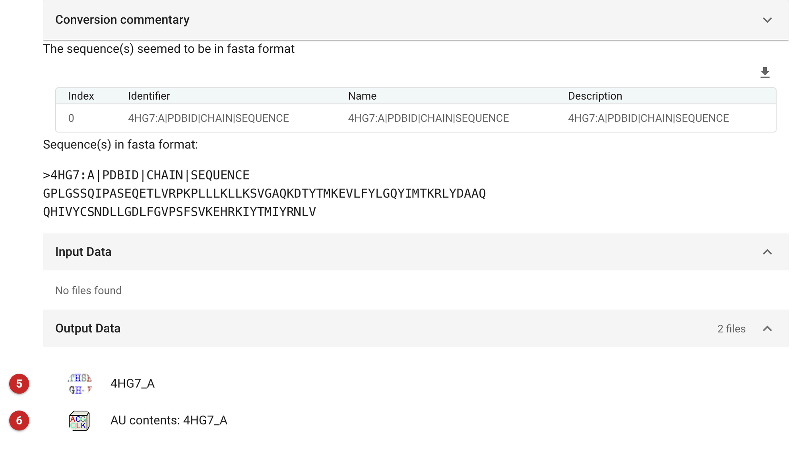

############################
Import sequence
############################

This task puts the sequence of a molecule into the project as a
sequence object, and, at the same time, as an AU contents object that
says the asymmetric unit holds one copy of it. While it is possible to
browse for a sequence in most task interfaces, it is more convenient to
have the sequence already in the project. One chain is stored in one
sequence object, so a complex of several chains becomes several
objects (one for each sequence in the text you give), all listed in a
single AU contents object.

When to use it
==============

Use it when you have a sequence, as text or in a file, or a model whose
sequence you want, and the project does not yet have it as an object.

- To state what is in the asymmetric unit, with the number of copies of
  each chain, use :doc:`../ProvideAsuContents/index`. This task always
  records one copy of each sequence: if the crystal holds more, load
  the AU contents made here into that task and change the copy numbers.
- To import an alignment of several homologous sequences, for example to
  prepare a molecular replacement model, use
  :doc:`../ProvideAlignment/index`. Several sequences pasted here
  become separate sequence objects, not an alignment.
- To bring in other kinds of file one at a time, see
  :doc:`../import_files/index`.

Input
=====

   Figure 1: The Sequence section, as it appears for a job that has
   been given a sequence

Paste or type the sequence into **Sequence text (1)** (Figure 1). FASTA format
is the usual choice, and one chain per record. PIR format and CLUSTALW
alignments are also tried, in that order of fall-back; other sequence
formats may be read correctly, but check the result. Below the box the
interface shows the **format it detected, and a table of the sequences it
found (2)**, with the identifier, description and length of each: check
that the count and the lengths are what you expect before you run the
job. A sequence of fewer than ten residues, or one without an identifier
or description, is flagged there.

   Figure 2: The Input files section

Instead of typing, you can fill the text box from a file (Figure 2). Choose a
**sequence file (3)** and its contents are copied into the box, where
you can still edit them. Choose a **coordinate file (4)** and the
sequence of each of its chains is written into the box as a FASTA record
named for the chain. What is imported is always the text in the box, so
the file fields are a convenience and the result is the same either way.

The pictures on this page come from the MDM2 project: the sequence of
the construct of PDB entry 4HG7 (chain A), pasted in as FASTA text.

Results
=======

   Figure 3: The report of the import

The report (Figure 3) says which format the text was read as, and tabulates the
sequences it found (index, identifier, name and description), followed by
them in FASTA format. The fold at the top, *Conversion commentary*, is
closed when the job succeeds. It records each format that was tried and
why the earlier ones failed (here CLUSTALW and PIR, before FASTA
succeeded): those failures are expected, and open it only when the job
does not succeed. If no format fits, the job ends unsatisfactory and the
fold opens.

Two files are made. Each sequence becomes a **sequence file (5)**,
annotated with the name of its record (a PDB header such as
``4HG7:A|PDBID|CHAIN|SEQUENCE`` becomes ``4HG7_A``), and all of them are
gathered in one **AU contents file (6)**, annotated ``AU contents:`` and
the names, with one copy of each. Here the sequence is 97 residues.

What to do next
===============

Choose the sequence in tasks that ask for one, or the AU contents in
tasks that ask for the contents of the asymmetric unit: molecular
replacement, model building and the Matthews coefficient calculation.
If the crystal holds more than one copy, edit the copy numbers in
:doc:`../ProvideAsuContents/index` and use the AU contents it makes.
