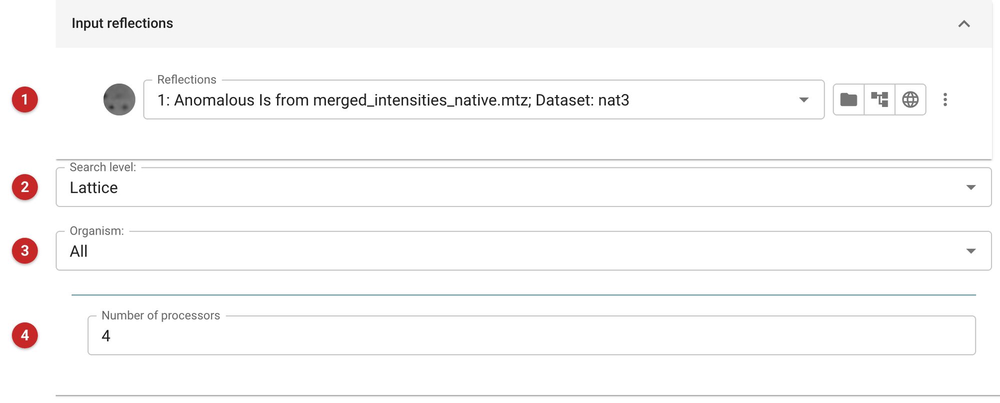
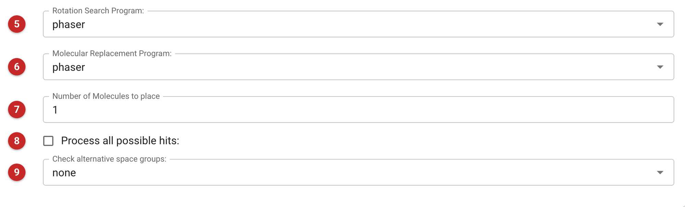
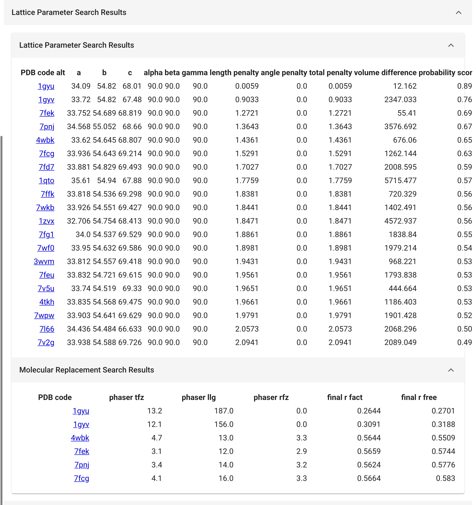
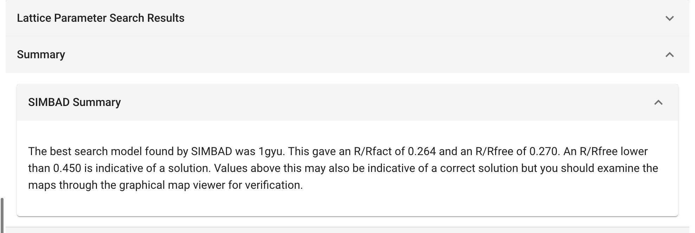

###############################################
Sequence-free molecular replacement (SIMBAD)
###############################################

SIMBAD (Sequence-Independent Molecular replacement Based on Available
Databases) looks for a search model without being told what the protein is.
Give it only the reflections. It has two searches, and the *Search level*
chooses between them or runs both:

* **Lattice**: compares the unit cell of your data with the unit cells of
  known structures in a database held with CCP4, ranks the structures by how
  well their cells match, and then runs molecular replacement with the best
  few. A structure that crystallised in your crystal form, even of a
  different protein, can solve yours.
* **Contaminants**: screens the data against a database of known contaminant
  structures, which is what to try when the crystal may be of the wrong
  protein altogether.

Use it when you have no sequence or no model, when sequence-based searches
(:doc:`../mrbump_basic/index`) found nothing that works, or when a
structure looks like it should have been solved and was not. If you do know
the sequence, MrBUMP is the better first choice, since it uses what you know.

The pictures on this page come from the Gamma project: a lattice-only search
on the native data, with no sequence and no model given.

Input
=====

   Figure 1: SIMBAD input

The reflections **(1)**, and the search level **(2)**: *Lattice*,
*Contaminants* or *Lattice + contaminants* (the default). The organism **(3)**
limits the contaminant search to contaminants from one organism, for example
your expression host; it does not affect a lattice-only search. The number of
processors **(4)** is how many SIMBAD may use at once.

   Figure 2: SIMBAD advanced options

The *Advanced options* tab chooses the program for the rotation search
**(5)** and the program that does the molecular replacement **(6)**, both
Phaser by default (AMoRe or MOLREP are the alternatives), and how many
molecules to place **(7)**. The rotation search program is used only by the
contaminant search, and the organism only limits the contaminant search: the
job leaves both out of the command when the level is *Lattice*. *Process all
possible hits* **(8)** makes SIMBAD trial every search model rather than stop
early. *Check alternative space groups* **(9)** offers *all* or *enant*
(SIMBAD's own options) for when the space group assignment is in doubt; the
default is *none*.

Results
=======

   Figure 3: SIMBAD lattice search results

The first table lists the structures whose cells best match yours, best
first: the PDB code (linked to the entry at PDBe), the cell, and how far it is
from yours (length and angle penalties, their total, and the difference in
volume). The last column, the probability score, is wider than the table and
is reached by scrolling it sideways. The match is the cell only. The second
table gives the molecular replacement for the best hits: Phaser's TFZ and LLG,
and R and R-free after refinement.

In this run the best cell match, 1gyu (cell 34.09 54.82 68.01, total penalty
0.006), gave a clear solution: TFZ 13.2, LLG 187, and R/R-free 0.264/0.270
after refinement. The second, 1gyv, also worked (TFZ 12.1, LLG 156, R-free
0.319). The next four hits, with cells a little further away, gave TFZ 3 to 5
and R-free of 0.55 to 0.58: no solution.

So **a cell match is a lead, not a solution; the molecular replacement result
decides.** Here the two hits that solved the structure placed with TFZ above
12 and refined to R-free below 0.32; the four that did not placed with TFZ 3
to 5 and stayed at R-free 0.55 or more. Unrelated structures can share a
cell, so a small penalty does not make them the same protein.

   Figure 4: SIMBAD summary

The summary names the best model and its R and R-free, and says that an
R-free below 0.45 indicates a solution. Treat that as the lowest bar: look at
the map, as it says, before trusting it.

The refined model and map for the best hits are in the job's output files,
named by rank and structure ("SIMBAD hit 1: 1gyu, placed and refined"), and
the "What next" buttons below the report lead to refinement and rebuilding.
Start from the best-scoring model, and check the density where it differs
from the protein you expected: a lattice hit can be a different protein.

SIMBAD's lattice database is a snapshot. The log may say it is older than 90
days and suggest updating it with ``simbad-database lattice`` in a terminal;
newer structures are missing until then.

**References**

Simpkin, A. J. et al. (2018). SIMBAD: a sequence-independent
molecular-replacement pipeline. Acta Cryst. D74, 595-605.

Simpkin, A. J. et al. (2020). Using Phaser and ensembles to improve the
performance of SIMBAD. Acta Cryst. D76, 1-8.
