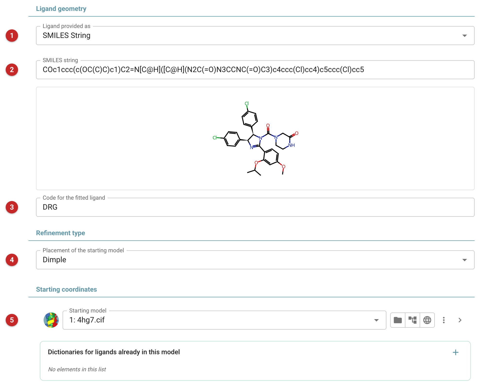
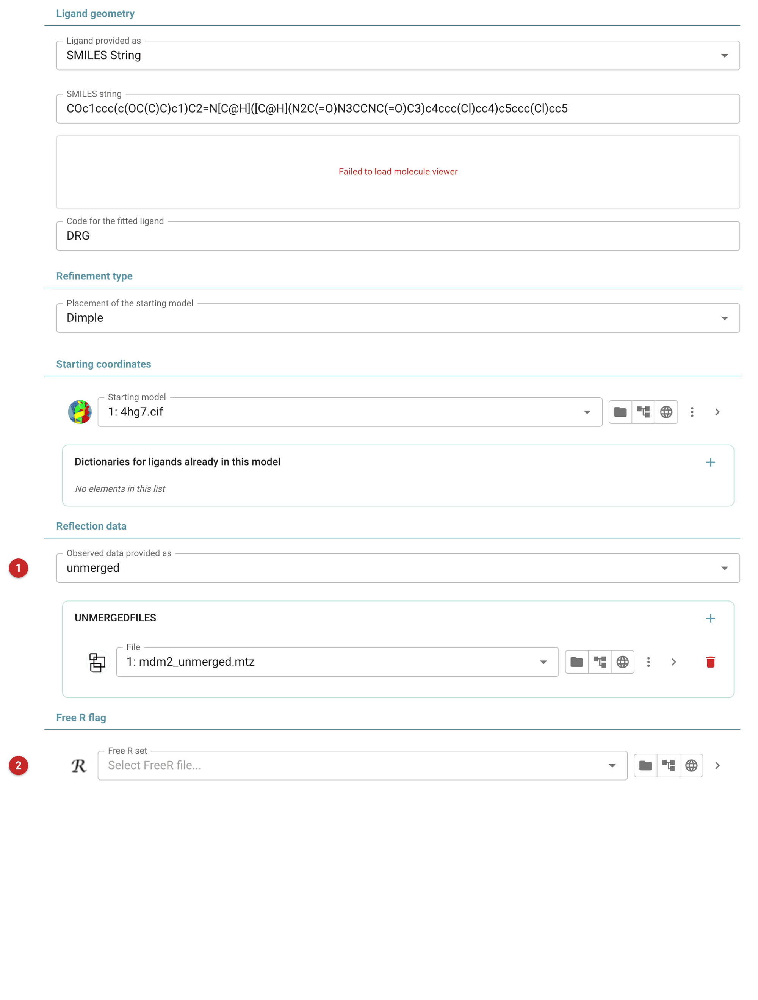
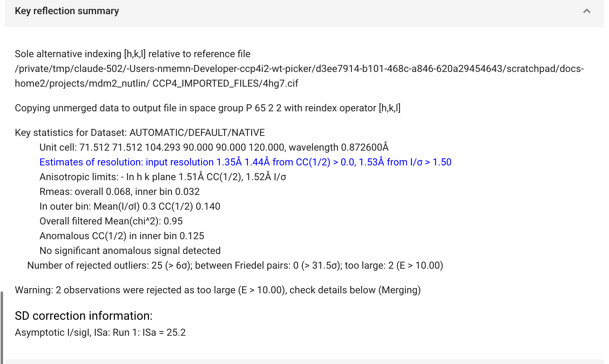

#####################################################
Automated solution of isomorphous ligand complex
#####################################################

   This task solves a ligand complex quickly when you already have a
   structure of the same crystal form: the protein alone, or with another
   ligand, as in a soaking or co-crystallisation campaign. From the new
   data, the parent structure and a description of the ligand, it

   #. makes a restraint dictionary for the ligand (AceDRG);
   #. scales and merges the new data, indexing them to match the parent
      (Aimless), unless you give merged data;
   #. places the parent model in the new cell and refines it (Dimple, or
      Phaser rigid-body placement);
   #. refines the model with Servalcat and calculates maps;
   #. fits the ligand into the difference density with Coot.

   The pictures on this page come from the demo data that ships with
   CCP4i2: MDM2 soaked with the inhibitor Nutlin-3a, starting from the
   structure 4hg7 with its ligand removed.

.. note::

   This page is a draft, written from the task's interface, parameters
   and code. It has not yet been reviewed by the pipeline's developers.

Input
=====

   |input|

The ligand
----------

   Say how the ligand is described **(1)**: as a SMILES string (the
   default), an MDL Mol file, or a restraint dictionary you already
   have. With a SMILES string, the molecule is drawn as you type **(2)**,
   so you can check it before running. Give the stereochemistry if it is
   known: Nutlin-3a has two stereocentres, and without them AceDRG is
   free to choose. Choose *NONE* to refine the parent model against the
   new data without looking for a ligand.

   The ligand's three-letter code **(3)** defaults to DRG. It must not be
   a residue name already in the starting model; the task checks this
   before it runs.

The starting model
------------------

   *Dimple* **(4)**, the default, places the parent model in the new
   crystal by rigid-body and restrained refinement, and reindexes the
   data first if that matches the model better; it suits the usual case
   of an isomorphous soak. *Phaser RNP pipeline* places it by rigid-body
   molecular replacement, for when the cell has changed too much for
   refinement alone.

   The starting model **(5)** is the parent structure. Use its atom
   selection to leave out the parent's own ligand and waters, which
   would otherwise sit in the density the new ligand should be fitted
   to: here ``not (NUT) and not (HOH)`` removes Nutlin-3a and the waters from
   4hg7. Any other non-standard residue left in the model needs its
   dictionary under *Dictionaries for ligands already in this model*.

The data
--------

   |data|

   The new data can be unmerged **(1)**, the default, straight from
   integration: they are scaled, merged and indexed to match the parent
   model. Or give merged data. A Free R set **(2)** is optional but
   recommended: give the parent structure's, and it is extended to the
   new data, so the same reflections stay free across a series of
   complexes. Without one, a new set is made from unmerged data; merged
   data given without one are refined with no free set, and the report
   can then give no R-free.

Results
=======

   |report|

   The report follows the pipeline: the data reduction summary (for
   unmerged data), shown here, then any reindexing Dimple found
   necessary, and a summary of the refinement.

   The outputs are the ligand's dictionary, the data, the maps and the
   model with the ligand fitted. **The fitted ligand is placed by Coot
   but not refined.** Look at it in the maps, in Coot or Moorhen, then
   refine the model with the *Refinement - Servalcat* task, giving it the
   ligand's dictionary from this job.

