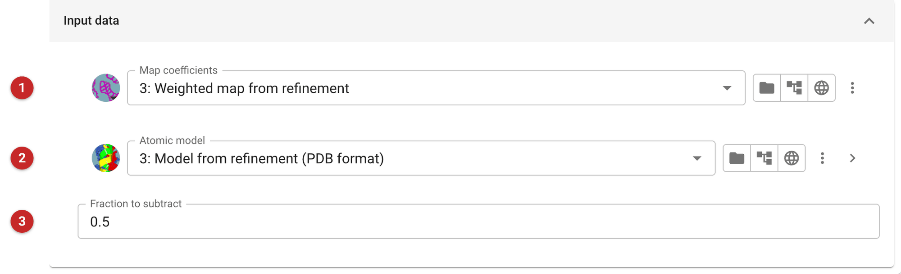
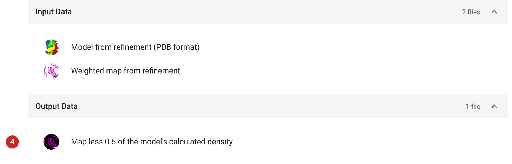

#########################################################
Subtract a fraction of a model's density (SubtractNative)
#########################################################

.. note::

   This task is deprecated. It is kept so that old projects still open,
   and is due to be replaced by a feature of the Moorhen viewer. For
   ligand-binding events in a series of crystals, use the PanDDA tasks,
   which make event maps by the same subtraction with the fraction
   estimated for you.

The task takes map coefficients and a model, calculates the model's
electron density, scales it by a fraction you give, and subtracts it from
the map. What is left is the density the given fraction of the model does
not account for: with the apo (*native*) model and the fraction of the
crystal that is still apo, a "binding event" map in which a partly
occupied ligand stands out more clearly than in a 2mFo-DFc map. The
output is a map, to view in Coot or Moorhen.

The pictures on this page come from the MDM2 project of the refinement
route: half of the refined model's calculated density subtracted from its
2mFo-DFc map.

Input
=====

   Figure 1: SubtractNative input

The map coefficients **(1)**, the model whose density is subtracted
**(2)**, and the fraction to subtract **(3)**: for an event map, one
minus the occupancy of the bound state, so 0.8 for a ligand bound in a
fifth of the crystal.

Results
=======

   Figure 2: SubtractNative output

The output is the map **(4)**, annotated with the fraction subtracted. The
report shows nothing else; open the map in a viewer.
