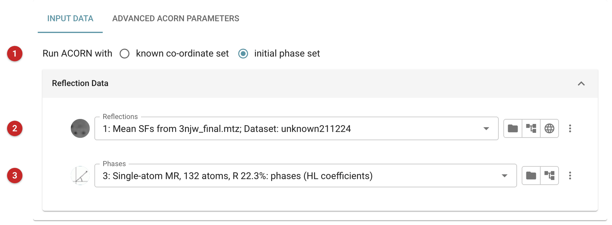
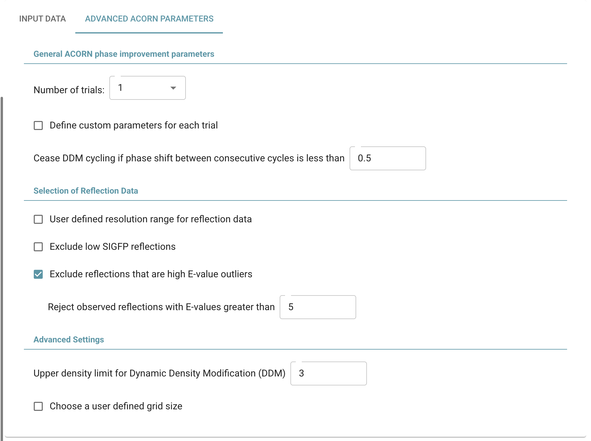
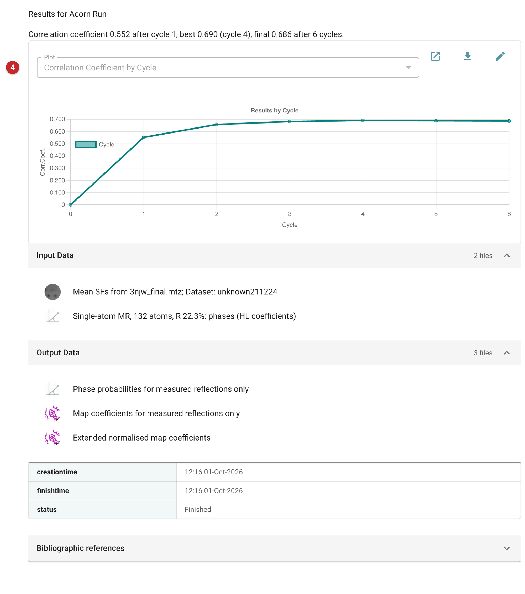

################################
Density Modification using Acorn
################################

**ACORN** refines and extends a set of starting phases by dynamic density
modification. It is the *ab initio* route for data that resolve individual
atoms: with a handful of correctly placed atoms, or phases from an
earlier step, it can complete the structure without a model of the rest.
Use it when the resolution of the observed data is high enough for the
maps to show separate atom sites. The old guidance, from the ACORN
documentation, is that it can work with data to 1.7 Å and reasonably
accurate starting phases, and is more consistently successful at 1.5 Å or
better; for a small starting fragment, such as a few heavy atoms or a
helix, about 1.2 Å or better.

For data at lower resolution, use a density modification program that
does not rely on resolved atoms (:doc:`../parrot/index`). ACORN is
usually the step after one that gives you phases, whether experimental
phasing, a molecular replacement solution (even a small correctly placed
fragment, which ACORN corrects for bias towards), or single-atom
molecular replacement (:doc:`../phaser_singleMR/index`), which places a
few atoms and completes the rest from log-likelihood-gain maps.

The pictures on this page come from the LassoPeptide project of the
atomic-resolution route: PDB entry 3njw, a 19-residue lasso peptide
measured to 0.86 Å (space group P2\ :sub:`1`\ 2\ :sub:`1`\ 2\ :sub:`1`,
data from PDB-REDO). Single-atom molecular replacement placed the two
sulfurs and completed them to 132 atoms (R 22.3%); ACORN was started from
those phases.

How it works
============

Before a map is calculated, the observed amplitudes are corrected for
anisotropy and "normalised": the amplitudes are modified so that the mean
value in every resolution shell is about one. The normalised amplitudes
are called Es.

**Dynamic Density Modification (DDM).** The map from the current phases is
modified by eliminating negative density and truncating the highest
density. Other options are described in the ACORN documentation
(https://www.ccp4.ac.uk/html/acorn.html). New phases are derived from the
modified map, and the procedure is repeated until the phase shift between
cycles is below a set value (default 0.5°).

**The "Free Lunch" algorithm.** If the resolution of the data is poorer
than 1.0 Å, the list of reflection indices is first extended to 1.0 Å and
all the added reflections are given an E value of 1.0, the mean expected
value. Including these terms, with estimated amplitudes but reasonable
phases, improves the resolution of the map that is modified.

**Indication of success.** The observed E values are divided into strong,
medium and weak. Only the strong and weak reflections are used in the map
calculation, so the correlation coefficient between Eobs and Ecalc for the
medium set acts as an independent figure of merit. If ACORN is working,
it rises as the map improves. A value of 0.2 or above suggests that the
phases are good enough for model building.

Input
=====

   Figure 1: ACORN input

Choose what to start from **(1)**: *known co-ordinate set*, an atomic
model from which starting phases are calculated, or *initial phase set*,
phases you already have. The reflections are always required **(2)**.

With *initial phase set*, give the phases **(3)**. These can be from
experimental phasing, from a previous refinement, or, as here, the
Hendrickson-Lattman coefficients from single-atom MR. Experimental phases,
even to medium resolution, are an excellent start as long as the
amplitudes go to high resolution.

With *known co-ordinate set* an *Atomic model* is asked for instead, in a
section "Model for approximate co-ordinates". It can be the whole
contents of the asymmetric unit, a domain, or a small fragment such as a
helix or a few correctly placed heavy atoms (metals, selenium or sulfur
sites, for example). The lower the resolution, the more complete the
starting model needs to be.

Advanced options
----------------

   Figure 2: ACORN advanced parameters

The defaults are a reasonable start; most runs need none of these. The tab
offers:

- the number of trials (1 to 10), and the option to define the number of
  cycles, the DDM type and the refinement for each trial;
- the phase shift between cycles below which DDM cycling stops
  (0.5° by default);
- a user-defined resolution range for the reflections, an exclusion of
  reflections with low F/σ(F), and the rejection of reflections with
  observed E values above a limit (on by default, at 5);
- the upper density limit for DDM (3 by default), and a user-defined grid
  size.

Results
=======

   Figure 3: ACORN report

The plot **(4)** shows the correlation coefficient by cycle; the line above
it states the first, the best and the last. Here it rose from 0.552 after
the first cycle to 0.658, 0.682 and 0.690 (cycle 4, the best), then eased
to 0.688 and 0.686 by cycle 6. This is the correlation for the medium set
(here 5203 reflections, from the log's "Corr for medium E"), so it is the
figure of merit described above, and well over 0.2. If the value goes up
and levels off, the
phases are improving and have settled. If it stays low and level, the
starting phases were not good enough, and no choice among the options
will rescue them; try better starting phases, a more complete model or a
different starting point.

The outputs are phase probabilities and map coefficients for the measured
reflections only, and extended normalised map coefficients (those for the
reflections added by the "Free Lunch" extension).

Follow-on tasks include manual model building, usually to inspect the
quality of the map, and automated model building.
