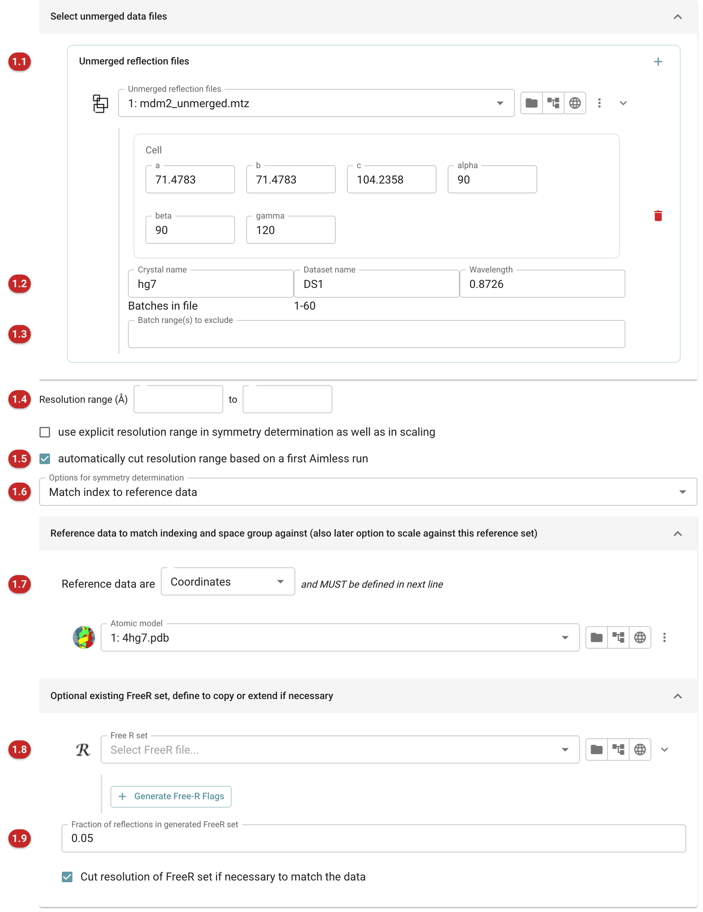
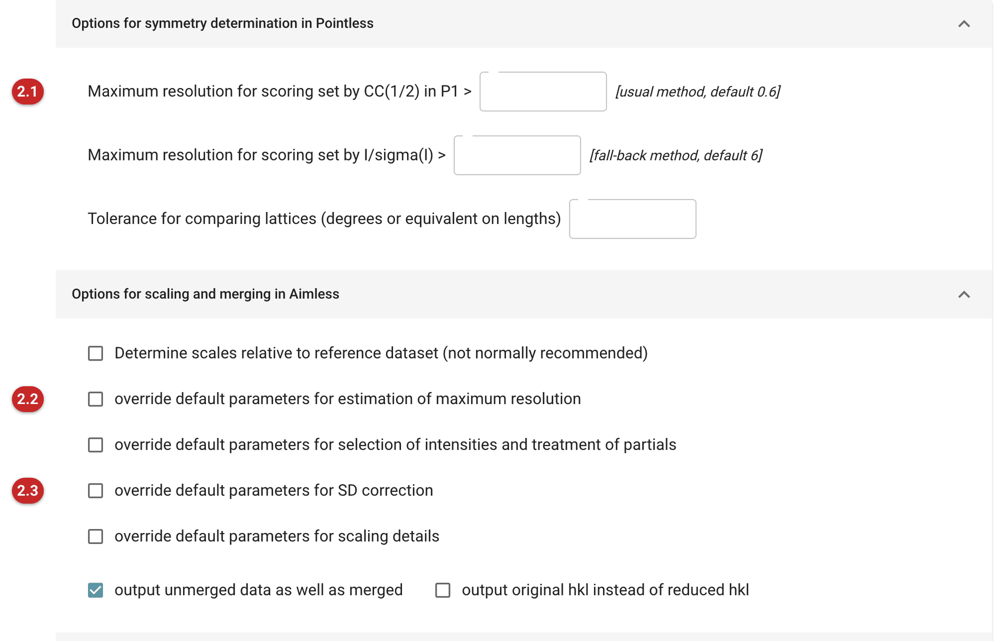
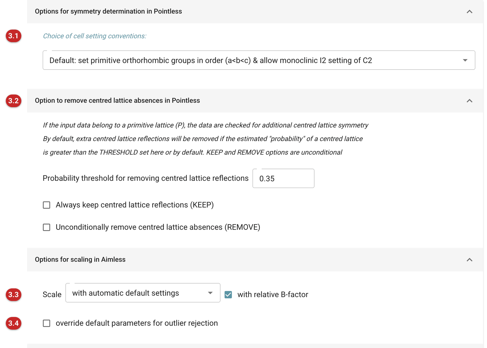
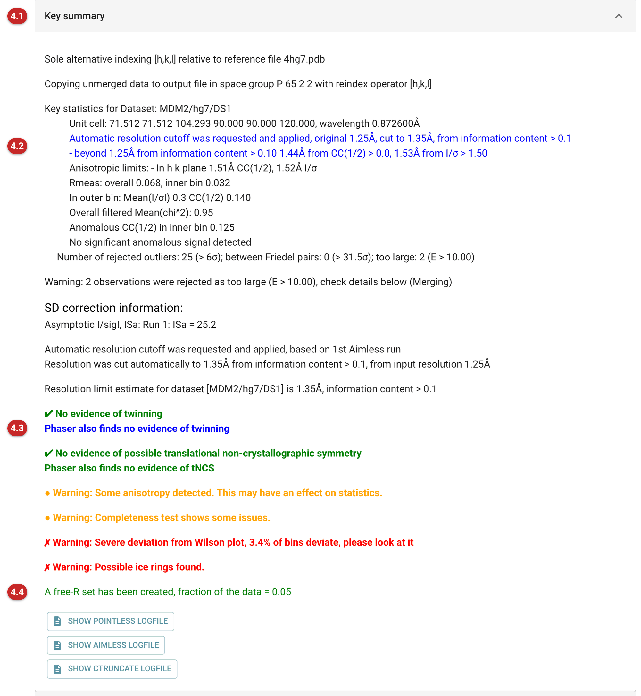
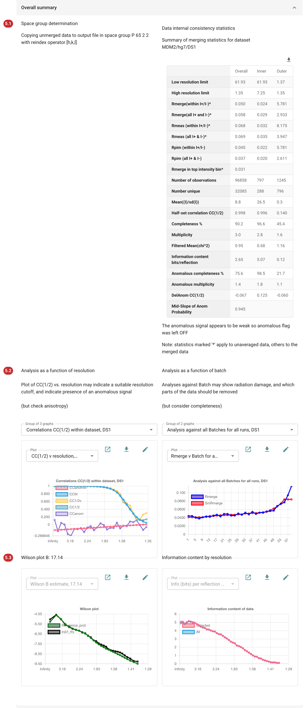

####################################
The AIMLESS Data reduction pipeline
####################################

   The Data Reduction task takes reflection intensities from an
   integration program such as Mosflm, XDS or DIALS, and converts them
   to scaled merged intensities and structure amplitudes. This consists
   of a number of stages

   #. Read one or more input files,  combining them and putting them on a consistent indexing scheme if necessary (program POINTLESS)
   #. Determine the crystal symmetry, ie the Laue group and if possible the space group, by inspecting the internal symmetry of the intensities (program POINTLESS)
   #. Scale together symmetry-related reflections (program AIMLESS)
   #. Analyse the merged data for information content, twinning, translational non-crystallographic symmetry (program PHASER)
   #. Examine the intensity statistics to detect twinning, and generate amplitudes (F) from intensities (I) (program CTRUNCATE)
   #. Generate or extend a set of FreeR reflections for later use in refinement

   If the option to automatically cut the resolution range is selected
   (see below **(1.8)** ), then the results from Phaser are examined, and
   if necessary AIMLESS is rerun with a new resolution cutoff, and then
   the pipeline continues with PHASER etc as before

   Detailed documentation for individual programs is available here:

   `POINTLESS <https://ccp4.gitlab.io/ccp4docs/pointless.html>`__
   `AIMLESS <https://ccp4.gitlab.io/ccp4docs/aimless.html>`__
   `CTRUNCATE <https://ccp4.gitlab.io/ccp4docs/ctruncate.html>`__

How to read the Results_

Input
=====

The pictures on this page follow the Ligand Tutorial data that comes with
CCP4i2: MDM2 with Nutlin-3a, whose images were integrated to 1.25 Å,
beyond where the diffraction ends. The data are indexed to match the model
they will be refined against (4hg7), and the resolution is cut
automatically.

   Figure 1: Input data

.. rubric:: Reflection input
   :name: reflection-input

Input reflection files are specified here, either from earlier jobs,
or from outside the project. They should contain unmerged reflections, ie
the output from an integration program **(1.1)**. The **+** button adds
further files. File formats recognised are: unmerged
MTZ, from Mosflm or DIALS; files from XDS, XDS_ASCII.HKL (scaled) or
INTEGRATE.HKL (unscaled); .raw files from SAINT (Bruker); Scalepack
files (.sca); ShelX files; and mmCIF reflection files from the PDB (a
block selector appears when a file holds more than one). Scalepack and
ShelX files cannot be properly scaled
by AIMLESS as they lack diffraction geometry information (only the
CONSTANT scale option is allowed, only useful to scale together
multiple files). Merged MTZ files can also be used, but again can only
be scaled to merge multiple files (use SCALE CONSTANT, see
*Additional Options* below).

The arrow at the end of a file's row opens its details: the cell and
wavelength read from the file, and the crystal and dataset names
**(1.2)**. These should be short and not include spaces. They are used to
identify the dataset in later structure solution tasks (as
/crystal/dataset), and if given here they replace any the integration
program wrote (here, hg7 and DS1 replace AUTOMATIC/DEFAULT/NATIVE). Files
with the same dataset name will be merged into a single output dataset:
different dataset names (eg for MAD data) will lead to multiple output
sets. Parts of the data may be omitted either by specifying batch ranges
for exclusion **(1.3)**, or by setting resolution limits **(1.4)**.
Typically you would do that after running the task first and inspecting
the output. It is often useful to integrate the images to slightly
higher resolution than you think the pattern extends to, then cut back
the resolution following a first run of Aimless, which can be done
automatically **(1.5)**. And parts of the data showing serious radiation
damage may be omitted, provided that completeness is not compromised
(you need to check that yourself).

The automatic resolution cutoff **(1.5)** runs Aimless twice. Phaser
estimates the average information content in bits/reflection as a
function of resolution from the first run, and the cutoff is set to the
point where the information content falls below a threshold (default
0.1 bits/reflection, changed under *Important Options*); the second run
applies it. If you use it, examine the other indicators to check that the
cutoff is sensible (see `Estimation of resolution
<./scaling_and_merging.html#estimation-of-resolution>`__). The MDM2 data
were cut from 1.25 Å to 1.35 Å.

.. rubric:: Symmetry
   :name: symmetry-options

The default option is to determine the Laue group (the rotational point
group), and if possible the space group. However if you know the space
group or the Laue group you can specify it explicitly, or give a reindex
operator, choosing the option from the menu **(1.6)**. The space group may
also be set by giving reference data **(1.7)**: *Match index to reference
data* (as here), with either a previous isomorphous dataset (reflections)
or atomic coordinates from which structure factors are calculated. The
reference is also used to resolve indexing ambiguities in space groups
where there are non-equivalent but valid alternative indexings (the same
cases where merohedral or pseudo-merohedral twinning is possible). In
P6\ :sub:`5`\ 22, the MDM2 space group, there is none: the report says the
sole alternative is [h,k,l]. If multiple input files are given, then if
necessary they will be checked for consistent indexing, against the
reference data if given, or against the first file.

.. rubric:: Free R set
   :name: freer-options

The last section can be used to specify a pre-existing FreeR set for
adoption and extension, provided it is compatible **(1.8)**. If this is
not given a new FreeR set is generated, with the fraction of reflections
given **(1.9)**, but you should use the same set for all isomorphous
datasets in a project. Generation of the FreeR set takes into account
potential merohedral or pseudo-merohedral twinning, just in case, ie
reflections which are related by a potential twin operator are either
all in the free set or all in the working set.

.. rubric:: Important options
   :name: options

   Figure 2: Important options

This tab (and the next one) set various options which are not usually
required (and are not all documented here: for further information see
the program documentation). You can override most of the default
parameters used in Pointless and Aimless, for instance those for
estimating the maximum resolution used in scoring the symmetry
**(2.1)**: note that these parameters do not control the actual
resolution cutoff. The thresholds for the resolution estimates, including
the information content used by the automatic cutoff, can be changed
**(2.2)**. Another possibly useful option is to change parameters for the
optimisation of the estimated sigma(I) **(2.3)** (see the report): the
default is to use the same correction factors for all runs, but in some
circumstances you may wish to have different parameters for each run,
either separate ("individual") or restrained to be "similar". The
refinement may also be stabilised if necessary by fixing the sdB
parameters.

.. rubric:: Additional options
   :name: additional-options

   Figure 3: Additional options

The third tab offers further options, again ones you will not normally
need to change. The first menu **(3.1)** allows you to override the
default of IUCr standard settings for primitive orthorhombic and centred
monoclinic spacegroups: this convention sets a<b<c for all primitive
orthorhombic, eg it allows P 2\ :sub:`1` 2 2\ :sub:`1` rather than the
"reference" setting P 2\ :sub:`1` 2\ :sub:`1` 2, and also chooses the
alternative I2 in place of C2 if it gives a smaller β angle. The default
is recommended. If the lattice is primitive, Pointless checks whether the
data show extra centred-lattice symmetry, and by default removes the
centred-lattice absences when the probability of a centred lattice
exceeds a threshold; this can be changed, or the reflections always kept
or always removed **(3.2)**. The scaling model can be specified in more
detail **(3.3)**: options other than the default open further controls,
for instance the interval on crystal rotation angle Phi (ROT) for the
scaling. You can also change the criteria for outlier rejection
**(3.4)**, and
define 'Runs' explicitly by batch range, to override the automatic
setting, and also set different high resolution cutoffs for each run.
If the data have already been scaled by XDS or DIALS, you may wish to
turn off scaling here ("No scaling only merge") and also turn off
optimisation of the SD correction **(2.3)**, and just use this pipeline
to get some statistics.

.. _Results:

Results
=======

The output from this task is quite detailed, and some of it is only
relevant if there are problems. You can drill down to the details of
the process, much of it presented as graphs. Based on the output, you
need to make some judgements about your data.

- What is the real resolution? Should you cut the high-resolution data?
- Are there bad batches (individual bad batches or ranges of batches)?
- Was the radiation damage such that you should exclude the later parts?
- Should you exclude some files or runs?
- Is there any apparent anomalous signal?
- Is the outlier detection working well?
- What is the overall quality of the dataset?
- How does it compare to other datasets for this project?

| Contents of the report description
| `1. Key Summary <#the-report-key-summary>`__
| `2. Overall Summary <#overall-summary>`__
| `3. Details of symmetry determination <./symmetry.html>`__
| `4. Details of scaling and merging <./scaling_and_merging.html>`__

.. rubric:: The report: key summary
   :name: the-report-key-summary

   Figure 4: Key summary

The report is divided into sections, each of which can be folded away.
The first **(4.1)** summarises the main conclusions from the task: (a)
the choice of space group, and the confidence in this choice (here, with
the indexing matched to the reference model); (b) various resolution
estimates, and the automatic cutoff if one was requested **(4.2)**; (c)
key statistics from merging, merging R-factors, I/sigma(I), CC(1/2) etc;
(d) any indications of translational NCS or twinning **(4.3)**. Warnings
are colour-coded as orange or red (severe): these may need more
investigation. Here the ice rings and the deviation from the Wilson plot
deserve a look (see `Scaling and merging <./scaling_and_merging.html>`__).
The summary ends by saying whether a free R set was made or an existing
one extended **(4.4)**, followed by buttons that show the log files, for
those who like them.

Warnings which should be noted include space group ambiguity, from axial
reflections missing or obscured by lattice centring, and cases where
alternative indexing schemes are possible.

.. rubric:: Overall summary
   :name: overall-summary

   Figure 5: Overall summary

The Key summary is followed by the Overall summary tables and graphs.
The first panel **(5.1)** shows more detail of the space group
determination. It may be worth looking at finer details later in the
report, particularly if the confidence is low. Beside it is the classic
"Table 1", suitable (more or less) for inclusion in a publication; the
download button above it saves it as a CSV file. Below **(5.2)** are the
main graphs of statistics against resolution, which illustrate where a
resolution cutoff might be applied, and also whether a significant
anomalous signal is present; other graphs are chosen from the menus above
each plot, and a graph can be opened in a window of its own. Beside them
are graphs against "Batch number", ie image number within each Run or
sweep of data. These graphs can be used to assess whether later parts of
the data suffer from serious radiation damage, and whether they may be
omitted without losing too much completeness (see the Cumulative
%completeness graph). The last row **(5.3)** holds the Wilson plot and,
beside it, the average "information content" (from Phaser) in
bits/reflection against resolution: the curve the automatic cutoff
reads, falling to 0.1 bits/reflection at 1.35 Å for these data.

.. rubric:: Space group determination
      :name: space-group-determination

   | Remember that the space group is only a hypothesis until the
      structure is satisfactory solved and refined. 

   | `Details of symmetry determination are here <./symmetry.html>`__

   .. rubric:: Scaling and merging
      :name: scaling-and-merging

   | `Details of the results of scaling and merging are
      here <./scaling_and_merging.html>`__
