 .. include:: <isogrk1.txt>

 .. include:: <isonum.txt>

####################################################################
Scaling and merging statistics (programs AIMLESS, PHASER, CTRUNCATE)
####################################################################

The statistics generated in the pipeline allow assessment of various
aspects of the data quality

In this document:-

- `Estimation of resolution`_
- Anisotropy_
- `Analysis of radiation damage etc`_
- `Completeness and multiplicity`_
- `Outliers`_
- `Detection of an anomalous signal`_
- `Analysis of Standard Deviations`_
- `Translational non-crystallographic symmetry`_
- `Statistics`_
- `References`_

| `Details of symmetry determination <./symmetry.html>`_
| `Back to main page <./aimless_pipe.html>`_

Estimation of resolution
^^^^^^^^^^^^^^^^^^^^^^^^

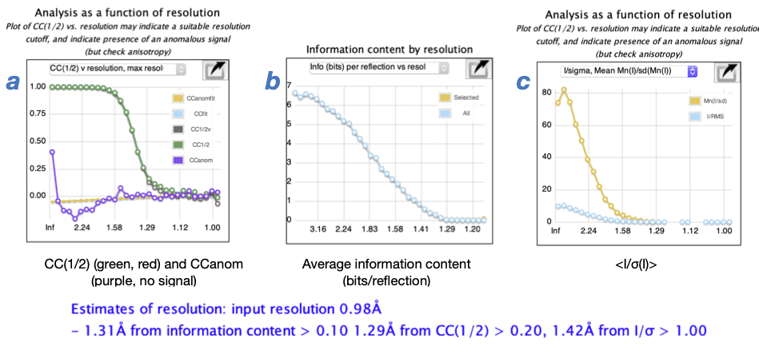

   Figure 8a: CC(1/2) against resolution

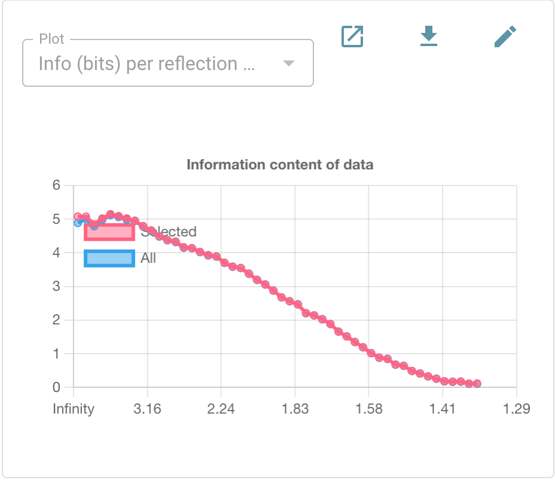

   Figure 8b: information content against resolution

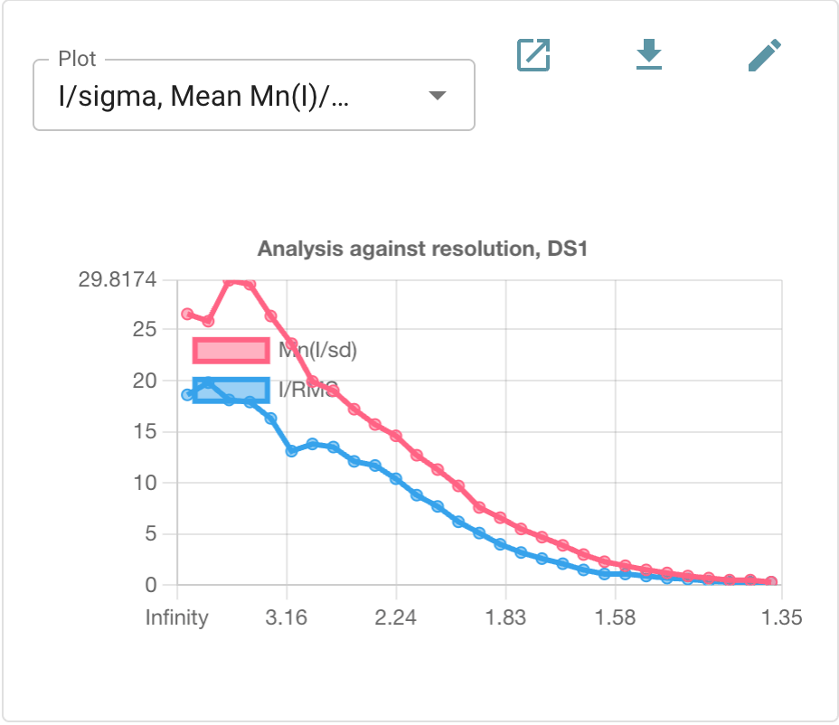

   Figure 8c: signal to noise against resolution

What is the real resolution? Good guides are **(8a)** the correlation
coefficient between random half-datasets CC(|frac12|), **(8b)** the
average information content (in bits/reflection) calculated by
Phaser and **(8c)** the
average signal/noise after averaging symmetry-related observations
<<I>/ |sgr| (<I>)>, labelled Mn(I)/sd(Mn(I)) in the Aimless table. 
The current default cut-offs are: on CC(|frac12|), 0.2; on
<<I>/ |sgr| <I>)>, 1.5; and on information content, 0.1. 
Resolution cut-offs ought to take into account anisotropy,
see `below <#anisotropy>`_.
The optional automatic cutoff in the pipeline is based on the information
content measure.

The estimates in the report differ for the different measures (here 1.44 Å
from CC(|frac12|) and 1.53 Å from Mn(I/sd) overall, and 1.57 Å where
Mn(I/sd) is 2.0), so look at the graphs, not only the numbers.

The final Summary table includes a rough estimate of the
resolution in each direction, as well as overall estimates. It is often
best to integrate the data to a higher resolution and then cut it back
after examining the Report. Note that R\ :sub:`merge` and its relatives
are not good indicators of resolution, as they increase to arbitrary
large values as the intensities get weaker.

Figure 8 shows three graphs against resolution which help you to decide
whether the estimated resolution limits are sensible, 
from CC(|frac12|), information content and Mn(I)/sd(Mn(I)).
Each is a choice in the report's graph menus (under Overall summary, and
under "Details of merging" for the information content). 8a shows CC(|frac12|)
(green line) with a curve fit (blue): it also shows CCanom (purple line), which
scatters about zero, so in this case (the MDM2 data, to 1.35 Å) there is
no significant anomalous signal (see 
`Detection of an anomalous signal`_ below for more). The fit falls below the
default threshold of 0.2 at 1.44 Å. In 8b the information content falls to
0.1 bits per reflection at 1.35 Å, which is where the automatic cutoff
cut these data (the input went to 1.25 Å); in 8c the average
signal/noise Mn(I/sd) reaches 1.5 at 1.53 Å.
AIMLESS calculates CC(|frac12|) in two ways: by
explicitly dividing observations for each reflection into two random averages
(labelled CC1/2); and the method of ref 6, based on variances and
covariances (labelled CC1/2v). The two methods usually give very
similar numbers.

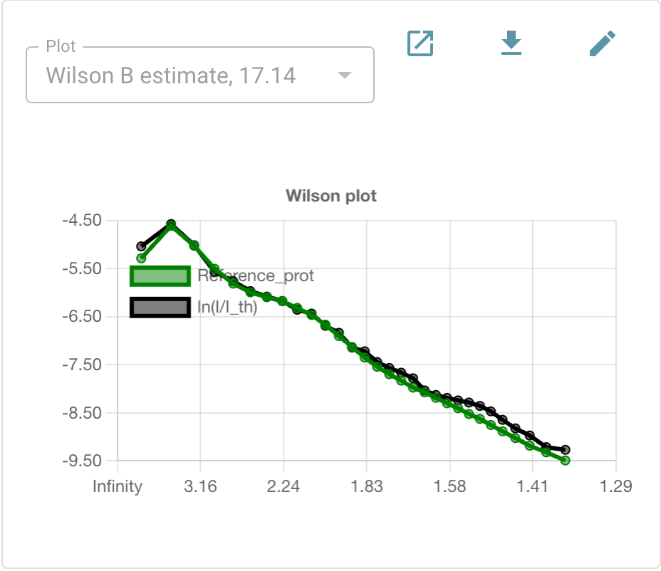

   Figure 9a: Wilson plot

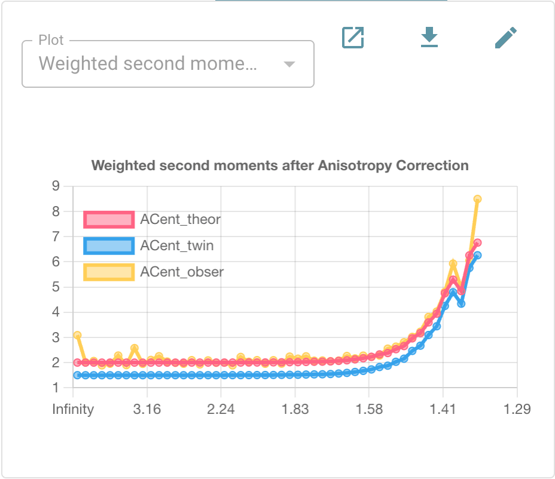

   Figure 9b: second moments against resolution

A number of other statistics may be useful in assessing the meaningful resolution.
Completeness (see `Completeness and multiplicity`_ below): note that
by default XDS and DIALS integrate into the corners of a square detector, 
so the highest resolution data are very incomplete (and the completeness of the
anomalous data is worse). Fig 9a shows the Wilson plot (here with a Wilson B of
17.14): flattening out or
going up is another indication of very weak or bad data, as are very large values
of the 2nd moment of intensity (fig 9b). The 2nd moment plot from
Phaser shows the "theoretical" value (rising with resolution as <I/ |sgr| (I)> gets
smaller) and the "twinned" value, as well as the observed value. In these data the
observed value follows the theoretical one to about 1.5 Å, then rises above it
at the highest resolution: large values of this moment indicate
very weak and probably useless data. This report also warns of a "severe deviation
from the Wilson plot" in 3.4% of bins and of possible ice rings (at 4.85, 3.86,
3.71 and 3.47 Å): these bins, and not only the overall
curve, should be looked at.

It is a mistake to cut back the resolution too severely at the data
reduction stage. It makes sense to restrict the resolution in locating
heavy-atom sub-structures, but in refinement and model building even
weak high resolution data can be helpful. Cutting back the resolution
makes your R-factors look better, but is unlikely to improve your
model.

Anisotropy
^^^^^^^^^^

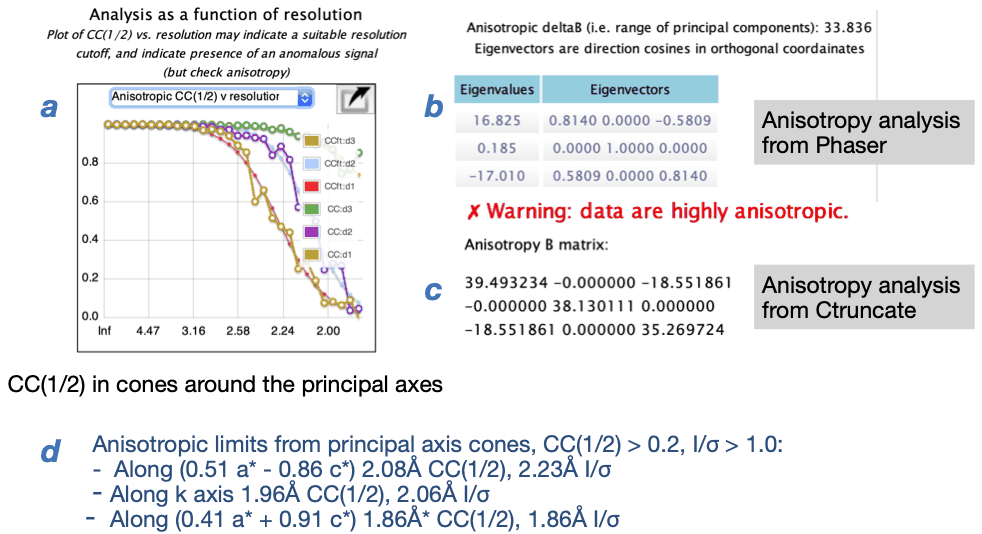

   Figure 10a: anisotropy of CC(1/2)

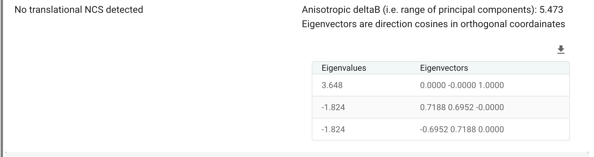

   Figure 10b: Phaser's eigenvalues and eigenvectors

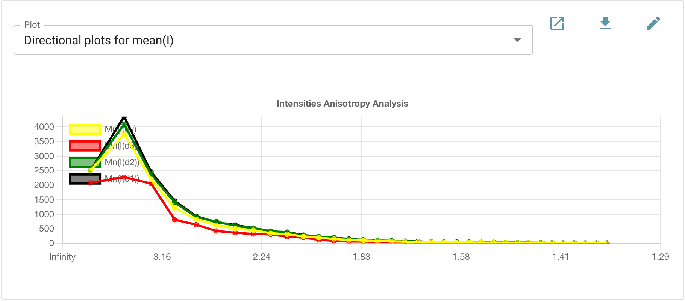

   Figure 10c: Ctruncate's directional plots of mean intensity

Most crystals diffract anisotropically to some extent, so decisions on
resolution cutoffs should take this into account, if the anisotropy is
severe. Anisotropy is analysed in various
ways here, along 2 or 3 orthogonal principal directions. Note 
that trigonal, hexagonal and tetragonal space groups only have two principal
directions, the unique axis and the perpendicular plane, and cubic space groups
show no anisotropy. In triclinic space groups there are 3 arbitrary axes, and in
monoclinic space groups the directions in the a*c* plane are
arbitrary. The example here (MDM2, P6\ :sub:`5`\ 22) therefore has two
directions: c* (d3) and the plane perpendicular to it (d12).
AIMLESS analyses anisotropy from CC(1/2) and <I/ |sgr| (I)> in cones of data
around the principal axes (fig 10a), so a rough resolution estimate can be made
for each direction: from CC(1/2), 1.44 Å in the a*b* plane and 1.52 Å
along c*; from Mn(I/sd) (threshold 1.5), 1.51 and 1.58 Å
(see "Details of merging", "Resolution estimates"). Phaser (fig 10b) and Ctruncate
(fig 10c) fit
orthogonal ellipsoids to the merged data, with different definitions. Phaser gives
an anisotropic delta B of 5.47, with the principal direction along c (the
eigenvector 0, 0, 1); Ctruncate describes "little or no
anisotropy". The report's key summary still shows a mild warning ("some
anisotropy detected"): the thing to note is that the data are only slightly
anisotropic, so the choice of cutoff will hardly depend on direction. When anisotropy is severe,
it may influence your decisions of whether or where to cut
the data. 
Other resources such as the Staraniso server might be useful in deciding what to
do with severely anisotropic data, though the value of anisotropic
cutoffs is controversial.

.. _Analysis of radiation damage etc:

Analysis against Batch, radiation damage etc
^^^^^^^^^^^^^^^^^^^^^^^^^^^^^^^^^^^^^^^^^^^^

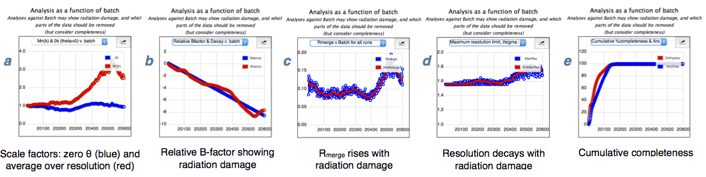

   Figure 11a: scale against rotation

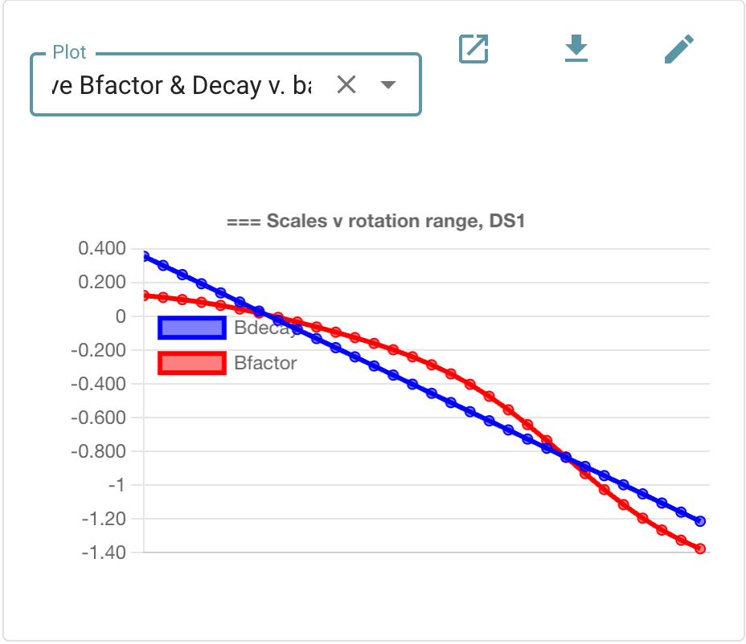

   Figure 11b: relative B-factor against batch

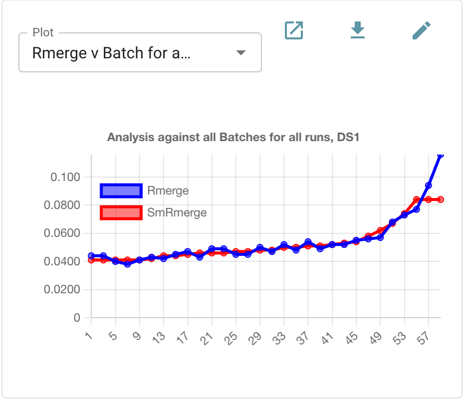

   Figure 11c: R\ :sub:`merge` against batch

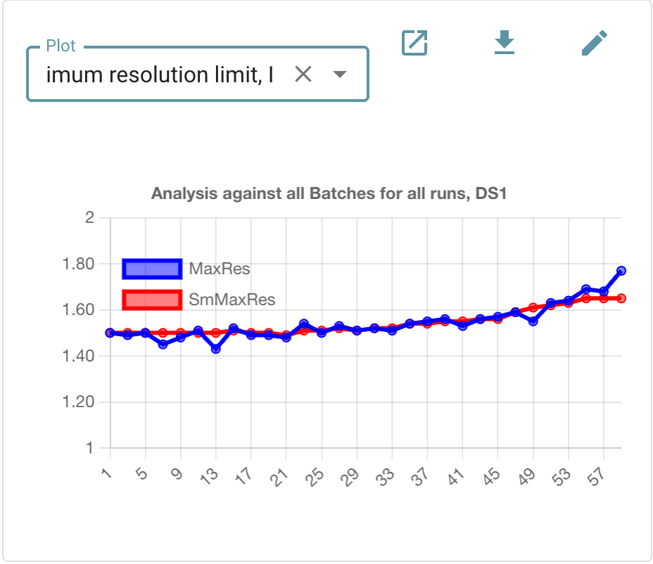

   Figure 11d: estimated maximum resolution against batch

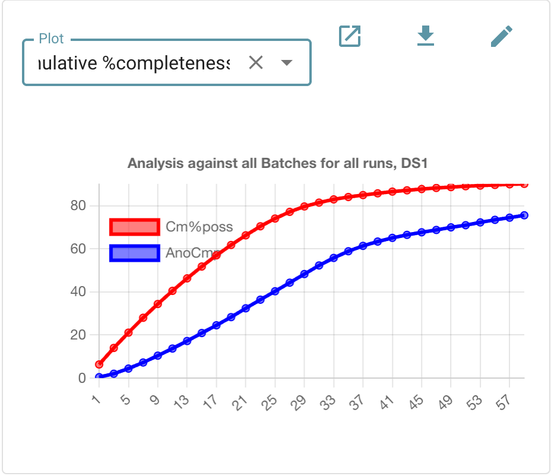

   Figure 11e: cumulative completeness against batch

The Batch Number is the image number for the central part of a spot, if
necessary incremented by a multiple of 1000 if you are merging multiple
sweeps (runs) or crystals. The various analyses against Batch allow you to
detect (a) radiation damage, causing a general decay in data quality
with time (radiation dose) (b) individual bad parts of the data, single
bad images or parts where something went wrong: these need further
investigation, examining the images and the integration process (c) if
you are merging data from multiple crystals or sweeps (all called Runs
in AIMLESS), some may be better than others (see below)

The graphs are chosen from the "Analysis against all Batches" group under
Overall summary: "Scales v rotation range" (11a, 11b) and the batch analyses
(11c to 11e). Figure 11 shows a mild example of radiation damage in the 60
batches of the MDM2 data. With
increasing radiation dose, the relative B-factor becomes more negative
(figure 11b), so that the average scale (red in 11a) increases above the
scale at infinite resolution (blue in 11a). R\ :sub:`merge` tends to
increase (figure 11c), more steeply in the last 10 or so batches, and the estimated
maximum resolution gets worse
(figure 11d, roughly estimated as the point at which I/σI falls below
1.5 here: it is near 1.5 Å for most of the data, and 1.77 Å in the last batch). The cumulative completeness plot (figure 11e) shows that
the first half of the data (30 batches) already give about 80% completeness, and
that the data reach 90.2% overall. The decay here is not severe enough to justify omitting
the end of the sweep, but it would be worth trying structure solution and
refinement with and without the last batches.

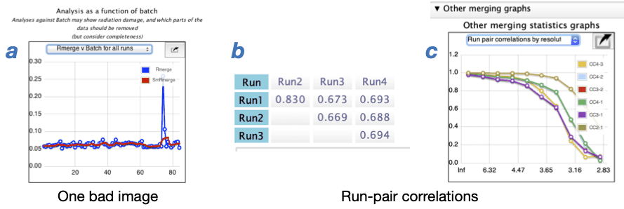

   Figure 12: one bad image and run pair correlations

Sometimes there is just a single bad image which should be excluded, as
in figure 12a.

With multiple crystals or sweeps, the decision on which part(s) of the
data to include is more complicated. With large numbers of crystals, the
analysis by the program BLEND may be useful. AIMLESS does include  two
other analyses which may be useful:

#. A table of pairwise correlations between runs, presented as a
   table, under "Details of merging", (figure 12b), and a graph
   against resolution (figure 12c)
#. If you have a preliminary structure, you can give the calculated
   structure factors as a reference file (using the Input option Use
   reference data in analysis against Batch after scaling). This will
   plot the correlation coefficient and R-factor between the observed
   intensity and F\ :sub:`calc`\ :sup:`2` as a function of Batch, which
   may help to show which parts of the data agree best with the model.
   Of course this has some danger of model bias, so perhaps should be
   used with caution.

Completeness and multiplicity
^^^^^^^^^^^^^^^^^^^^^^^^^^^^^

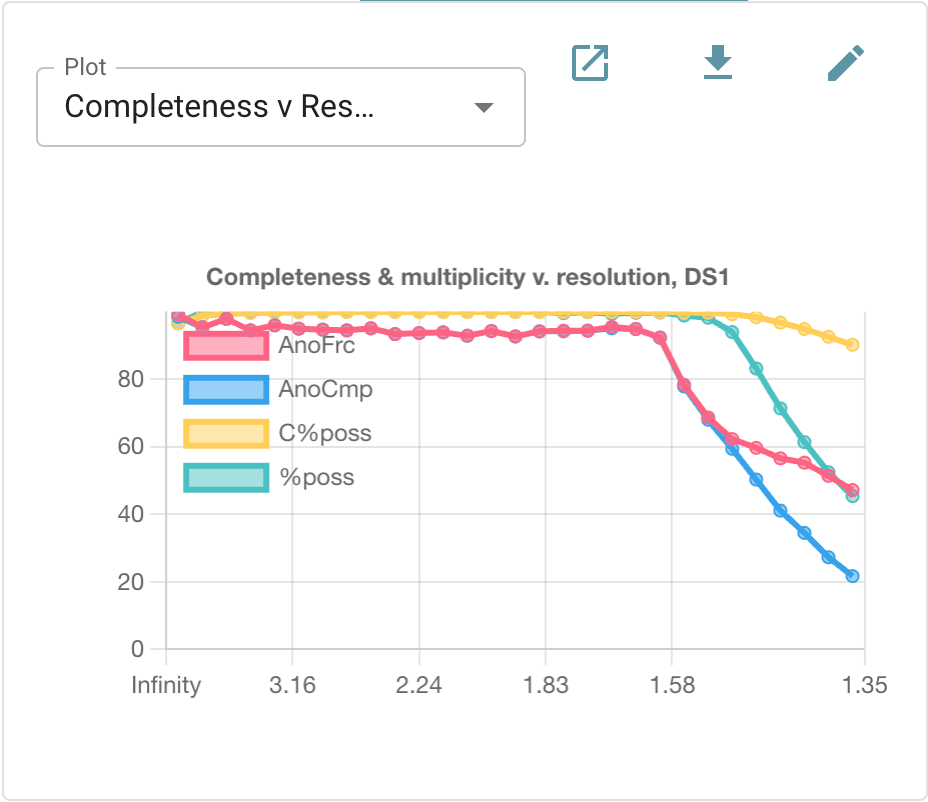

   Figure 13a: Completeness against resolution

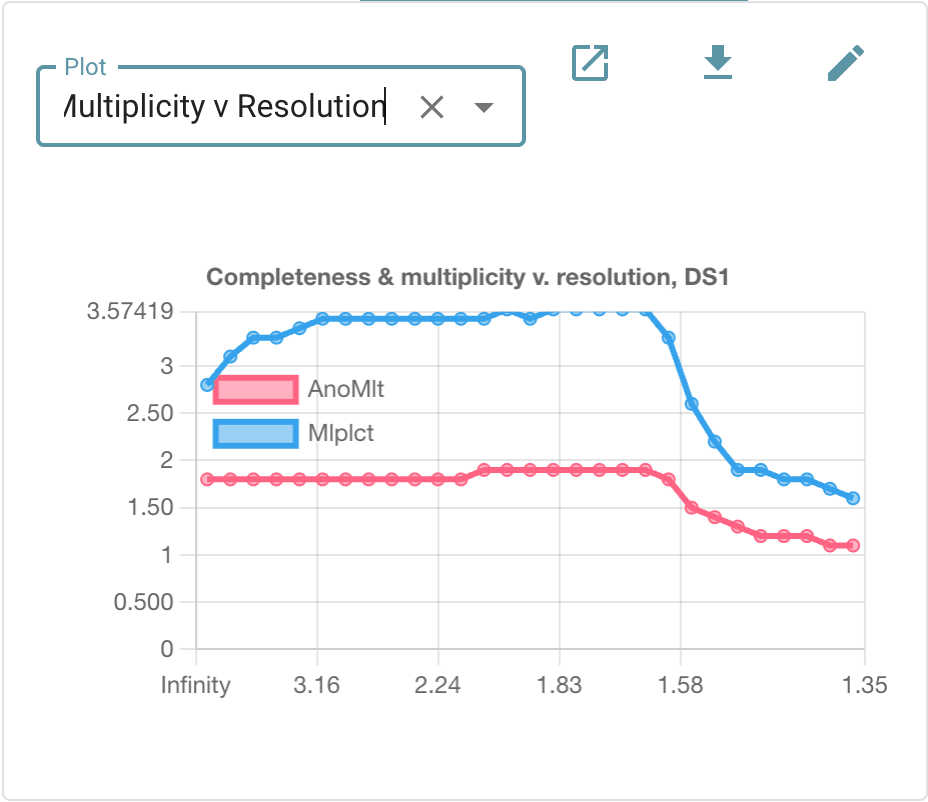

   Figure 13b: Multiplicity against resolution

Datasets should be complete, as near to 100% as you can manage. Some
loss of completeness can be tolerated in the outermost resolution bins.
Dangers: watch out for bad anomalous completeness.
Note that in P1 you need a rotation of at least 180°+2θmax (or better 360°)
to get complete anomalous data. Also that XDS and DIALS integrate into the
corners of square detectors, leading to very incomplete data at the
maximum resolution (figure 13a: here overall completeness is 90.2%, falling to 45.4% in
the outermost shell, and the anomalous completeness to about 20%; multiplicity, figure 13b, is 3.0 overall and 1.6 in the outermost shell). You should perhaps apply a high
resolution limit, maybe to 
the resolution of the inscribed circle. Detectors with many tiles may
lose significant numbers of spots in the gaps between tiles, leading to
serious incompleteness in low symmetry space groups (P1). You can
complete the data with another dataset collected by rotation about a
different axis (eg with a Kappa offset). You may also be able to recover
some data by accepting "Edge" reflections flagged by MOSFLM (see
Input->Additional options).

Outliers
^^^^^^^^

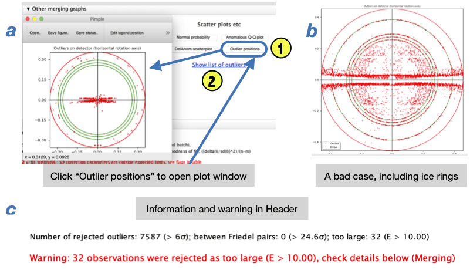

   Figure 14: Outliers

AIMLESS checks for outliers, ie observations that agree poorly with
other observations of repeated or symmetry-related reflections. The
default rejection test is for a deviation of > 6 |sgr| (I) from the mean
of other observations of equivalent *Ihkl* (see ref 1, appendix A5).
This criterion is relaxed
for testing between Friedel or Bijvoet-related observations
(ie I+ and I-), to allow roughly for any anomalous differences.
Observations may also be rejected if they appear to be very much
larger than would be expected (Emax test): this test is done on
intensities normalised to make <E :sup:`2`> = 1.0 for each resolution
range. Note that the normalisation in AIMLESS does not account for
anisotropy, twinning, nor for tNCS (unlike Phaser), so this test is
likely to be unreliable in the presence of serious pathologies. 

The number of rejections is listed in the main report header (figure
14c; here 25 unique observations were rejected, and 2 for the Emax test). The most useful view of the outliers is shown by clicking on the
"Outlier positions" button under "Merging" (Other merging graphs) **(14a.1)**,
which displays the positions of outliers on the detector (figure 14a).
This shows whether the outliers are syatematic, indicating possible problems.
Figure 14b shows a particularly bad example, showing serious ice rings
(marked with green circles) and many outliers along the rotation axis
(horizontal): this was a crystal with a very long cell axis which was
poorly resolved. Outliers along the rotation axis may indicate the
beamstop shadows have not been properly masked, but it is not
normally a problem to have some outliers there, as they are poorly
measured anyway. Ice rings are also detected elsewhere, eg in the
Wilson plot, but are hard to eliminate once you have ice on your
crystal.

A list of all rejected outliers, with their symmetry
equivalents, is available by clicking "Show list of outliers"
**(14a.2)** . If you have a lot of outliers, you may wish to check
that you think the rejections are reasonable.

Detection of an anomalous signal
^^^^^^^^^^^^^^^^^^^^^^^^^^^^^^^^

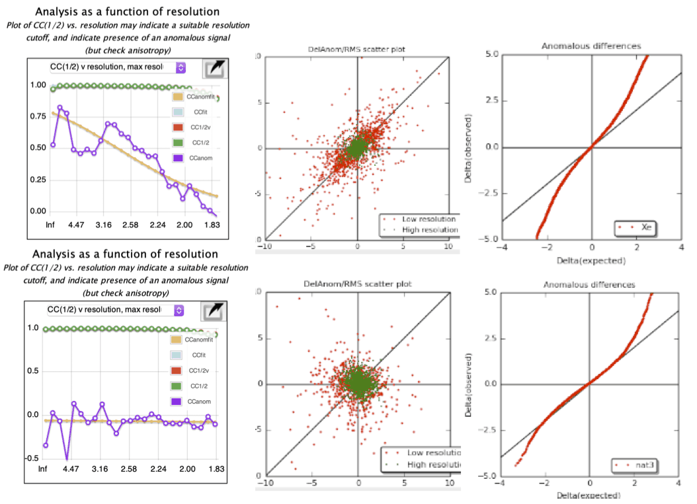

   Figure 14: Anomalous signal detection

   Top line: strong anomalous signal. Bottom line: no anomalous (native)

The most useful indicator of the presence of an anomalous signal is the
plot of CC(anom) (purple line in the left-hand panels of figure 14).
CC(anom) is the correlation between two random half-dataset values of
(I+ - I-), a similar definition to that for CC(|frac12|). Figure 14 top left
shows typical behaviour of a strong signal, declining with resolution as
the intensities weaken. With multiple datasets (eg MAD), the
correlation between datasets is also plotted. The correlation
coefficient is essentially the slope of the scatter plot shown in the
central panels of figure 14 (DelAnom scatterplot), showing elongation
along the diagonal at the top, and a random pattern on the bottom. The
right-hand panels are normal probability or Q-Q plots: these have a
slope > 1.0 if the differences are greater than would be expected from
their estimated errors. For the location of the anomalous sub-structure,
you might want to restrict the resolution to the point where CC(anom)
drops below about 0.1 - 0.3, then use the full resolution range for phasing.
Even a weak or undetectable anomalous signal may be useful for locating
anomalous scatterers in difference Fouriers once you have phases (or
better in log-likelihood gradient maps).

Analysis of Standard Deviations
^^^^^^^^^^^^^^^^^^^^^^^^^^^^^^^

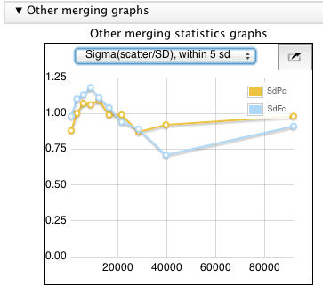

   Figure 15: SD correction plot (the table of parameters is above the plot)

AIMLESS compares the observed scatter of symmetry-related observations
around the mean with the estimated σ(I), and "corrects" the σ(I) by a
multiplier and a function of <I>. On average, the observed scatter
should equal the estimated standard deviation.

|sgr| ' :sup:`2` (I) = SdFac :sup:`2` {|sgr| :sup:`2` (I)+ SdB <Ih> + (SdAdd <Ih>) :sup:`2` }

where <Ih> is the average intensity of reflection h. By default, the
three parameters SdFac, SdB & SdAdd are determined automatically, with optionally
separate values for fulls & partials, and for each run. The plot in
figure 15 represents the distribution of normalised errors δ =
(I-<Ih>)/σ(I) as a function of <Ih>. This distribution should have a
standard deviation of 1.0, so the plot should be horizontal with a value
= 1.0 everywhere. If it slopes upwards, then σ(I) is too small for large
I, so SdAdd should be increased, or reduced if it slopes downwards. The
example in figure 15 (SdFac 0.93, SdB 2.56, SdAdd 0.0426, ISa 25.2) is OK: the curves lie just below 1.0 and are nearly flat, but not particularly good, but if these plots
vary too much from 1.0 then some parameters can be changed in the input,
in Additional Options->override default parameters for each run. Useful
options are (a) making the the parameters the same (default) or similar (ie
restrained equal) for all runs, and (b) fixing the sdB parameter to
0.0.

Translational non-crystallographic symmetry
^^^^^^^^^^^^^^^^^^^^^^^^^^^^^^^^^^^^^^^^^^^

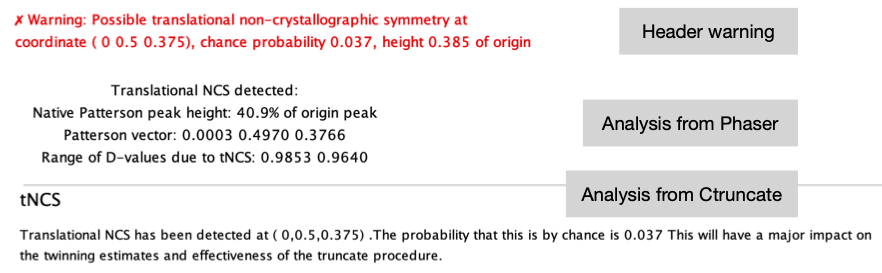

   Figure 16: tNCS information

Both Phaser and Ctruncate analyse the merged data for translational
non-crystallographic symmetry (tNCS), by looking for large off-origin
peaks in the native Patterson map. Such a peak indicates that two
molecules in the asynmetric unit are in more or less the same
orientation, ie are related by a pure translation. 
A common special case arises when a non-crystallographic rotation is
parallel or nearly parallel to a crystallographic axis of the same
order, then the combination creates a tNCS operator relating all atoms.
Either the crystallographic or non-crystallographic axis may contain a
screw component: this can confuse the determination of the true
space group, since it may be hard to distinguish whether the screw
axis is crystallographic or not.

Figure 16 shows the Warning in the Key Summary (from ctruncate), and
the reports from Phaser and Ctruncate: note that the peak heights may
be different due to the slightly different data used in the native
Patterson.

The presence of tNCS can complicate the solution and refinement of
structures, since it can introduce marked modulation of the
diffraction pattern, such as producing alternating layers of strong and weak
intensities, particularly at low resolution. Note for example that
the traditional (unweighted) R-factor in 
refinement is likely to be significantly higher than in unmodulated
structures, even when the structure is correct, since up to half of
the data may be systematically weak. Phaser takes explicit account of
tNCS in molecular replacement calculations.
				   
Statistics
^^^^^^^^^^

*Measures of self-consistency:* these are R-factor or correlation
coefficient statistics which compare symmetry-related or replacate
measurements. They are used in analyses against resolution and against
batch, as described above.

#. Classical R\ :sub:`merge`: ∑\ :sub:`h`\ ∑\ :sub:`l`\ \|I\ hl-<I\ h>|/ ∑∑<I\ h>
#. R\ :sub:`meas`: ∑\ :sub:`h`\ ∑\ :sub:`l`\ (n/n-1)\ :sup:`1/2` \|I\ hl-<I\ h>|/∑∑<I\ h> 
   Multiplicity-weighted R-factor, a better overall indicator than the
   classic version as it does not increase with multiplicity
#. R\ :sub:`pim`: ∑\ :sub:`h`\ ∑\ :sub:`l`\ (1/n-1)\ :sup:`1/2` \|I\ hl-<I\ h>|/∑∑<I\ h>
   Precision-indicating R-factor, more closely related to precision of
   the merged intensity 
#. Correlation coefficients, such as CC(|frac12|)
   These have the advantage of well-defined statistical properties (0 no
   correlation, +1 perfect correlation), unlike R-factors

Note that some authorities use a slightly different definition of
R\ :sub:`merge` and its relatives, with ∑∑I\ hl as the denominator
instead of ∑∑<I\ h>. These are likely to have very similar values in
most cases.

References
^^^^^^^^^^

1. Scaling and assessment of data quality, Evans, P.R., Acta Cryst . D62, 72-82 (2006)

2. An introduction to data reduction: space-group determination, scaling and intensity statistics. Evans, P.R.,  Acta Cryst. D67, 282-292 (2011)

3. Linking crystallographic model and data quality. Karplus, A. & Diederichs, K. (2012). Science, 336, 1030-1033

4. How good are my data and what is the resolution? Evans, P.R. and Murshudov, G.N., Acta Cryst. (2013). D69, 1204-1214,

5. Better models by discarding data? Diederichs, K. & Karplus, P. A. (2013). Acta Cryst. D69, 1215-1222
       
6. Identification of rogue datasets in serial crystallography, Assmann, G., Brehm, W. and Diederichs, K., J. Appl. Cryst. (2016). 49, 1021-1028

7. Measuring and using information gained by observing diffraction data Read, R.J, Oeffner, R.D. and McCoy, A.J.,  Acta Cryst. (2020). D76, 238-247

