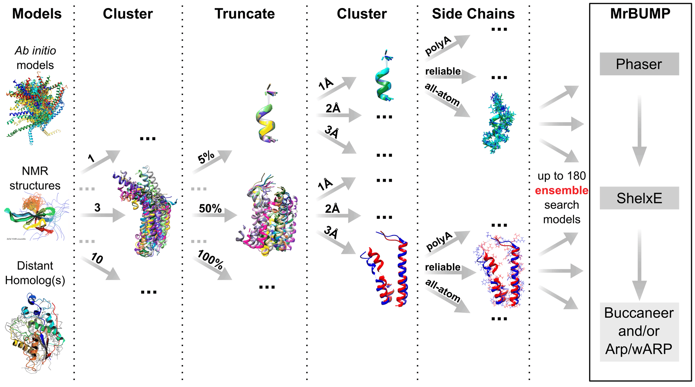
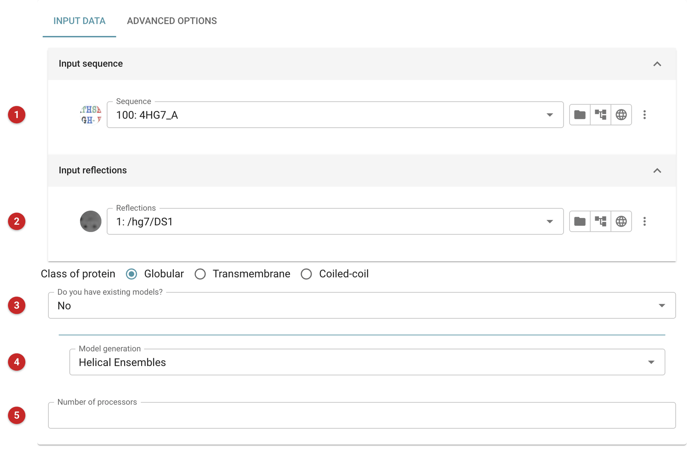
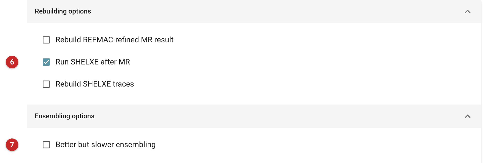

========================================================
Molecular Replacement with unconventional model -- AMPLE
========================================================

.. note:: **Known problem.** AMPLE as shipped in CCP4 9 (the 2026-07-02 and
   2026-09-04 builds) cannot currently finish a run that makes its own
   models with *Helical Ensembles*. It writes a non-integer number of copies
   (for example ``COPIES 15.7``) into the scripts it gives MrBUMP, so every
   MrBUMP job stops while reading its keywords and AMPLE finds nothing. The
   cause is in AMPLE itself (a division that gives a fraction under Python 3
   in ``ample/util/ample_util.py``). CCP4i2 now ends such a run as
   *unsatisfactory*, with an error saying that no solution was found, instead
   of reporting a success with nothing to show; each search model's MrBUMP log
   is kept in the job's directory. The pictures on this page come from an
   unrun job, because there is no run to show.

Use AMPLE when you have diffraction data and a sequence but no homologous
structure: no related model to give :doc:`MrBUMP <../mrbump_basic/index>`
(which searches for and prepares homologues), and no cell match for
:doc:`SIMBAD <../SIMBAD/index>` (which looks for a known structure by lattice
or in a contaminant database). AMPLE is
for the case where the only models on offer are *ab initio* (or *de novo*)
predictions, or idealised helices. If your target is mostly helical and the
data are good, small helical fragments placed with Phaser and then extended
are the other route; see :doc:`Fragon <../fragon/index>` and
:doc:`ARCIMBOLDO <../arcimboldo/index>`.

`AMPLE <https://doi.org/10.1107/s0907444912039194>`_ (*Ab initio* Modelling
of Proteins for moLEcular replacement) is a pipeline that takes cheaply
obtained *ab initio* models and prepares search models from them. The models
are clustered, which lets AMPLE predict how accurate each region is, and
inaccurate regions are truncated away, giving a set of ensembles at several
truncation levels. Each ensemble is then tried as a search model by MrBUMP
(Phaser, then Refmac), and, unless switched off, the best solutions are
passed to SHELXE for density modification and chain tracing.

The workflow is shown below
`[Bibby et al. 2012] <https://doi.org/10.1107/s0907444912039194>`_.

All-α proteins are particularly favourable (80% success in the original
study) and mixed α/β targets were solved in 36% of cases, but all-β proteins
are presently unlikely to succeed. For when AMPLE is likely to work, see the
AMPLE documentation.

Input
=====

   Figure 1: AMPLE input

The **sequence** **(1)** and the **reflections** **(2)** are always needed.
The picture is of a job set up for helical ensembles but not run.

The question **"Do you have existing models?"** **(3)** decides what else
is asked. It starts on *Yes*; the picture shows *No*:

* **No**: AMPLE makes its own models, and a *Model generation* choice
  **(4)** appears: *Ideal Helices*, *Helical Ensembles* (the default), or
  *ROSETTA*. ROSETTA needs a ROSETTA installation and its 3- and 9-residue
  fragment libraries, and the **class of protein** (globular,
  transmembrane or coiled-coil) matters only here; inter-residue contact
  predictions can be added to guide it. Helical Ensembles is the choice
  affected by the known problem above.
* **Yes**: AMPLE is given models, as a directory of PDB files on the machine
  running the job, or a file or archive containing them (this state is not
  pictured). What sort of models these are decides how they are used:
  *Sequence Identical* (*ab initio* models of the target, the case AMPLE was
  made for), *Multiple Homologs*, or an *NMR Ensemble*, which can be used as
  it is or remodelled with ROSETTA.

**Number of processors** **(5)** may be left blank, and then AMPLE uses every
processor on the machine.

   Figure 2: AMPLE advanced options

On the Advanced Options tab, **Run SHELXE after MR** **(6)** is on by
default: SHELXE's density modification and tracing is often what turns a
weak, partial MR solution into one you can recognise. Two rebuilding options
(of the REFMAC-refined MR result, and of the SHELXE traces) are off.
**Better but slower ensembling** **(7)** changes the clustering method to
the TM-score one. Anything else AMPLE accepts on its command line can be
typed into *Extra command-line arguments*.

Results
=======

When AMPLE finds solutions, the best are given as coordinates, the MTZ
file of each solution and its map coefficients, each annotated with the
search model that gave it. A job that finds nothing ends as unsatisfactory
with the error described above. This page has no results figure: AMPLE
cannot currently be run to completion here.

References
==========

`Bibby, J., Keegan, R.M., Mayans, O., Winn, M.D., Rigden, D.J., 2012. Acta Crystallographica Section D Biological Crystallography 68, 1622–1631. <https://doi.org/10.1107/s0907444912039194>`_

`AMPLE documentation <https://ample.readthedocs.io/en/latest/contents.html>`_;
`AMPLE video guide <https://ample.readthedocs.io/en/latest/video_guides.html>`_;
`AMPLE official page <https://ample.readthedocs.io/en/latest/index.html>`_
