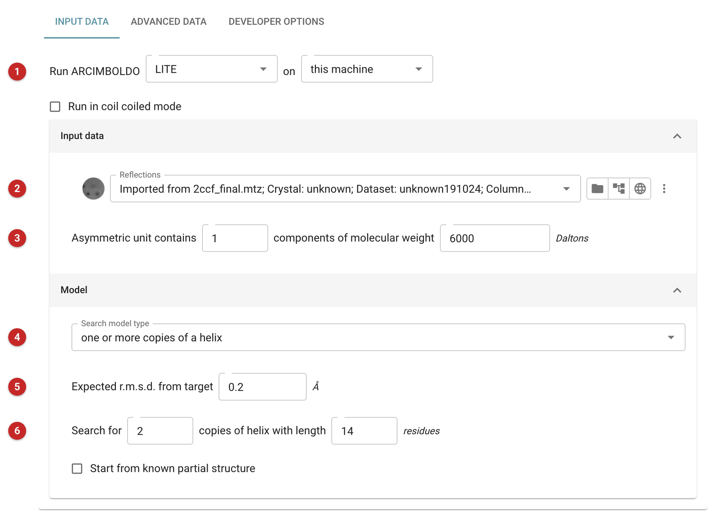
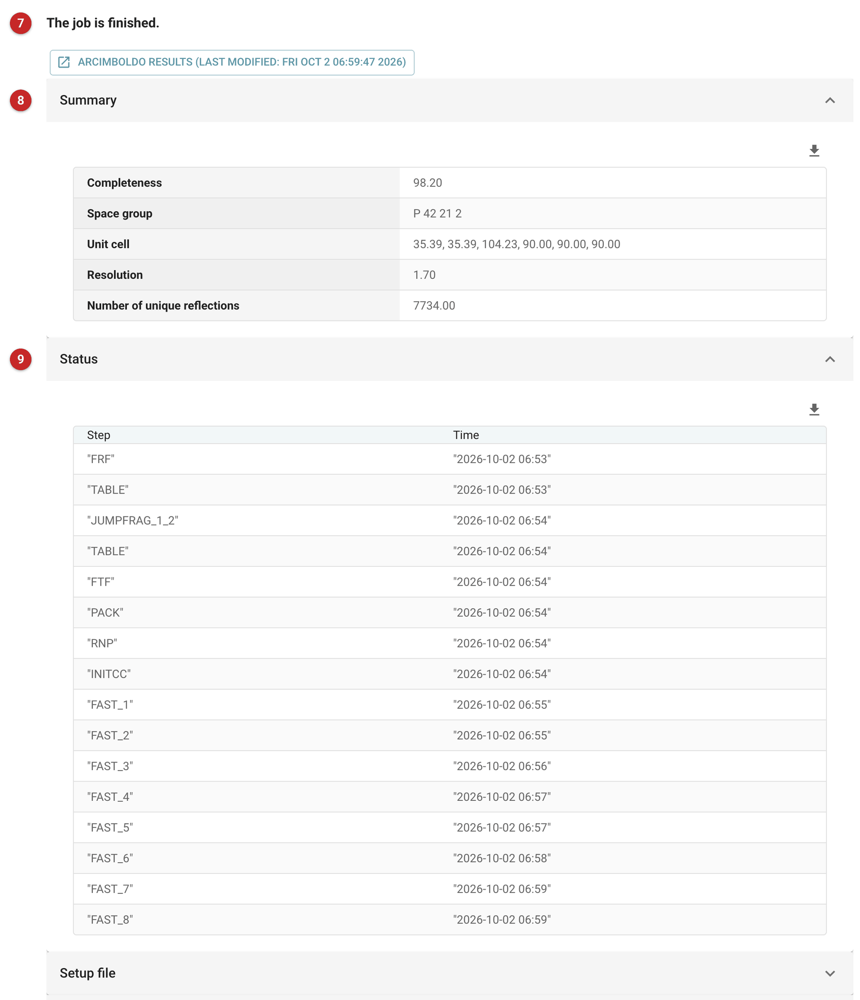

================================================
Ab initio phasing and chain tracing - ARCIMBOLDO
================================================

`ARCIMBOLDO <http://journals.iucr.org/m/issues/2015/01/00/lz5004/>`_ phases a
structure with no model of the protein itself. It places small, reliable
fragments (typically α-helices) with
`Phaser <../phaser_pipeline/index.html>`_, then expands each placement with
`SHELXE <../shelx/shelx.html>`_ (density modification and autotracing) in the
hope that a few correct fragments will grow into the whole chain.

Use it when molecular replacement has nothing to offer (no homologue, no
predicted model) and the data are good: the method was devised for data to
about 2 Å, and helical structures are the preferable cases. If you have a
model, however distant, :doc:`../phaser_simple_phil/index` or the other
molecular-replacement tasks are the first thing to try, and
:doc:`../ample/index` builds search models from ab initio predictions.
SHELXE is licence-restricted and is not shipped with CCP4, so a missing SHELXE is
the commonest reason for the task failing. If a run stops, the report shows
ARCIMBOLDO's own FATAL message, as the program itself exits without an error.

The task runs one of three programs, chosen in **Run ARCIMBOLDO** (1):

* **LITE** places polyalanine helices (or other single search fragments you
  supply), runs on all cores of one machine, and needs no grid, supercomputer
  or database.
* **BORGES** searches with a library of small folds (several helices or
  strands in a given arrangement).
* **SHREDDER** cuts a distant homologue into fragments and uses the ones the
  data support.

The pictures on this page are of ARCIMBOLDO_LITE, run on PDB-REDO's data for
2ccf (to 1.70 Å, space group P4\ :sub:`2`\ 2\ :sub:`1`\ 2) as a test of the
task, not as a recipe: the structure is small (about 6 kDa in the asymmetric
unit), and the run below did **not** solve it. It is described under Results
because a failure is worth knowing how to read.

Input
=====

   Figure 1: ARCIMBOLDO_LITE input

Which program, and where **(1)**: "this machine", or a local or remote grid
(for which a grid configuration is then asked for). *Run in coil coiled mode*
is described below.

The reflections **(2)**, as amplitudes (FP, SIGFP here) or intensities, and
the contents of the asymmetric unit **(3)**: the number of components and the
molecular weight of each, in Daltons. The task passes both to Phaser, so
set them as well as you know them.

LITE, the model section
-----------------------

The search model type **(4)** is one or more copies of a helix; one or more
copies of a custom model; several different helices; or several different
custom models. The expected r.m.s.d. from the target **(5)** defaults to
0.2 Å (a value that can be increased). You must define how many helices to
search for and how long they are **(6)**; the length should come from a
secondary-structure prediction or from what you know of the target. Here:
two copies of a helix of 14 residues. *Start from known partial structure*
takes a directory holding a structure to build on.

**How many fragments.** Do not give one if the data may have translational
non-crystallographic symmetry. With one fragment, this run stopped at once:
Phaser found tNCS in the data, and ARCIMBOLDO then searches for *pairs* of
fragments rather than single ones, and asked for another fragment ("Please
add another fragment" in the log). With two it ran to the end. Because tNCS
was present, the TFZ filter on the translation function was not active
(the log says so), so TFZ is not a guide in such a run. The Advanced data tab
has a switch for Phaser's tNCS option, but this run did not need it: the
program detected the tNCS itself.

Coil coiled mode
----------------

Coil coiled mode is a search for coiled-coil structures that probes and
verifies alternative helix directions (adapted from
http://chango.ibmb.csic.es/tutorial_coiled). It entails:

* calculating VRMS in the refinement step, to optimise the r.m.s.d. so as to
  maximise the LLG;
* activating Phaser's packing filter at translation, so that at least one
  translated solution passes the packing check;
* generating and probing reversed helices: below 2 Å resolution the first
  helices were frequently placed in the right position but pointing the wrong
  way, and at low resolution Phaser's figures of merit cannot tell them
  apart;
* a final verification step, which perturbs the substructure leading to the
  best solution and compares the scores before and after extension (only
  at a resolution worse than 2 Å, as for the reversed helices);
* SHELXE with helical sliding, which improves the autotracing of coiled
  coils.

BORGES
------

BORGES (`Borges <http://chango.ibmb.csic.es/BORGES/>`_) uses tertiary-structure
searching, combining composite secondary-structure elements as a search
model with density modification and tracing to reveal the rest of the
structure. Before using it, make a secondary-structure prediction, so as to
have a hypothesis about the local folds present.
BORGES libraries made with ALEPH are distributed with CCP4; choose one in
*Library*, or give a directory for your own. In the names, **U** (up) and
**D** (down) give the relative orientations of the fragments in the fold:
``UUU`` is three parallel fragments, ``UDU`` is antiparallel. A table of the
libraries is `here <https://journals.iucr.org/d/issues/2020/03/00/ba5305/index.html#TABLE2>`_.
BORGES may assess subsets of a library first, to prioritise starting
hypotheses by their molecular-replacement figures of merit, or follow the
order of the most frequent folds.

Options of Phaser, each a switch plus a value, are offered:

* **GYRE** optimises the orientation and relative position of rigid-body
  fragments after the orientation of the model has been found but before it
  is positioned in the cell, refining rigid groups against the rotation
  function target. Atoms of different chains in an ensemble are independent
  rigid groups. An initial r.m.s.d. is chosen as a trade-off between
  convergence radius and sensitivity to coordinate error and decreased in
  turn; the aim is models with a true r.m.s.d. below 0.6 Å, which can be
  expanded in density modification and autotracing (McCoy *et al.*, 2018).
* **GIMBLE** refines rigid-body fragments after positioning, against the
  translation function target. It is a re-implementation of Phaser's
  rigid-body refinement made for ease of scripting.
* **MULTICOPY** is also offered.

SHREDDER
--------

`Shredder <http://chango.ibmb.csic.es/shredder>`__ uses fragments derived from
a distant homologue, selected on the experimental data rather than on
sequence similarity. The template is shredded, each fragment is scored
against each unique solution of the rotation function, the results are
combined into a score per residue, and the template is trimmed accordingly.
Potential solutions go to SHELXE for density modification and model
building. Give the model to shred, and choose a mode:

* **sequential**: the template is systematically shredded, and models are
  selected by Phaser's rotation function and trimming in SHELXE. It can
  improve models where the average deviation from the target is high because
  of dissimilar or flexible regions.
* **spherical**: a set of compact search models is made from a template
  annotated for secondary and tertiary structure, and used as a library as in
  BORGES. It can improve models whose deviations from the target are spread
  evenly over a similar fold.

Other options are the polyalanine conversion, B-factor equalisation, coil
handling, gyre and gimble refinement as above, **LLG-guided pruning**
(trimming residues that contribute no signal to the LLG at the target r.m.s.d.;
see Oeffner *et al.*, 2018), phase combination with alixe, MULTICOPY, and
(Advanced data tab) the fragment size for spherical shredding. *Run in
predicted model mode* is for a model predicted by software.

The Advanced data tab also takes a SHELXE command line, and further lines to
add to the program's setup (``.bor``) file; the Developer options tab can
generate the setup file and stop, or rerun in a copy of an existing working
directory.

Results
=======

   Figure 2: ARCIMBOLDO report

The report says whether the job has finished **(7)**, with a link to
ARCIMBOLDO's own results page; a green message appears here when the final
CC is 30% or more. Below are the data's summary (space group, unit cell,
resolution, number of unique reflections) **(8)** and the time at which each
step of the program finished **(9)** (the steps are ARCIMBOLDO's own names:
FRF and FTF are the rotation and translation functions, PACK the packing
filter, RNP rigid-body refinement, FAST\_n the SHELXE expansions). The setup
file is kept in a closed fold. The LLG and CC figures are *not* in the report:
they are on ARCIMBOLDO's results page, reached from the link, in its
*Search and expansion* and *Backtracking* tables (for the first and second
fragments, then the best solution found and its map). The best structure is
written to the job's outputs as *Best pdb solution* (``best.pdb``); the
SHELXE phases it came from are in the job directory as ``best.phs``.

What the numbers mean
---------------------

**LLG** (log-likelihood gain) shows how much better the model explains the
data than random atoms do. It has to be positive, as high as possible, and
should increase as the solution progresses. It compares models against the
same data, but values for different data sets should not be compared.

.. list-table:: Is the top solution correct? (from the program's guide)
   :header-rows: 1

   * - LLG
     - Top solution correct?
   * - below 25
     - no
   * - 25 to 36
     - unlikely
   * - 36 to 49
     - possibly
   * - 49 to 64
     - probably
   * - above 64
     - definitely

**TFZ** (the translation-function Z-score) compares the LLG of the
translation search with that of a set of random translations.

.. list-table:: TFZ (from the program's guide)
   :header-rows: 1

   * - TFZ
     - A solution?
   * - below 5
     - not
   * - 5 to 6
     - unlikely
   * - 6 to 7
     - possibly
   * - 7 to 8
     - probably
   * - above 8 (6 for the first model in monoclinic space groups)
     - definitely

**CC** is the correlation coefficient between the SHELXE-traced main chain
and the data. **A CC above 25% indicates that the solution is found**; once
it is, the program stops after some recycling steps to improve it. A CC
calculated on all the data is reliable with atomic-resolution data; at lower
resolution, any collection of enough unconstrained atoms gives high CCs.

The example, read
-----------------

With two fragments the run placed several candidate pairs: after rigid-body
refinement, Phaser's top LLGs were about 30 to 35 (the best 35.1), which in
the table above is "unlikely". The SHELXE expansions of the six candidates
traced main chains with CCs of 22.4%, 17.9%, 16.6%, 16.4%, 14.2% and 12.6%.
The best, a trace of 33 residues in three chains after the first cycle
(``best.pdb``, which carries that CC in its title line), is below the 25%
that marks a solution. **It is not solved**, and ARCIMBOLDO's own results page
says so: "No structure solution was found in P 42 21 2", suggesting other
space groups of the same lattice to try.

Do not refine ``best.pdb`` as a model. What to try next, from the figures
above and the program's own documentation: more fragments, a different
helix length if the secondary-structure prediction allows one, a BORGES
library, a different space group from those the results page lists, and
other r.m.s.d. values; the program's tutorials are at
`www.chango.ibmb.csic.es <http://chango.ibmb.csic.es/>`_
(`ARCIMBOLDO_LITE <http://chango.ibmb.csic.es/tutorial_arc>`_,
`BORGES <http://chango.ibmb.csic.es/tutorial>`_,
`SHREDDER <http://chango.ibmb.csic.es/tutorial_shredder>`_ and its
`spherical mode <http://chango.ibmb.csic.es/tutorial_shredder_spherical>`_).
If a trace does reach 25%, refine it with
Refmac (the "Refinement - Refmacat/Refmac5" task offered under What next).

**References**

`Rodríguez DD, Grosse C, Himmel S, González C, Martínez de Ilarduya I, Becker S, Sheldrick GM & Usón I (2009) Crystallographic ab initio protein structure solution below atomic resolution. Nat Methods 6, 651-653. <https://www.nature.com/articles/nmeth.1365>`_

`Sammito, M., Millan, C., Frieske, D., Rodriguez-Freire, E., Borges, R. J. & Uson, I. (2015) ARCIMBOLDO-LITE: single-workstation implementation and use. Acta Cryst. D71, 1921-1939. <https://doi.org/10.1107/S1399004715010846>`_

`Sammito, M. D., Millán, C., Rodríguez, D. D., de Ilarduya, I. M., Meindl, K., De Marino, I., Petrillo, G., Buey, R. M., de Pereda, J. M., Zeth, K., Sheldrick, G. M. & Usón, I. (2013) Exploiting tertiary structure through local folds for crystallographic phasing. Nature Methods, 10, 1099-1101. <https://doi.org/10.1038/nmeth.2644>`_

`Sammito, M., Meindl, K., Ilarduya, I. M., Millán, C., Artola-Recolons, C., Hermoso, J. A., Usón, I. (2014) Structure solution with ARCIMBOLDO using fragments derived from distant homology models. FEBS J. 281, 4029-4045. <https://doi.org/10.1111/febs.12897>`_

`Millán C, Sammito M, Usón I (2015) Macromolecular ab initio phasing enforcing secondary and tertiary structure. IUCrJ 2, 95-105. <https://doi.org/10.1107/S2052252514024117>`_

`Millán C, Sammito M. D, McCoy A. J, Nascimento A. F. Z, Petrillo G, Oeffner R. D, Domínguez-Gil T, Hermoso J. A, Read R. J, Usón I (2018) Exploiting distant homologues for phasing through the generation of compact fragments, local fold refinement and partial solution combination. Acta Cryst. D74: 290-304. <https://doi.org/10.1107/S2059798318001365>`_

`Caballero I, Sammito M, Millán C, Lebedev A, Soler N, Usón I (2018) ARCIMBOLDO on coiled coils. Acta Cryst D74, 194-204. <https://doi.org/10.1107/S2059798317017582>`_

`McCoy, A. J., Oeffner, R. D., Millán, C., Sammito, M., Usón, I., Read, R. J. (2018) Gyre and gimble: a maximum-likelihood replacement for Patterson correlation refinement. Acta Cryst. D74, 279-289. <https://doi.org/10.1107/S2059798318001353>`_

`Oeffner, R. D., Afonine, P. V., Millán, C., et al. (2018) On the application of the expected log-likelihood gain to decision making in molecular replacement. Acta Cryst. D74, 245-255. <https://doi.org/10.1107/S2059798318004357>`_

`Uson, I., Sheldrick, G. M. (2018) An introduction to experimental phasing of macromolecules illustrated by SHELX; new autotracing features. Acta Cryst. D74, 106-116. <https://doi.org/10.1107/S2059798317015121>`_

`McCoy, A. J., Grosse-Kunstleve, R. W., Adams, P. D., Winn, M. D., Storoni, L. C., Read, R. J. (2007) Phaser crystallographic software. J. Appl. Cryst. 40, 658-674. <https://doi.org/10.1107/S0021889807021206>`_
