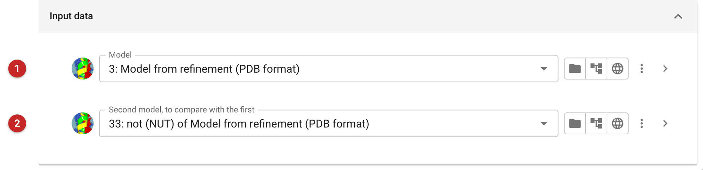
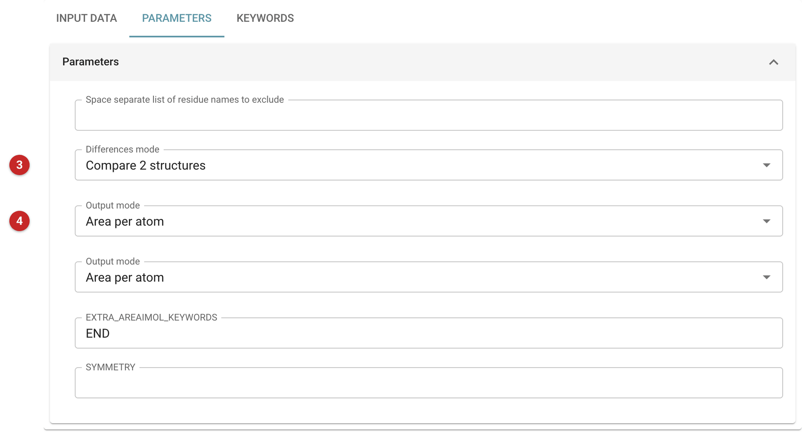
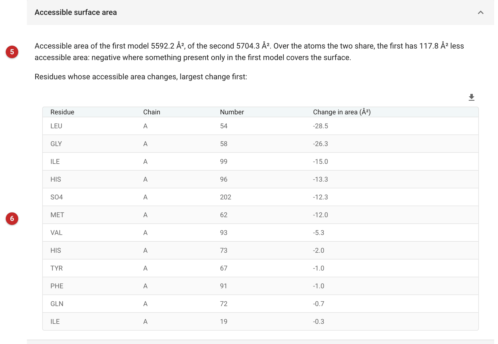

###################################
Solvent accessible area (AREAIMOL)
###################################

AREAIMOL calculates the solvent accessible surface area of a model, atom
by atom: the area a probe the size of a water molecule can touch. It
answers three kinds of question:

- **How exposed is each atom or residue?** (Differences mode *off*.) The
  output model carries each atom's area, or its residue's, in the
  B-factor column, for colouring in a graphics program.
- **Which surface does a ligand or a partner cover?** (*Compare 2
  structures*.) Give the model with and without the ligand, or the
  complex and one partner: the atoms whose area changes form the
  interface, and the total change measures it.
- **What is buried in crystal contacts?** (*Intermolecular contact
  differences*.) The area each molecule loses to its symmetry mates.

Waters are ignored. For interfaces between molecules in the crystal and
whether they are biologically meaningful, PISA (from the Validation
tasks) is the better tool.

The pictures on this page come from the MDM2 project of the refinement
route. Nutlin-3a binds MDM2 in the pocket where p53 binds, and the
comparison below shows which residues it covers: the refined model with
the ligand, against the same model with the ligand removed by
:doc:`../coordinate_selector/index`.

Input
=====

   Figure 1: AREAIMOL input

The model **(1)** and, for a comparison, the second model **(2)** (Figure 1).

   Figure 2: AREAIMOL parameters

The kind of calculation **(3)** (Figure 2) and what goes into the output
model's B-factor column **(4)**: the area of each atom or of each residue.

Results
=======

   Figure 3: AREAIMOL report

The report (Figure 3) opens with the areas **(5)**: the total accessible area
of each model and, over the atoms the two share, how much less the first model
exposes. Here Nutlin-3a covers 117.8 Ų of MDM2's surface. The table
**(6)** lists the residues whose area changes, largest change first:
Leu54, Gly58, Ile99, His96 and Met62 lead, then Val93, with His73,
Tyr67, Phe91 and Gln72 barely touched. These line the pocket that p53's Phe19,
Trp23 and Leu26 occupy, which is how Nutlin competes with p53. The sulphate
beside the pocket loses 12.3 Ų too.

The program's own summary follows, closed; the plot of area by atom
number is for a quick look at the exposed stretches of the chain.
