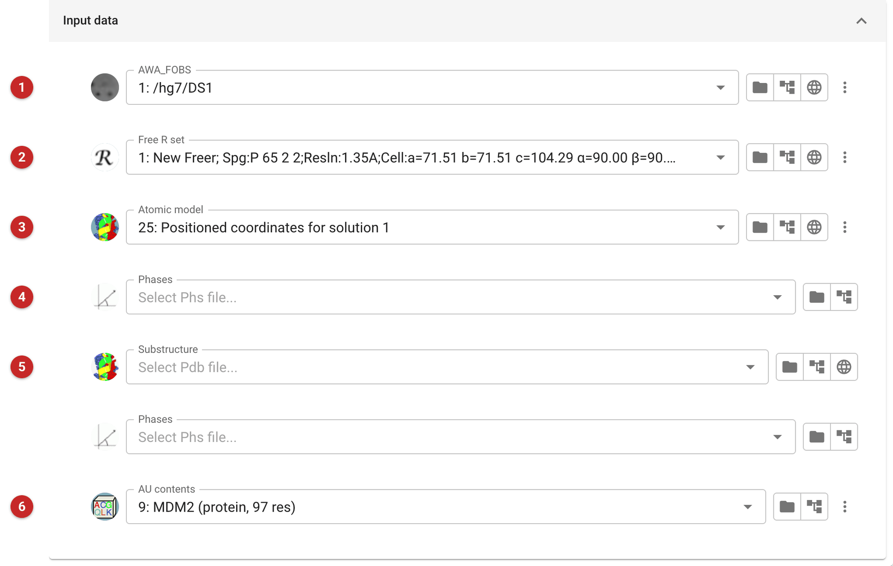
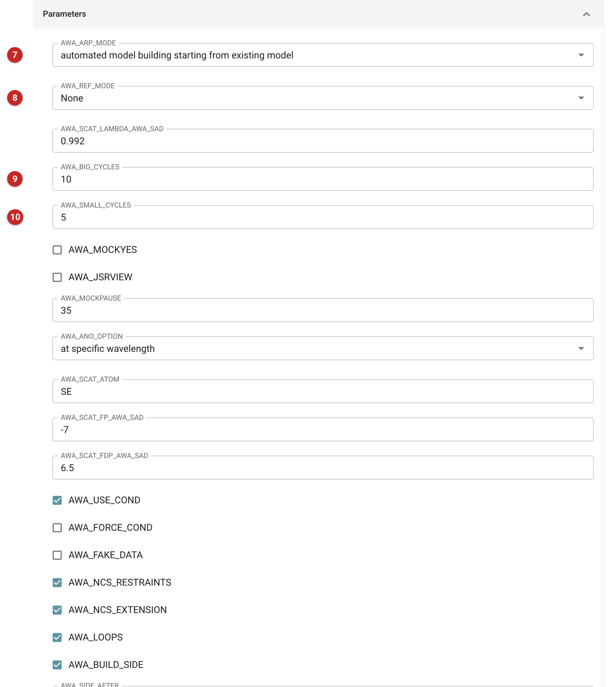

############################
Model Building with ARP/wARP
############################

.. note::

   This page is a draft, written for the new interface from the task's
   code. ARP/wARP was not installed where the pictures were made, so the
   task was never run: the pictures show an unrun job's input, and the
   *Results* section says only what the code shows. Not yet reviewed by
   a crystallographer who uses ARP/wARP.

ARP/wARP builds protein models automatically, either from a set of
phases or by improving a model you already have. CCP4i2 runs ARP/wARP's
own ``auto_tracing.sh`` script and reports its progress.

Use it when you want a second automated builder next to
:doc:`../modelcraft/index` (CCP4's own pipeline, which needs nothing
beyond CCP4) or when you are following a protocol that calls for ARP/wARP.
After a molecular-replacement solution, :doc:`../shelxeMR/index` is the
other quick way to a first trace; to correct a built model by hand, go on
to :doc:`../coot_rebuild/index`.

Before you start: ARP/wARP must be installed
============================================

ARP/wARP is not part of the CCP4 build the pictures were made with, and
it is licensed separately (the ARP/wARP site is at EMBL Hamburg,
`ARP/wARP Manual
<https://www.embl-hamburg.de/ARP/Manual/UserGuide8.0.html>`__). The
task finds it in the way ARP/wARP's own setup arranges: CCP4i2 starts a
helper that runs the script ``auto_tracing.sh`` by name, so that script
must be on the search path of the environment CCP4i2 runs in. The
wrapper has no setting or preference that points at an ARP/wARP
installation. The task's test is skipped unless the environment variable
``warpbin`` is set.

The older version of this page said ARP/wARP was installed with CCP4 by
default. The CCP4i2 customisation documentation says it is not
automatically included in the CCP4 distribution.

Input
=====

The pictures come from the MDM2 project of the reduction route: the
reflections and free set from the data-reduction job, the Phaser
placement of an MDMX model as the starting model, and the contents of
the asymmetric unit from *Define AU contents*. The job was set up and
not run.

   Figure 1: ARP/wARP input data

The task needs, at a minimum, the observed data as mean structure factors
**(1)**, and then either phases or a model, according to the mode chosen
under *Parameters* **(7)**:

* **automated model building starting from experimental phases** (the
  default): the *Phases* **(4)** are the starting point, for example
  phases from experimental phasing or from a molecular-replacement
  solution. The wrapper passes ARP/wARP the best phase and its figure of
  merit.
* **automated model building starting from existing model**: the *Atomic
  model* **(3)** is the starting point, which is the choice for a
  molecular-replacement solution. Here it is the Phaser placement.

The mode starts on *experimental phases* whatever else is filled in; this
job was set to build from the model, so it shows *existing model* **(7)**
and has no phases. If you start from a model, change the mode yourself.

The *Free R set* **(2)** is optional; when given, ARP/wARP can use the
free reflections. Give the same free set the model's refinement used.
The *AU contents* **(6)** are optional too. When given, the number of
residues and of copies are passed to ARP/wARP, and the sequence is used
to dock and build side chains: with no sequence, side chains are not
built (the wrapper then tells ARP/wARP not to build them).

*Substructure* **(5)** is only read when the phase information for
refinement (below) is *Anomalous data*: it is the heavy-atom model for
that refinement. The second *Phases* field, with no label of its own,
is the phase information for refinement when *Phases* or *HL
coefficients* is chosen.

   Figure 2: ARP/wARP parameters

The mode **(7)**, here *automated model building starting from existing
model*. The phase information for refinements **(8)** is one of
*None* (the default), *Phases*, *HL coefficients* or *Anomalous data*;
the wavelength, scattering atom and f' and f'' fields below it apply to
*Anomalous data* (a wavelength, scan-derived values, or the Cu K-alpha
wavelength). Build and refinement cycles are set by the number of
building cycles **(9)**, default 10, and the number inside each of them
**(10)**, default 5. Below these (not shown) are options for NCS
restraints and extension, building loops, building side chains after a
given cycle, selenomethionine data, twinning, the weighting of the
X-ray term (automatic or manual), scaling, and the solvent model.

Fields to leave alone: the two options and the pause time that begin
*AWA_MOCK* and the one named *AWA_JSRVIEW* make ARP/wARP replay stored
demonstration output instead of running, and can open a report viewer.
They are for developers testing the report.

Results
=======

Not run here. From the code, a finished job offers:

* the model, as *ARP/WARP model*, with any dummy atoms removed;
* *ARP/WARP model with dummy atoms*, written only if the model ARP/wARP
  produced contains dummy (DUM) atoms;
* the map coefficients, as *2mFo-DFc map coefficients from ARP/WARP* and
  *mFo-DFc map coefficients from ARP/WARP*, for the maps to look at in
  Moorhen or Coot;
* a report page that follows ARP/wARP's building and refinement cycles;
  the job's R-factor and the fraction built are recorded from a results
  file when ARP/wARP writes one.

If the model file is not written, the job fails. What to do next: judge
the model against the map as you would any automated build, rebuild by
hand (:doc:`../coot_rebuild/index`), and refine with REFMAC5 with the
free set you started from. For what R and R-free to expect of a good
build, the test for this task requires a final R-free below 0.4 on its
test data.
