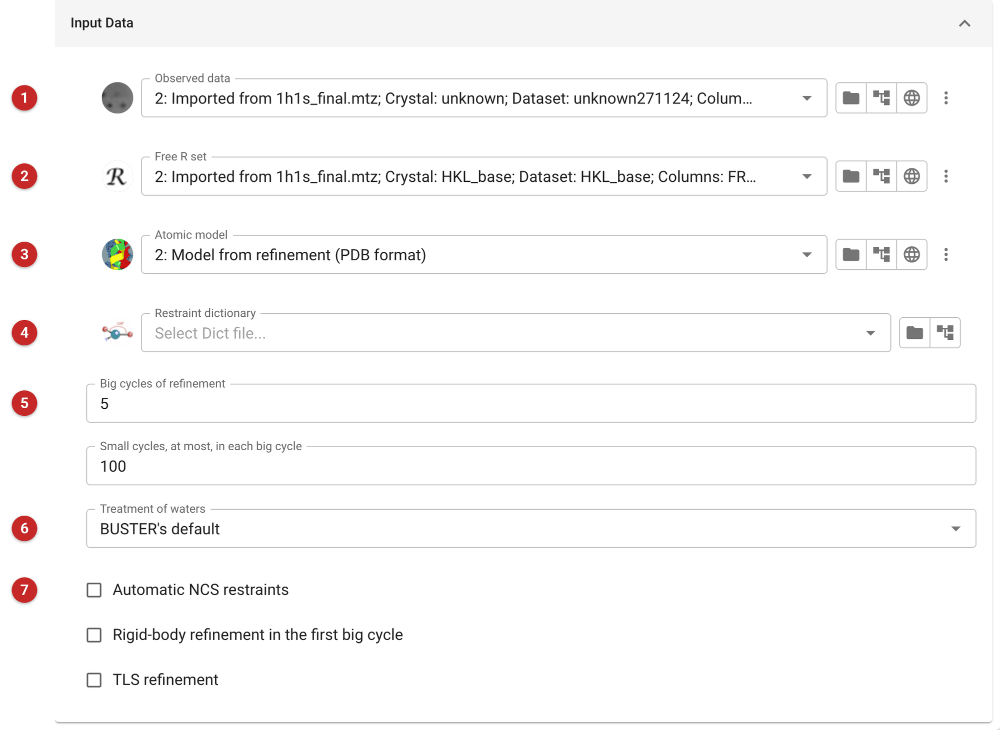

################################
Refinement - BUSTER
################################

BUSTER is Global Phasing's macromolecular refinement program. This task
runs its ``refine`` command on a model and reflections, and gives back the
refined model, maps and phases in the forms the rest of CCP4i2 uses.

BUSTER is not installed in the CCP4 build these pages were made with: it is
licensed separately by Global Phasing, and the task cannot run without it.
The picture below is of a job set up but not run, and this page has no
results to show; what follows the picture on outputs comes from the task's
definition, not from a run.

Use it when you hold a BUSTER licence and want a refinement from a
program other than Refmac. If you do not, the neighbouring tasks are
CCP4's own: :doc:`../servalcat_pipe/index` and
:doc:`../prosmart_refmac/index` (Refmac with ProSMART restraints) refine
the same inputs, and ``PDB-REDO`` (a web service, not a local program) is a
third route. A model refined here can be refined again by Refmac, or
rebuilt with Modelcraft: the task offers those, and itself, as what to do
next.

Finding BUSTER
==============

Before it runs, the task looks for BUSTER's ``refine`` program: in the
BUSTER directory set in the preferences, in the program search paths, and
on the ``PATH``, in that order. If it is not found, the task sources
``setup.sh`` from the BUSTER directory in the preferences, if that file
exists. If neither works the job fails with the error "Failed to initialise
BUSTER, do you have BUSTER installed & the i2 preferences setup to point to
the correct BUSTER installation folder (or have run the setup script for
BUSTER)?". So either set the BUSTER directory in the preferences, or run
BUSTER's own setup script before starting CCP4i2.

Input
=====

   Figure 1: BUSTER input

The observed data **(1)** (Figure 1), either amplitudes or intensities; the
free R set **(2)**; the atomic model **(3)**; and, for any ligand the monomer
library does not describe, a restraint dictionary **(4)**, which should be
the one the model was refined with. Here the data, free set and model come
from the refinement (job 2) of the CDK2 project, with no dictionary.

Keep the free set the model was refined against; a new one would put
reflections the model has already seen into the test set.

The task converts the reflections to a single MTZ with the free-R column
renamed to what BUSTER expects, before the run. The model is passed to
BUSTER as the whole file.

The number of *big cycles of refinement* **(5)**, and the most *small
cycles in each big cycle*, are passed to BUSTER as its
``-nbig`` (default 5) and ``-nsmall`` (default 100). The treatment of waters
**(6)** is *BUSTER's default* (no water option), *None* (``-noWAT``),
*Add waters* (``-WAT``), or *Add waters from a given big cycle* (``-WAT``
followed by that cycle's number, entered in the "From big cycle" box that
appears for it). Below **(7)** are three switches, each off by default:
*automatic NCS restraints* (``-autoncs``), *rigid-body refinement in the
first big cycle* (``-RB``) and *TLS refinement* (``-TLS``).

Outputs
=======

When the run succeeds, the job's outputs are: the refined model (BUSTER's
``refine.pdb``) and the same model, with its reflections, in mmCIF form
(``BUSTER_model.cif`` and ``BUSTER_refln.cif``); the weighted map
(2mFo-DFc) and weighted difference map (mFo-DFc) as map coefficients; and
calculated phases as Hendrickson-Lattman coefficients. The final R and
R-free are read from BUSTER's log and recorded on the job.

The report gives the best R and R-free the refinement reached, and graphs
by cycle: R and R-free, the log-likelihood gain (LLG, and LLG for the free
reflections), and the RMS deviations of bonds and angles. BUSTER's own
summary pictures, if it wrote them, are folded under the graphs. As ever, R-free
is the number to watch, and its gap from R: a gap that grows over the
cycles means the model is being fitted to noise.

**Reference**

The task's bibliography is in the job's Bibliography button.
