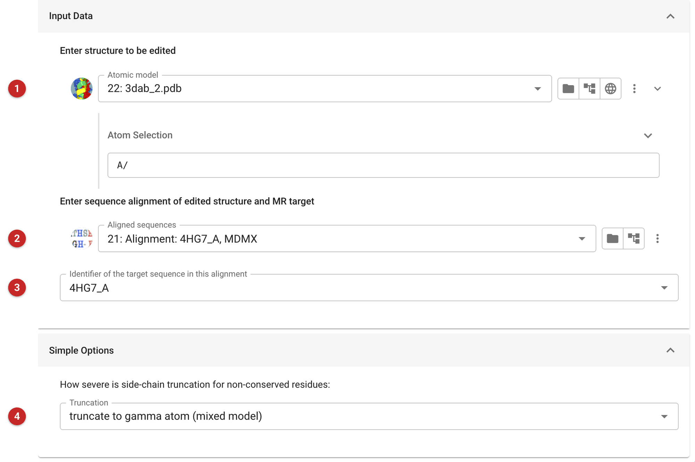
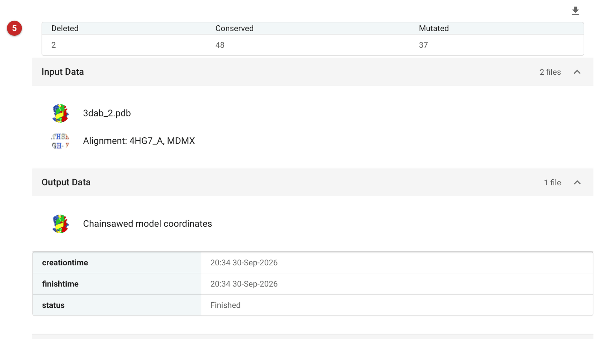

#####################
Truncate Search Model
#####################

Molecular replacement generally works better if the search model is
pruned of side chains that are not conserved between it and the target:
a wrong side chain adds error, while a truncated one adds none. This task
takes an alignment of target and model sequences and edits the model:
conserved residues are left as they are, non-conserved residues are
renamed and truncated, and residues missing from the target are deleted.
The retained atoms are renamed to match the target.

The residues of the output are numbered consistently with the target
sequence: a residue of the target that corresponds to a gap in the model
leaves a gap in the numbering, while model residues that correspond to a
gap in the target are numbered consecutively. Where the input has
alternative conformations, Chainsaw keeps the most probable, at occupancy
1.

Use Chainsaw for a quick, standard edit of a homologue with reasonable
identity to the target (roughly 30% and above). For more distant
homologues *Sculptor* offers finer control, and *MrBUMP* and *MrParse*
search for and prepare models automatically.

The pictures on this page prune MDMX (PDB 3dab, chain A) to the sequence
of MDM2, using the alignment made on the *ClustalW* page.

Input
=====

   Figure 1: Chainsaw input

The structure to be edited **(1)** (Figure 1), as downloaded from the PDB; use
the atom selection to keep one chain (here ``A/``), since Chainsaw edits the
model as a whole and a search model is usually one copy. The alignment of
its sequence with the target's **(2)**, and which sequence in it is the
target **(3)** (the first, by default).

The level of truncation **(4)**: the default, *truncate to gamma atom*, is
the mixed model of Schwarzenbacher *et al.*, which truncates
non-conserved residues to the gamma atom and keeps conserved residues
whole. *Truncate to beta atom* truncates non-conserved residues further,
to the beta carbon, which suits more distant homologues. *Keep the atoms
common to both residues* keeps as much as the two residue types share.

Results
=======

   Figure 2: Chainsaw report

The report (Figure 2) counts the residues deleted, conserved and mutated
**(5)**: here 48 residues are kept whole, 37 truncated and 2 deleted. The
pruned model is the output. In this example it solves the MDM2 structure in the
MDM2 data with Phaser at once: one solution, with an LLG of 104 and a TFZ of
12.7 (a TFZ above 8 is a clear solution).
