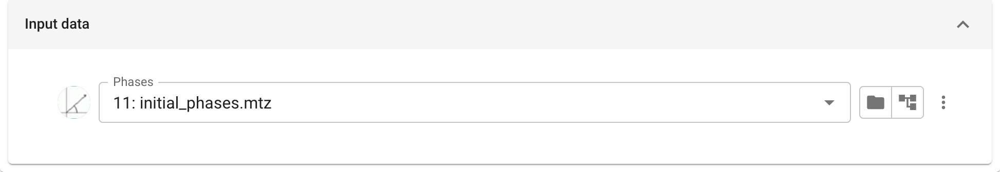
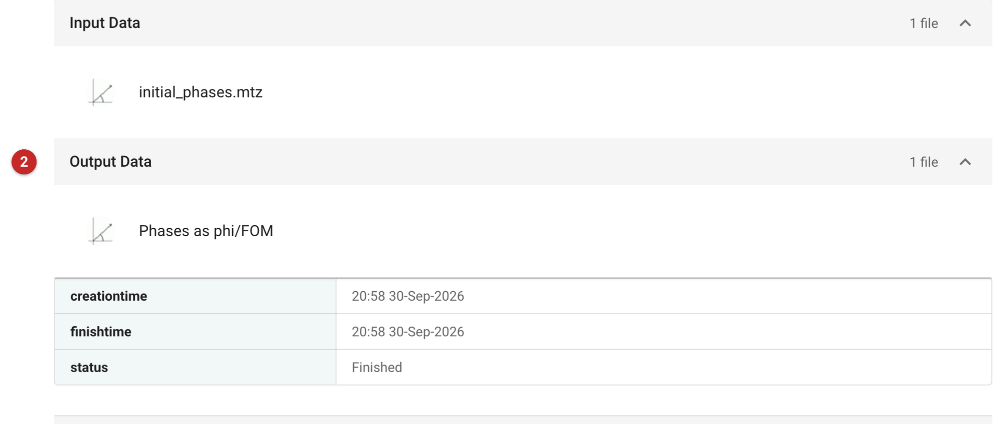

############################################################
Convert between Hendrickson-Lattman coefficients and phi/FOM
############################################################

This task converts phase probabilities between their two common forms:
Hendrickson-Lattman (HL) coefficients, and a phase with a figure of merit
(FOM). *There is rarely a reason to do this except to export phases for
another program.* CCP4i2 converts phases internally as and when a task
needs them, and converting HL coefficients to phase and FOM loses
information: HL coefficients can describe a bimodal phase probability
(as SAD phasing gives), and a single phase and FOM cannot.

The pictures on this page convert the HL coefficients supplied with the
*gamma* demo that comes with CCP4i2.

Input
=====

   Figure 1: chltofom input

The input is a set of phases. HL coefficients are converted to phase and
FOM; a phase and FOM are converted to HL coefficients.

Results
=======

   Figure 2: chltofom report

The report lists the converted phases among the outputs **(2)**.
