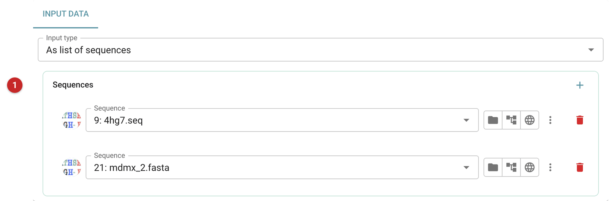
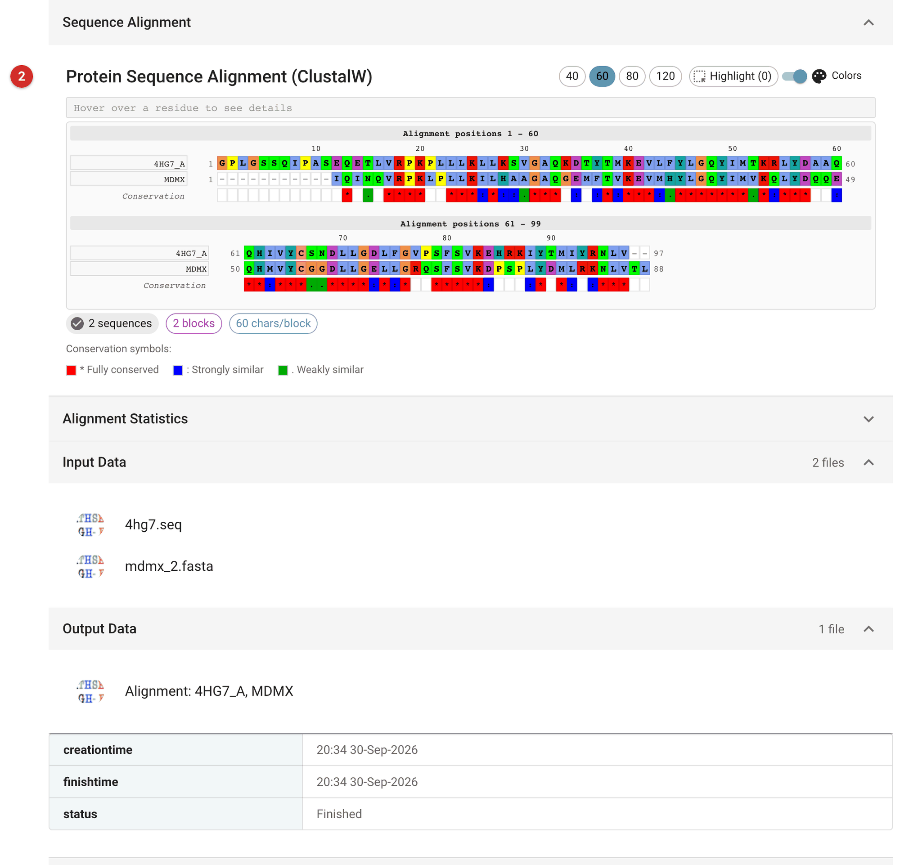

##########################
Align sequences - CLUSTALW
##########################

This task aligns two or more protein sequences with ClustalW2, using the
program's default parameters. In a structure solution its usual job is the
first step of preparing a molecular replacement search model: aligning the
target sequence with the sequence of a homologue of known structure, so
that *Chainsaw* or *Sculptor* can prune the homologue to match.

A pairwise alignment is only as good as the similarity behind it. Above
about 40% identity ClustalW's alignment is usually reliable; below about
30%, regions (loops especially) may be misaligned, and a profile-based
alignment (HHpred, for instance) is worth the trouble.

The pictures on this page align MDM2 (the target, from the Ligand
Tutorial data that comes with CCP4i2) with its homologue MDMX (PDB entry
3dab), which is 57% identical.

Input
=====

   Figure 1: ClustalW input

Give the sequences either as a list of sequence files **(1)**, adding one
row per sequence with **+**, or as one alignment file to realign. Put the
target first: the tasks that use the alignment take its first sequence as
the target unless told otherwise. The supported formats are described in
the `Model data documentation <../../general/model_data.html>`__; CCP4i2
converts imported alignments to Clustal format and sequences to FASTA.

Results
=======

   Figure 2: ClustalW report

The report shows the alignment **(2)**, coloured by residue, with a line
marking each column as fully conserved (*), strongly similar (:) or weakly
similar (.). Check it before using it: long runs of gaps in the homologue
mean parts of the target it cannot model, and a region with no conserved
columns is probably misaligned. Here the N-terminal tag of the MDM2
construct has no counterpart in MDMX, and the domains align over their
length. *Alignment statistics* gives the pairwise scores. The alignment
file is the output, for Chainsaw, Sculptor or the Phaser ensembler.
