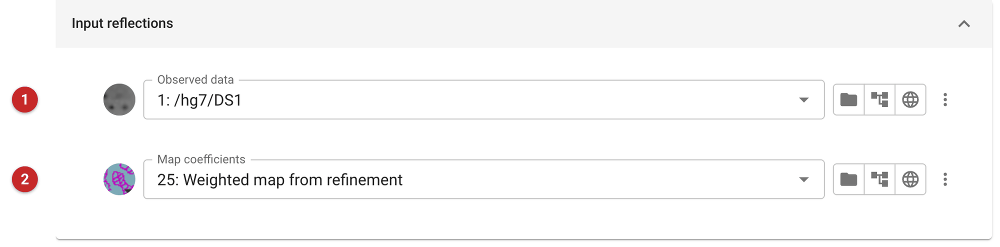
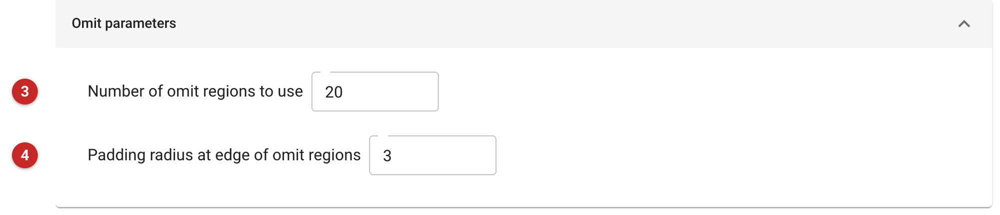
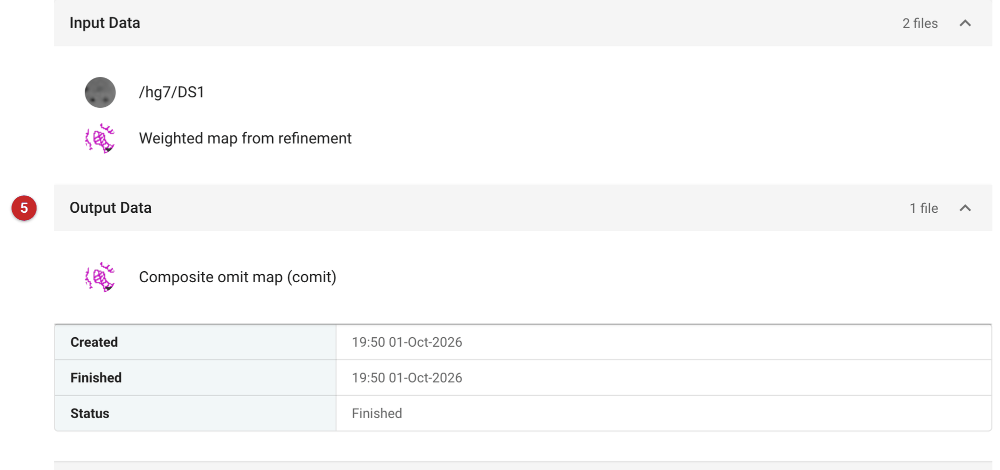

==================
Calculate omit map
==================

An omit map shows the density *without* the model's say in it. A map
calculated from a model carries that model's phases, so wherever the model
is wrong the map is pulled towards it (model bias), and this matters most
right after molecular replacement, when a distant search model is the only
source of phases. `comit
<https://legacy.ccp4.ac.uk/newsletters/newsletter48/articles/Comit/news-comit.html>`_
removes the bias region by region: it divides the asymmetric unit into
spheres, omits the density of each in turn, and reconstructs it from
sigma-A weighted maps, then joins the pieces into one *composite omit map*
(Bhat, 1988). The task runs comit's fast method, which works from the
observed amplitudes and the map coefficients of a refinement you have
already run (it does not re-run Refmac), so it takes seconds.

Use it to check a solution you are not yet sure of, and to decide whether a
region you are about to rebuild really has density. Features that are still
there in the omit map are supported by the data; features that vanish were
put there by the model. The refinement's own maps (from
:doc:`../prosmart_refmac/index`, or the 2mFo-DFc map of Servalcat) are
built with the whole model in place and are the maps to build into; use the
omit map when you want to know whether to believe them. The task takes a
solution that already exists, so it comes after one of the molecular
replacement tasks (for example :doc:`../phaser_simple_phil/index`).

The pictures on this page come from the MDM2 project of the molecular
replacement route: Phaser placed a Chainsaw-pruned model of the related
protein MDMX in the MDM2 data (TFZ 12.7), and the placement was refined
(R-free about 0.50). A model that distant is the case where bias is the
worry, so the omit map is made for that refinement.

Input
=====

   Figure 1: comit input data

The task has two tabs, *Input Data* and *Options*. On the first you give
the observed reflections **(1)** and the map coefficients to be made
unbiased **(2)**. The map coefficients must be an ordinary (2mFo-DFc type)
map from the solution's refinement, not a difference map, and from the same
crystal as the reflections. Here they are the weighted map from the
refinement of the Phaser solution, and the reflections are the data the
refinement used.

The reflections may be amplitudes or intensities: intensities are converted
to amplitudes on the way in.

   Figure 2: comit options

The options are the number of omit spheres **(3)** (default 20, at least
8) and the padding radius at their edge **(4)** (default 3.0 Å). The defaults are the ones to use unless you have a reason; the run
here took them and finished in about seven seconds.

Results
=======

   Figure 3: comit report

The report lists the inputs and the one output **(5)**, a file of map
coefficients labelled "Composite omit map (comit)", the name later tasks
offer it under.
comit writes no statistics and the report has no graphs or tables of
results: there is no number to read, and nothing to say the map is
"good". The result is the map itself, so open it, with the model it was
made for, in a viewer, and judge the density.

Compare it with the map you already have, in the same place. Density for a
helix, a ligand or a loop that survives is real evidence for it. Density
that was clear in the refinement map and has gone is bias, and the model
should not be rebuilt to fit it. Compare like with like: the omit map is a
noisier map than the refinement's, since each part of it is calculated
without that part of the model, so expect it to be weaker everywhere and
look at what is left in relation to its surroundings rather than at its
absolute level.

The map can go on to another task as map coefficients. If the omit map
shows that the solution is wrong, go back to molecular replacement with a
different model; if it shows that it is right, carry on with the refined
model.

**References**

`Bhat, T. N. (1988). J. Appl. Cryst. 21, 279-281 <https://doi.org/10.1107/S0021889887012755>`_
