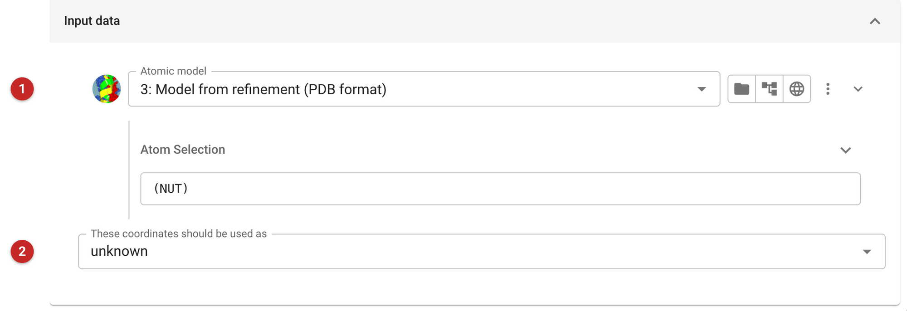
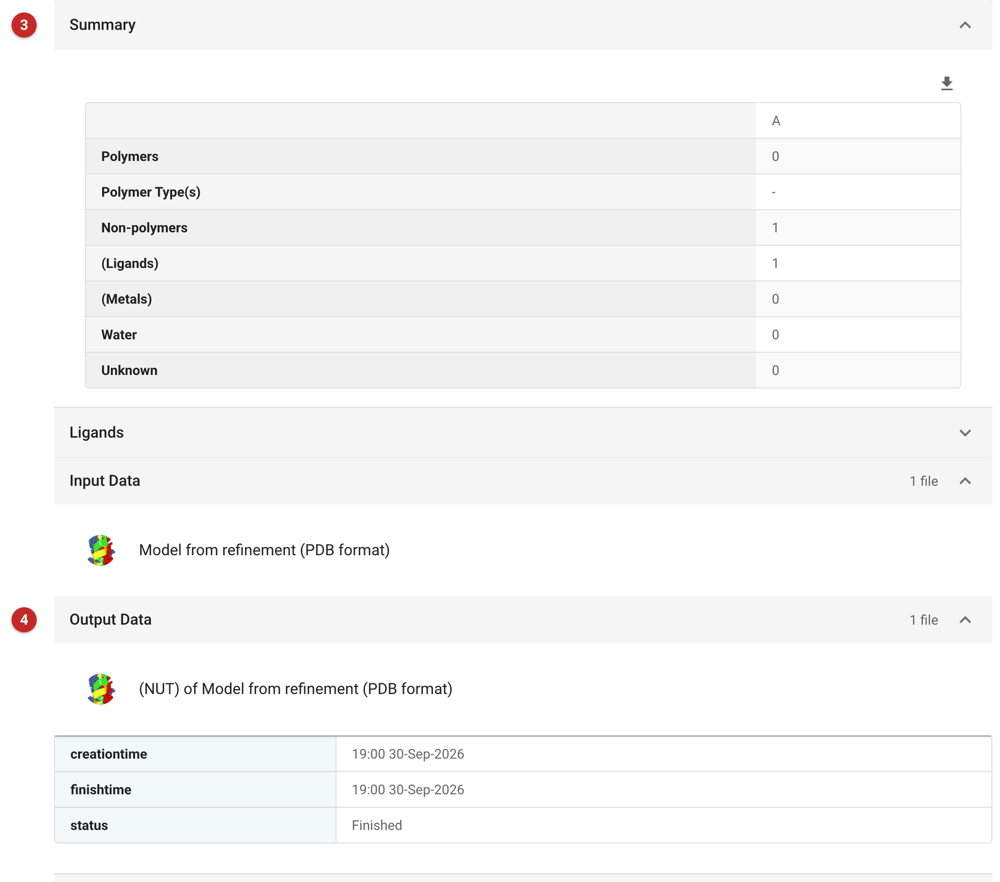

###########################################
Import or select subset from coordinate set
###########################################

This tool selects part of a coordinate file, a set of chains, residues or
atoms, and saves it to a new file: a domain for molecular replacement, a
ligand, or a model without its waters. It can also be used simply to
import a coordinate file into the project, and say what it is.

The pictures on this page take the ligand, Nutlin-3a, out of the MDM2
model refined from the Ligand Tutorial data that comes with CCP4i2.

Input
=====

   Figure 1: Input

Choose the coordinates **(1)**. The arrow at the end of the row opens the
atom selection (it is open already once a selection is set): type it there, here ``(NUT)``, the ligand by
its residue name. The selection language is explained
`here <../../general/atom_selection.html>`__. The menu beside the model
gives views of its contents.

The coordinates can be marked as a model, a homologue, a fragment of the
structure or heavy atoms **(2)**, so that the new file is offered only
where it makes sense.

Results
=======

   Figure 2: Report

The report summarises what was selected, chain by chain **(3)**: polymers,
ligands, metals and waters (with the ligands listed in a fold of their
own). Here one ligand, NUT in chain A. The selected coordinates are the
output **(4)**, named after the selection and the file it came from.
