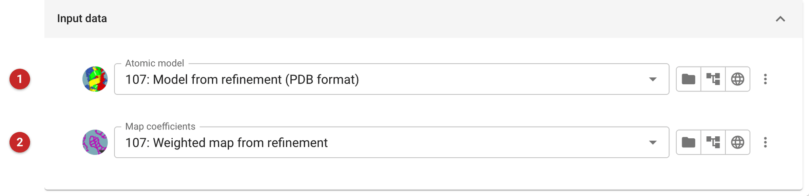
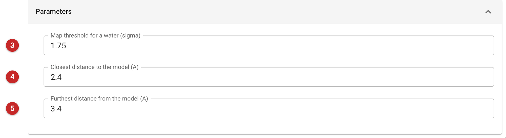
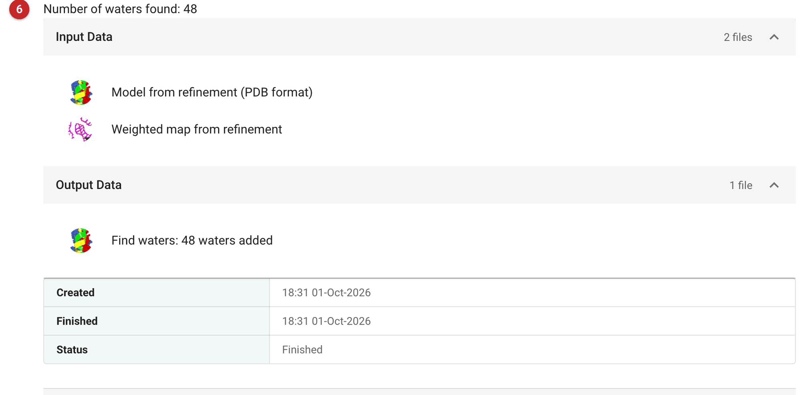

#####################
Find waters with COOT
#####################

Find Waters searches an electron density map for water-sized peaks that no
atom of the model accounts for, and adds a water at each one that sits at
a sensible distance from the model. The new waters are written to the
output model as a separate chain, so the input model is left as it was.

Use it near the end of model building: when the model is nearly complete
and refinement has converged. Do not use it on a model that is still being
built. Density that belongs to a side chain or loop you have not yet built
looks like water peaks, and waters placed there are a common error that
later has to be undone. After adding waters, refine again and check
R-free: it should not rise. Refmac can also add waters during refinement
(:doc:`../prosmart_refmac/index`); Find Waters is the alternative when you
want to add them once, as a separate step, and look at them before they
are refined. To fix a model in other ways with a script, see
:doc:`../coot_script_lines/index`.

The pictures on this page come from the MDM2 project of the refinement
route: a homologue placed by Phaser, its side chains filled in with a
scripted Coot step, and refined with Refmac (R-free 0.490, with the
data at 1.35 Å). Here the model is far from finished, so the example
shows the mechanics rather than good practice.

Input
=====

   Figure 1: Find Waters input

The input (Figure 1) is the atomic model **(1)** and map coefficients **(2)**.
Use the model and the map coefficients from the same refinement. The map
should be a normal rather than a difference map: weighted
F\ :sub:`obs` coefficients from experimental phasing or density
modification, or 2mF\ :sub:`o`-DF\ :sub:`c` coefficients from
refinement. Here both come from the Refmac job that refined the model
(107: "Weighted map from refinement", not the "Weighted difference map").

Parameters
==========

   Figure 2: Find Waters parameters

In Figure 2 the map threshold **(3)** is the lowest peak height accepted, in
standard deviations of the map (default 1.75). Lower it to accept weaker peaks,
and expect more false waters. The minimum **(4)** and maximum **(5)**
distances (defaults 2.4 and 3.4 Å) are the allowed distances between a
new water and the existing model. They keep waters at hydrogen-bonding
distance from the model: closer than the minimum is a clash, farther than
the maximum is a water with nothing to hold it.

Results
=======

   Figure 3: Find Waters report

The report (Figure 3) gives the number of waters found **(6)** above the input
files and the output model, which is named with the same count. In this run the
job added 48 waters, as residues named HOH in a new chain C, to the 699
atoms of the input model.

What to do next: refine the output model (:doc:`../prosmart_refmac/index`)
against the same data and free set, and check that R-free falls or stays
level. Then look at the waters in the map. A water with weak density that
makes no hydrogen bond, or that sits against unmodelled density, should be
removed.
