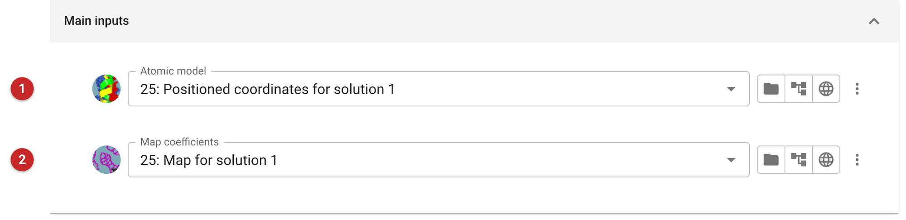
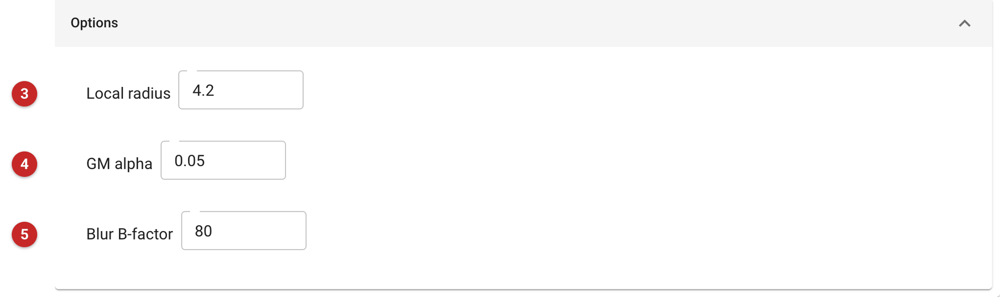
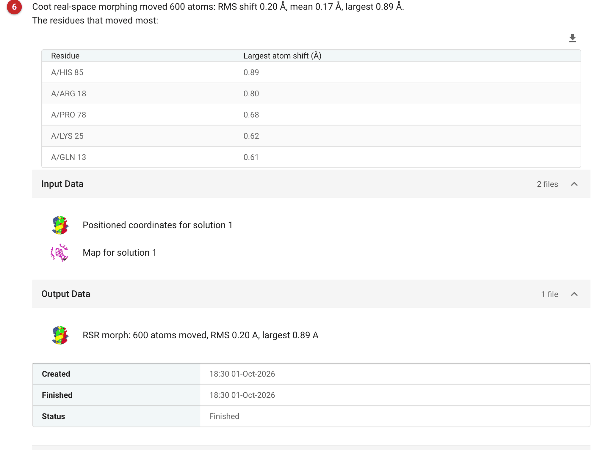

========================================
Real space refinement morphing with COOT
========================================

RSR Morph moves a placed model into its map, locally. It is Coot's
real-space refinement applied to the whole model at once, restrained to the
model's own shape: each atom is held to the distances it already has to its
neighbours, so a region moves together with the atoms around it and the
model is bent, not rebuilt. Bonds, angles and the fold survive; displaced
helices and loops slide towards the density.

Use it after molecular replacement, when the placement is right but parts of
a homologue are slightly displaced from where they are in your crystal, and
before reciprocal-space refinement (:doc:`../prosmart_refmac/index`), which
has a narrow radius of convergence and may start from a better place. It
does not rebuild anything or change the sequence: missing residues,
truncated side chains and wrong loops stay as they are. For those, build
(:doc:`../modelcraft/index`) or edit the model, for example with a script
(:doc:`../coot_script_lines/index`). Its counterpart in reciprocal space is
:doc:`../shift_field/index`, which also moves a model in smooth, local
steps, but against the structure factors rather than a map.

The pictures on this page come from the MDM2 project of the "completing a
molecular-replacement model" route. The starting model is Phaser's
placement of MDMX (PDB 3dab), pruned by Chainsaw against MDM2: a clear
placement (TFZ 12.7, see :doc:`../chainsaw/index`) of a homologue with 600
atoms, whose refinement reached only R-free 0.503.

Input
=====

   Figure 1: RSR Morph input

The atomic model **(1)** and the map coefficients **(2)**: amplitudes and
phases of a 2mFo-DFc-type map. Here they were Phaser's own model and map
for the placed solution (the map coefficients are read as the columns F and
PHI). Take the map from the same job as the model, or from a refinement of
it: a map calculated for a different placement would pull the model
somewhere else.

   Figure 2: RSR Morph options

The defaults suit most uses. What the three options do, from the task's
code and Coot's documentation:

* **Local radius** **(3)** (default 4.2, a choice of 4.2, 5, 6, 7): the
  distance within which atoms are restrained to each other, taken from the
  starting model. A larger radius ties each atom to more neighbours, so
  larger parts move as one body; a smaller one lets regions flex more
  independently.
* **GM alpha** **(4)** (default 0.05, a choice from 1 down to 0.01): the
  strength parameter of the Geman-McClure distance restraints. This is a
  robust penalty: restraints that the map strongly disagrees with are
  allowed to break, rather than being stretched, so that a real
  displacement can be followed. Leave it at the default unless you know
  why; Coot's documentation gives the exact form.
* **Blur B-factor** **(5)** (default 80, a choice from 20 to 600): the map
  is blurred by this B-factor before it is used, which smooths away detail
  and widens the funnel of the target, so that atoms further from their
  density are still drawn in. Higher values reach further but fit less
  precisely.

The task refines every residue of the model, whatever its chain.

Results
=======

   Figure 3: RSR Morph report

The report says how far the model moved **(6)**: the number of atoms
matched between the input and the morphed model, their RMS, mean and
largest shift, and the residues that moved most; the output model is named
with the same figures. The output is the morphed model (an mmCIF file if
the input was mmCIF). The report offers refinement with Refmac as the next
step.

What it did here: it moved all 600 atoms, by an RMS of 0.20 Å (mean 0.17 Å,
largest 0.89 Å). That is
a small correction, as expected for a placement that was already clear, and
the gain is small too: the model is a homologue, with truncated side
chains, and morphing cannot supply what is missing. In this route the next
steps were to fill the side chains (scripted Coot: 600 to 699 atoms),
refine (R-free 0.490, from 0.527 at the start of that refinement; the
refinement of the unmorphed placement had reached 0.503) and add waters
(48). If the homologue is distant, automated building
(:doc:`../modelcraft/index`) is the real next step.

Check a morph by the movement: a few tenths of an ångström is a tidy
adjustment; shifts of several ångströms in some region mean the map and
the model disagree there, and the region needs looking at in Coot rather
than trusting.

**References**

`Emsley, P., Lohkamp, B., Scott, W.G., Cowtan, K. (2010) Features and development of Coot. Acta Cryst. D66: 486-501; doi:10.1107/S0907444910007493 <https://doi.org/10.1107/S0907444910007493>`_

Read more about Coot's `real-space refinement <https://www2.mrc-lmb.cam.ac.uk/personal/pemsley/coot/web/docs/coot.html#Regularization-and-Real-Space-Refinement>`_
and the `Coot tutorial <https://paulsbond.co.uk/coot-workshop/part1.html#4.6>`_.
