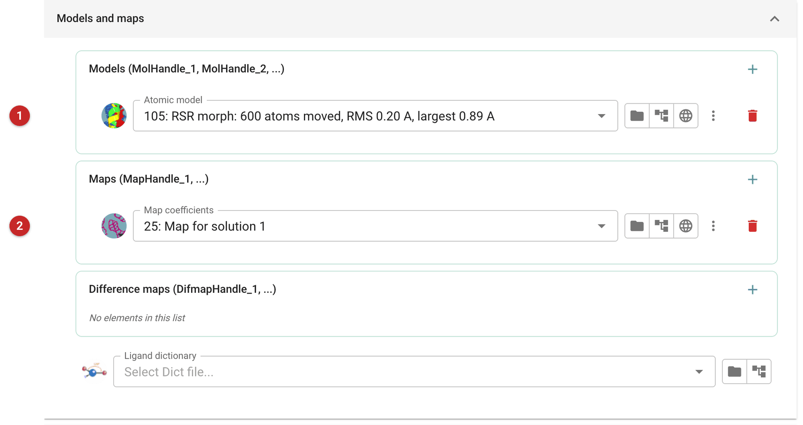
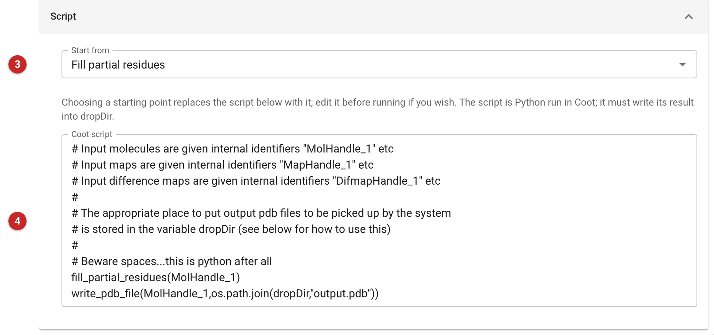
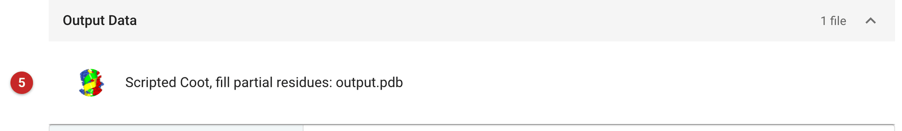

##########################################
Scripted model building - COOT
##########################################

This task runs a Python script of your own in Coot, without graphics, on
the models and maps you give it, and saves the models the script writes as
the job's output. Use it for a model-building step you want to repeat
exactly and have recorded in the project: the script is kept with the job,
the run needs nobody at the screen, and the same recipe can be cloned and
run on the next model. For interactive work, looking at the map and moving
atoms by hand, use the Coot task instead; for real-space refinement
morphing alone, see :doc:`../coot_refinement/index`, and to add waters see
:doc:`../coot_find_waters/index`.

The task runs CCP4's Coot 1 (``coot-1``) with no graphics window. A script
written for an older Coot (0.9) may need changes: Coot 1's Python
functions have Coot 1's names, so a Coot 0.9 name such as ``rename_chain``
is not there (``change_chain_id`` is).

The pictures on this page come from the MDM2 project. Job 25 is Phaser's
placement of a Chainsaw-pruned MDMX model: placed clearly, but a homologue
with its side chains truncated. The model was first moved into the map by
:doc:`../coot_refinement/index`; this task then gave back the truncated side
chains, and the model was refined (R-free 0.490, against 0.503 for the
placed model).

Input
=====

   Figure 1: Models and maps

Give the models **(1)**, the maps **(2)**, any difference maps and, if the
script handles a ligand, its dictionary. Each list can hold several
entries. They reach the script under fixed names, counted from 1 in the
order of the lists: ``MolHandle_1``, ``MolHandle_2``, ...; ``MapHandle_1``,
...; ``DifmapHandle_1``, .... Maps are given as map coefficients (F, PHI),
as Phaser and Refmac write them. The first model of Figure 1 is therefore
``MolHandle_1`` and its map ``MapHandle_1``.

   Figure 2: The script

*Start from* **(3)** puts a ready-made script in the script box **(4)**,
replacing what is there; run it as it is or edit it first. The starting
points are recipes for common jobs:

- **Fill partial residues**: complete side chains that are truncated, as
  they are after Chainsaw or Sculptor, fitting the missing atoms to the map.
- **Fit protein**: automatic fitting of the whole model to the map.
- **Perform stepped refinement** (with or without Ramachandran
  restraints): real-space refinement of the model a few residues at a
  time, along each chain; the first also restrains the backbone torsions
  towards favoured Ramachandran regions.
- **Iterative morph fit molecule with decreasing blur**: morph fitting
  of each chain in rounds, from a coarse, blurred map to the full map; for
  a model that is generally right but displaced.
- **Blank script**: copies the input to the output, with commented examples
  to uncomment.

The script is Python. Keep to what the task sets up:

- The script must write its result into ``dropDir``, for example
  ``write_pdb_file(MolHandle_1, os.path.join(dropDir, "output.pdb"))``.
  The task collects the ``.pdb`` files in that directory as the job's
  output models, named by the starting point and the file name
  ("Scripted Coot, fill partial residues: output.pdb").
  A file of any other kind is not collected.
- A script that raises an error now fails the job, with the Python
  traceback in the job's log. (It used to stop silently, with no output.)
- To debug, open the job's *Logs* tab or its directory: ``script.py`` is
  the whole generated script, with the lines that read the inputs, and
  ``log.txt`` is Coot's output.

Results
=======

   Figure 3: Output

The report lists the input files and the output models **(5)**, each named
by the starting point used; it does not say what the script changed, so
check the result yourself. Here
``fill_partial_residues`` took the 600 atoms of the morphed model to 699,
the truncated side chains returned. Fitting a side chain to a map that
barely shows it gives it a plausible place, not a measured one: refine the
model next (Refmac) and look at R-free, which here fell to 0.490, and
check with the map before trusting the new atoms.

The output model is ready for refinement, or for :doc:`../coot_find_waters/index`.
