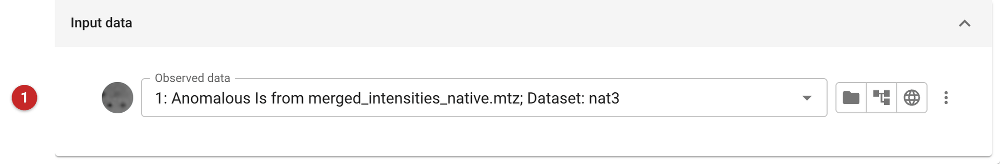

############################
Patterson map (cpatterson)
############################

This task calculates a Patterson map from a set of amplitudes: a map of
the vectors between atoms, which needs no phases. Its main use in
structure solution is to look for translational non-crystallographic
symmetry (tNCS): two or more copies of a molecule in the same orientation
produce a large peak in the Patterson away from the origin, typically
more than about 20% of the origin peak. tNCS must be accounted for in
molecular replacement and refinement, and data reduction (*Aimless*)
checks for it too. A Patterson of anomalous or isomorphous differences
shows the vectors between heavy atoms.

The pictures on this page calculate the Patterson of the native data of
the *gamma* demo that comes with CCP4i2.

Input
=====

   Figure 1: cpatterson input

The only input is the reflection data **(1)**; mean amplitudes are used.

Results
=======

The Patterson map is the output: open it in Coot or Moorhen and look for
peaks other than the origin. For the gamma data the largest peak more
than 5 Å from the origin is 4% of the origin's height: no tNCS, as
expected for one molecule in the asymmetric unit.
