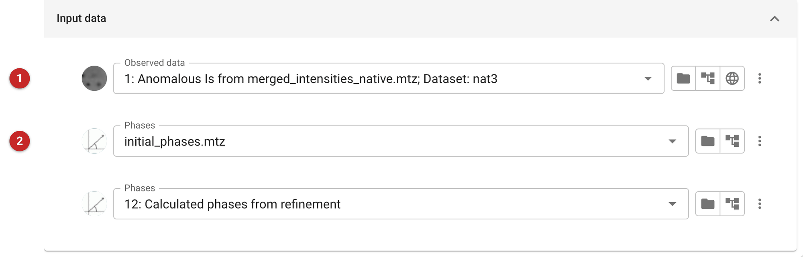
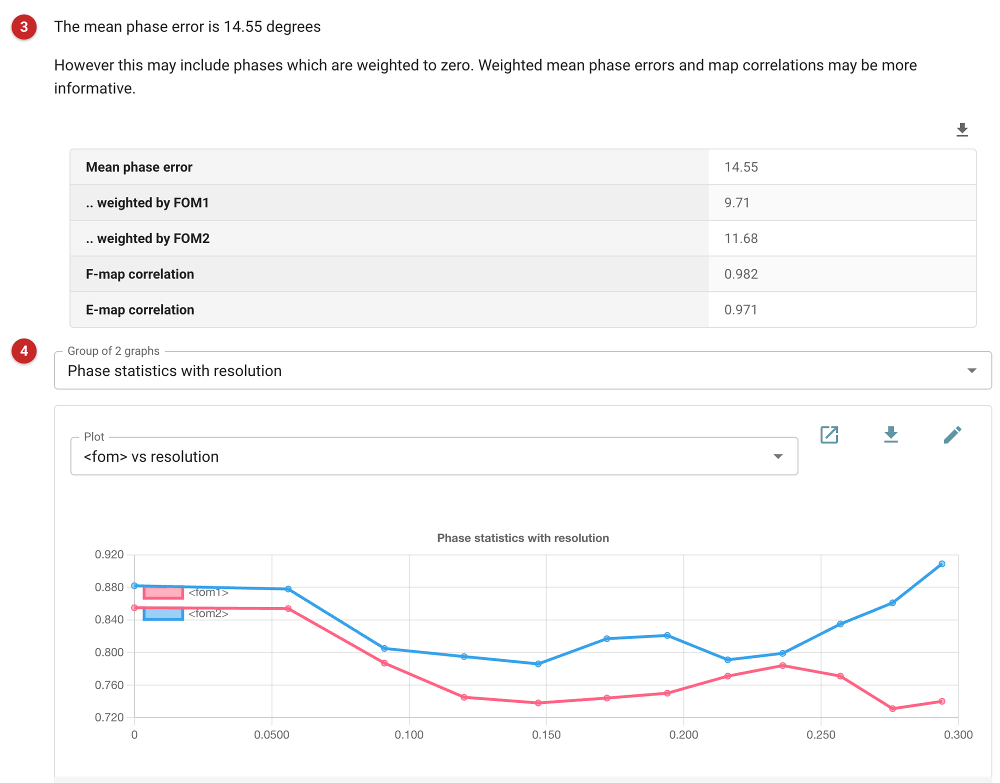

##############################
Phase comparison (cphasematch)
##############################

This task compares two sets of phases for the same data. Its most common
use is to ask how good a set of phases was, once a better set is known:
experimental phases, or density-modified ones, against the phases of the
final refined model. The answer shows which phasing step worked, and
calibrates the figures of merit a program reported.

As a rough guide, a mean phase error below about 30° against the final
model gives a map that is easy to interpret; raw SAD or MAD phases
typically have errors of 40-60°, improved by density modification; above
about 70° a map is hard to interpret at all.

The pictures on this page compare the phases supplied with the *gamma*
demo that comes with CCP4i2 with those of the model refined against the
native data.

Input
=====

   Figure 1: cphasematch input

A set of reflection data **(1)** and two sets of phases **(2)**: here the
supplied phases, then the phases calculated from the refined model. The
data are used for the map correlations.

Results
=======

   Figure 2: cphasematch report

The mean phase error between the two sets is reported first **(3)**, with
weighted errors and map correlations. The unweighted error counts every
reflection equally, including those whose phases carry no information;
weighting by either set's figure of merit discounts them, and so also
shows whether a figure of merit was meaningful. The map correlations
weight by amplitude as well: the F-map correlation is dominated by the
low-resolution phases, the E-map correlation by the high-resolution ones.
Graphs **(4)** give the figures of merit and phase differences against
resolution.

Here the mean phase error is 14.6° (9.7° weighted by the first set's
figure of merit) and the F-map correlation 0.98: these phases are as good
as the model's, far better than raw SAD phases would be.
