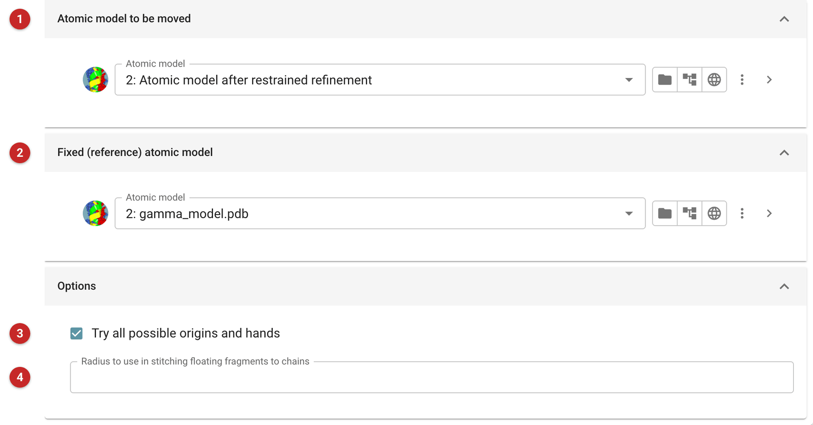
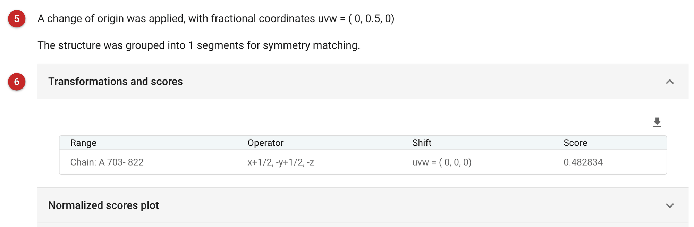

#################################
SYMMETRY MATCH MODEL TO REFERENCE
#################################

This task compares atomic models placed in different parts of the unit
cell. It uses the crystal symmetry to move the chains, ligands and waters
of one model to lie in the same part of the cell as another, and can
change the origin on which the model is defined: for example to compare
different molecular replacement solutions, or to bring a new solution
onto the frame of a known structure.

The pictures on this page move a molecular replacement solution (from the
*Molrep* page) onto the model it was solved with.

Input
=====

   Figure 1: Csymmatch input

The first model **(1)** is the one to be moved. It is broken into
connected fragments, and each fragment is moved by the crystal symmetry to
overlap the second model best. The second model **(2)** is the fixed
reference; it is not moved or altered.

An origin and/or hand change may be tried as well **(3)**. A change of hand
is meaningless for most biological structures, but useful for heavy-atom
substructures, which have a hand ambiguity. Note that the origin shift is
not restricted to obey symmetry constraints.

The connectivity radius **(4)** decides what counts as one fragment. A
model is normally moved a chain at a time, but monomers of the same chain
more than this distance apart (2 Å by default) are moved separately, which
keeps chains intact while moving waters and ligands individually.

Results
=======

   Figure 2: Csymmatch report

The report says whether an origin shift **(5)** or a change of hand was
applied, and how many fragments the model was divided into. Check for a
change of hand: for anything but a substructure it usually means the
models could not be matched. Check too that an origin shift is one the
space group allows. The fragments' symmetry operators and scores follow
**(6)**. Here the Molrep solution is moved by an origin shift of (0, ½, 0)
and the operator x+½, -y+½, -z onto the frame of the original model, as
one fragment.
