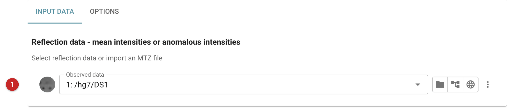
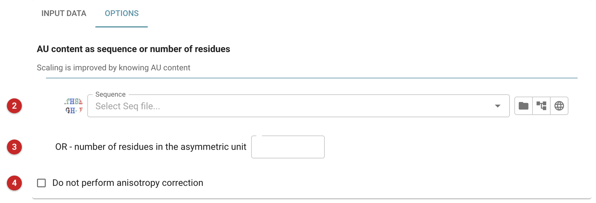
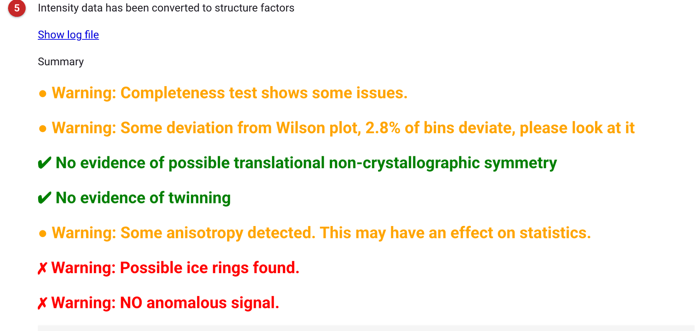

#########################
Intensities to amplitudes
#########################

Reflection data can be in the form of intensities or amplitudes
(structure factors), and tasks accept either and perform any necessary
conversion automatically. This task, *CTRUNCATE*, is provided in case the
conversion is needed for use outside CCP4i2, or to see the analysis of
the data that goes with it: twinning, translational NCS, anisotropy, ice
rings and the anomalous signal. Data reduction (*Aimless*) runs it as one
of its steps.

The pictures on this page follow MDM2 with Nutlin-3a, from the Ligand
Tutorial data that comes with CCP4i2.

Input
=====

   Figure 1: Input data

In Figure 1, select reflection data in the form of intensities, mean or
anomalous **(1)**.

   Figure 2: Options

Knowing the contents of the asymmetric unit (Figure 2), as a sequence **(2)**
or a number of residues **(3)**, improves the scaling of the intensities to an
absolute scale. The correction for anisotropy can be turned off **(4)**.

Results
=======

   Figure 3: Summary

The report (Figure 3) confirms the conversion **(5)** and summarises the
analyses, with warnings in orange and red, each detailed in a fold below. Here
the data came from *Aimless* as anomalous intensity pairs; CTRUNCATE finds no
anomalous signal in them **(6)**, as expected for a crystal without
anomalous scatterers at this wavelength: the anomalous differences are
noise. The ice-ring warning is the one to follow up:
see *Data quality* in the report, and the Aimless page.
