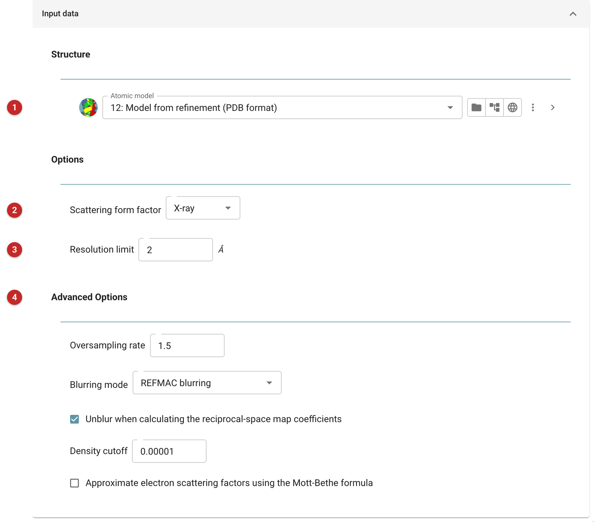

#################################################
Calculate a map from a model (density calculator)
#################################################

This task calculates the electron density (or, for electron or neutron
work, the potential or nuclear density) of an atomic model, as a map and
as map coefficients, at a chosen resolution. Uses include comparing a
model with an experimental map, making a synthetic map for a figure or a
test, and preparing a model-derived map for tasks that take maps.

The pictures on this page calculate a 2 Å map of the refined model of the
*gamma* demo that comes with CCP4i2.

Input
=====

   Figure 1: density calculator input

The model **(1)**. The kind of scattering **(2)**: X-ray, electron or
neutron. The resolution limit **(3)**, which sets how much detail the map
has; a map at the resolution of the data it will be compared with is the
fair comparison.

The *Advanced options* **(4)** control the grid (the oversampling rate),
the blurring applied during the calculation (by default as Refmac does),
whether that blurring is removed from the map coefficients, the density
cutoff, and, for electron scattering, the Mott-Bethe approximation.

Results
=======

The report lists the outputs: the map, and the map coefficients.
