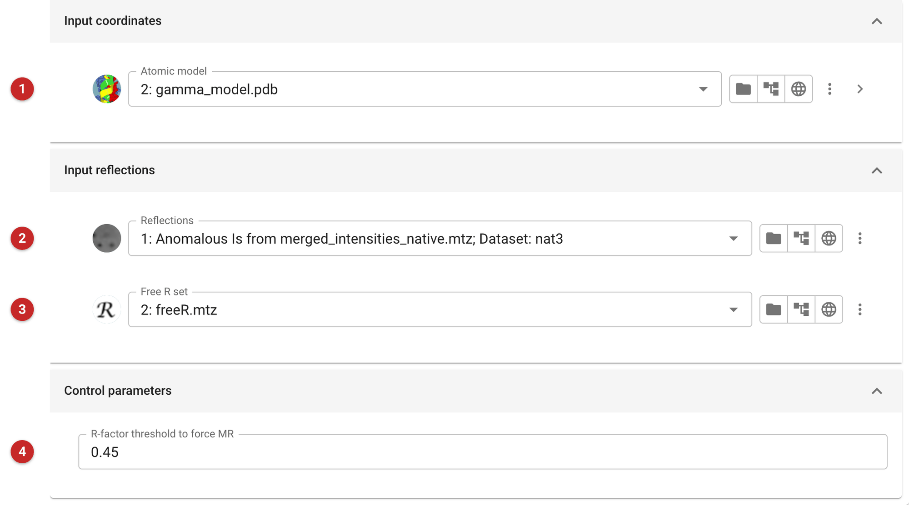
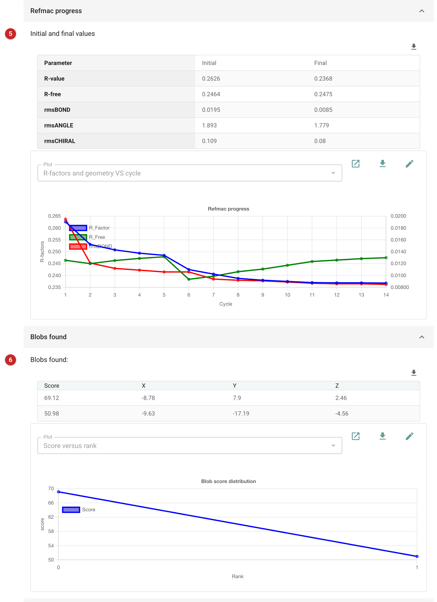

######
DIMPLE
######

`DIMPLE <https://journals.iucr.org/a/issues/2013/a1/00/a50958/a50958.pdf>`_
(DIfference Map PipeLinE) quickly refines a known structure against new
data from the same crystal form and finds the "blobs": places of
unexplained density, where a ligand may have bound. It is a joint
development of the CCP4 software group and Diamond Light Source, meant
for crystals of a known protein soaked or co-crystallised with a ligand:
within a few seconds an experienced user can see whether density for the
ligand is there.

DIMPLE checks that the data match the model (reindexing if needed), runs
rigid-body refinement, falling back to molecular replacement if the
R-factor stays above a threshold, then restrained refinement (jelly-body,
then restrained), and finally searches the difference map for blobs.
Please visit the `official site <http://ccp4.github.io/dimple/>`_ for more.

The pictures on this page run DIMPLE with the model and native data of the
*gamma* demo that comes with CCP4i2.

Input
=====

   Figure 1: DIMPLE input

The model **(1)** (Figure 1), typically the refined apo structure; the data
**(2)**; and the free R set **(3)**. Use the free set the model was refined
against, so that R-free stays meaningful. The R-factor threshold **(4)**
decides when rigid-body refinement is judged to have failed and molecular
replacement is run instead (default 0.45).

Results
=======

   Figure 2: DIMPLE report

The report (Figure 2) gives the R-factors and geometry before and after
refinement **(5)** with a graph of the cycles, and the blobs found **(6)**:
their scores and positions, largest first. Here rigid-body refinement took R to
0.21 at 3.5 Å, so no molecular replacement was needed, and the restrained
refinement ended at R 0.237 and R-free 0.248. There is no ligand in these
crystals, and the model has no waters or ions, so the two blobs found are
most likely unmodelled solvent: look at them, with the output model and
maps, in Coot or Moorhen.

The *Summary* below repeats DIMPLE's own log of the steps, and the outputs
are the refined model and its map coefficients.
