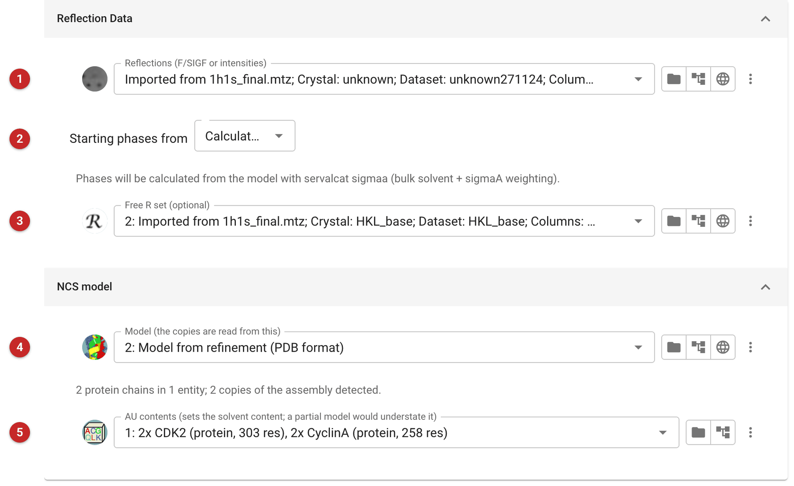
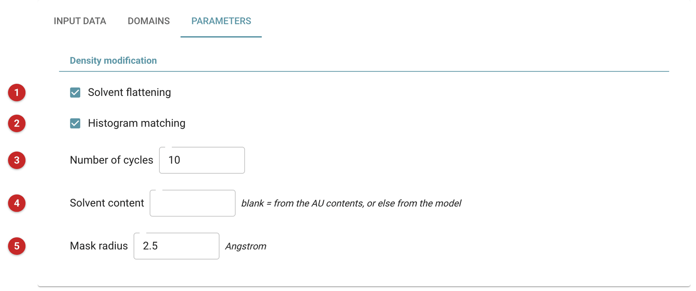
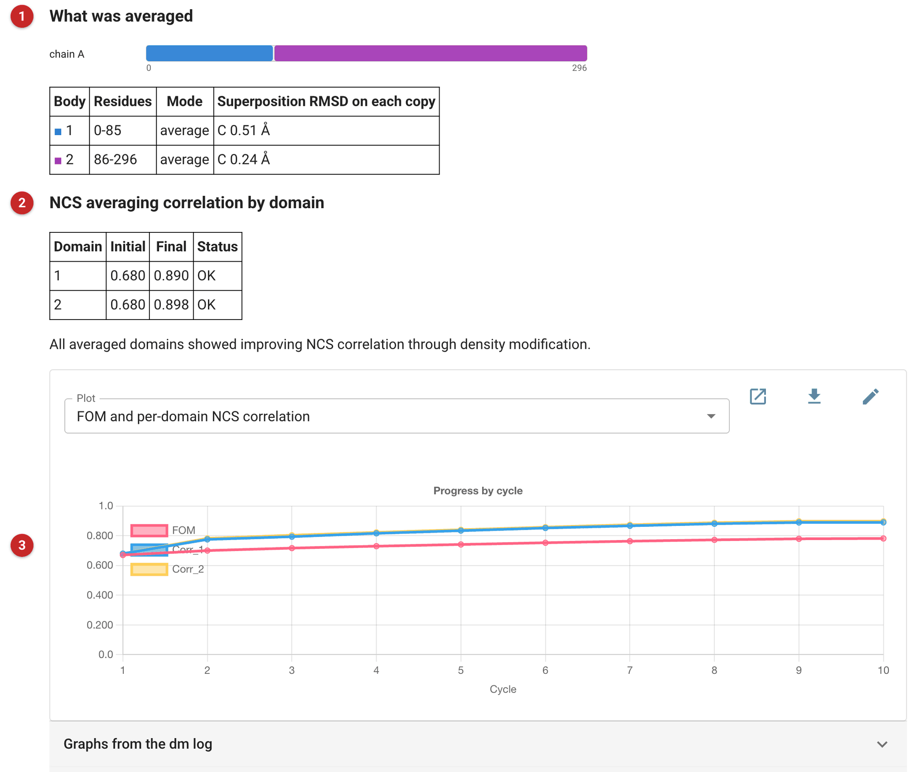

##########################################
Multi-domain NCS averaging (dm)
##########################################

   The "Multi-domain NCS averaging (dm)" task improves phases with the
   program ``dm``, using non-crystallographic symmetry (NCS) averaging in
   which different parts of the molecule are averaged with different
   operators. It does solvent flattening and histogram matching as well,
   like the *Density modification (parrot)* task, but where Parrot finds
   one NCS operator per copy of the molecule, this task lets you cut each
   copy into rigid *bodies* and find an operator for each body
   separately.

   That matters when the copies in the asymmetric unit are not identical:
   when a domain, a lobe or a helix sits differently in each copy, no
   single operator superposes the whole molecule, and averaging with one
   operator smears the density where the parts have moved. Cut at the
   hinge, each body does superpose.

   **When to use it.** Try *Density modification (parrot)* first. It is
   simpler, it finds the NCS itself, and when the copies are the same
   shape it does as well as or better than this task, as the example
   below shows. Use this task when the copies differ by domain movements
   (the superposition of the whole copy is poor, but each domain on its
   own superposes well), or when a body spans two different proteins in a
   complex and has to move with them together.

   The pictures on this page come from PDB entry 1h1s, phospho-CDK2 in
   complex with cyclin A, with two complexes in the asymmetric unit. The
   starting model is the two CDK2 molecules (chains A and C) without
   their cyclins, as it might be after molecular replacement with CDK2
   alone, so the density of the cyclins is what density modification
   should recover. The Parrot page uses the same project.

Input
=====

The task has three tabs: *Input Data*, *Domains* and *Parameters*.

Input data
----------

   |input|

   Select the observations **(1)**. The starting phases may either be
   supplied or calculated from the model **(2)**. With *Use supplied
   phases* a further field takes the phases, for example from experimental
   phasing or from a refinement. With *Calculate from model (servalcat
   sigmaa)* the task calculates them from the model below, with bulk
   solvent and sigma-A weighting, and nothing else is needed. That is what
   was done here.

   A Free-R set **(3)** is optional; as for Parrot, density modification
   does not need it.

   The model **(4)** provides the NCS: the copies are read from it, and
   the interface tells you how many protein chains it found and how many
   copies of the assembly it detected (here two chains in one entity, two
   copies). The model need not be complete: here it is missing the
   cyclins.

   Give the AU contents **(5)**, from the *Define AU contents* task, the
   way you would for Parrot: they set the solvent content, which tells
   ``dm`` how much of the cell to flatten. Give the number of copies of
   each sequence the asymmetric unit really holds, here two CDK2 and two
   cyclin A, not what the model contains. Without them the task has to
   estimate the solvent content from the model, and a model that is
   missing part of the structure is taken to have a great deal of
   solvent: whatever the model lacks is flattened as solvent, and the
   density you hoped to recover is removed. The task warns (orange) when
   it has neither the AU contents nor a solvent content. If you know the
   solvent content, you can instead type it on the *Parameters* tab.

Domains
-------

   |domains|

   This tab answers two questions, both read from the model, so it opens
   already filled in with what the model implies.

   *Which chains are copies of each other?* is a grid with a row for each
   copy and a column for each different protein (entity) in the copy. The
   first row is the reference: the averaging masks are cut from it and
   every other copy is superposed onto it. Here the reference copy is
   chain A and the second copy is chain C. For a complex such as
   CDK/cyclin, add a column for the second protein and choose its chain
   in each row; leave a cell empty where a copy lacks that protein. *Re-detect from model* returns to
   what the model implies.

   *Which parts move as one unit?* is a list of rigid bodies, each with
   one or more residue ranges (a body can span two proteins, for example
   a helix of one that travels with a domain of the other). The bar above
   the list draws the bodies on the residues of the reference copy, so a
   gap or an overlap is seen rather than deduced. Each body has a mode:
   *average* holds the operators fitted from the model fixed, *refine*
   lets ``dm`` improve them as it goes, and *exclude* leaves the body out
   of averaging altogether (for a flexible loop, say).

   Under each body the interface gives, for each other copy, the number of
   CA atoms it matched and the RMSD of the superposition, before the job
   is run. That is the number to look at: a body that superposes badly
   (the task warns above 3 Å) probably contains more than one rigid unit,
   and should be cut again. Here the model's two CDK2 copies were
   cut into two bodies, the N-lobe (residues 0 to 85) and the C-lobe (86
   to 296), which superpose on the second copy to 0.51 Å (86 CA atoms) and
   0.24 Å (211 CA atoms).

   The task needs at least two copies, and each body is averaged only
   over the copies that have all the chains it names.

Parameters
----------

   |parameters|

   Solvent flattening **(1)** and histogram matching **(2)** are both on
   by default, and there is rarely a reason to change that. The number of
   cycles **(3)** defaults to 10; more are seldom useful once the
   correlations in the report have stopped rising. The solvent content **(4)** is normally left
   blank, to be calculated from the AU contents; type a value to override
   it (for example when you have a better estimate than the sequence
   gives). The mask radius **(5)**, 2.5 Å by default, is the radius of the
   sphere placed round each atom of a body to build its averaging mask;
   the masks of different bodies are made disjoint, since ``dm`` needs
   that.

Results
=======

   |report|

   The report starts with what was averaged **(1)**: the bodies drawn on
   the reference copy, and a table giving each body's residues, mode and
   the RMSD of its superposition on each other copy. Check it says what
   you intended.

   The table of NCS averaging correlations **(2)** is the figure of
   merit of the averaging. For each body it gives the correlation of the
   density in the copies before density modification and after it. Averaging
   should raise it. Here both bodies went from 0.68 to about 0.9 (0.89 for the N-lobe
   and 0.90 for the C-lobe over the 10 cycles). A body whose correlation
   does not rise, or that is flagged by ``dm``, is one whose operator or
   mask is wrong: the wrong chains matched, a mask that is too small or
   leaks onto its neighbour, or a body that is not really rigid. Cut it
   again, or *exclude* it.

   The plot **(3)** gives, cycle by cycle, the mean figure of merit
   (rising here from 0.67 to 0.78) and the NCS correlation of each body;
   a second plot gives ``dm``'s perturbation gamma. Further graphs from the ``dm``
   log are in the fold below it. The output is a set of phases and map
   coefficients (to look at the map in Moorhen) and the mask for each
   body, which can be overlaid on the map to check what was averaged.

   **How well did it work?** The only real test of a density-modified
   map is whether it is better than the one you started with. In this
   project the deposited 1h1s structure gives that test. Measured as the
   real-space correlation with the deposited model inside the masks, this
   run's map was no better than its starting map, in the CDK2 region
   (0.85 before and after) or in the cyclin, which was missing from the
   starting model (0.64 before and after), whereas Parrot with the same
   data improved both (0.88 and 0.68). The two CDK2 copies are almost the
   same shape (0.39 Å apart), so cutting them into lobes gains nothing
   over averaging each whole: multi-domain averaging is for copies whose
   domains have moved relative to one another. The correlations in the
   table are therefore not enough by themselves: a rise in the NCS
   correlation means the copies have been made more alike, not that the
   map is nearer the truth.

   Follow-on tasks are the same as for Parrot: inspecting the map in the
   viewer and then model building. To find out whether a crystal has NCS
   at all, use *Calculate self rotation function*. *ACORN* is the other
   density-modification task, for data at atomic resolution.

