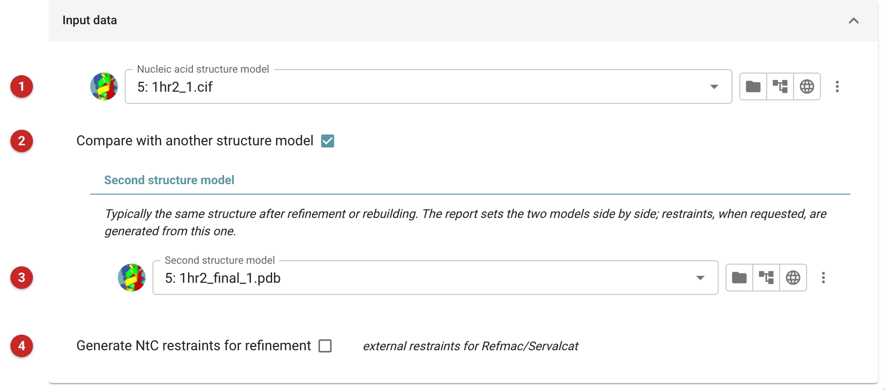
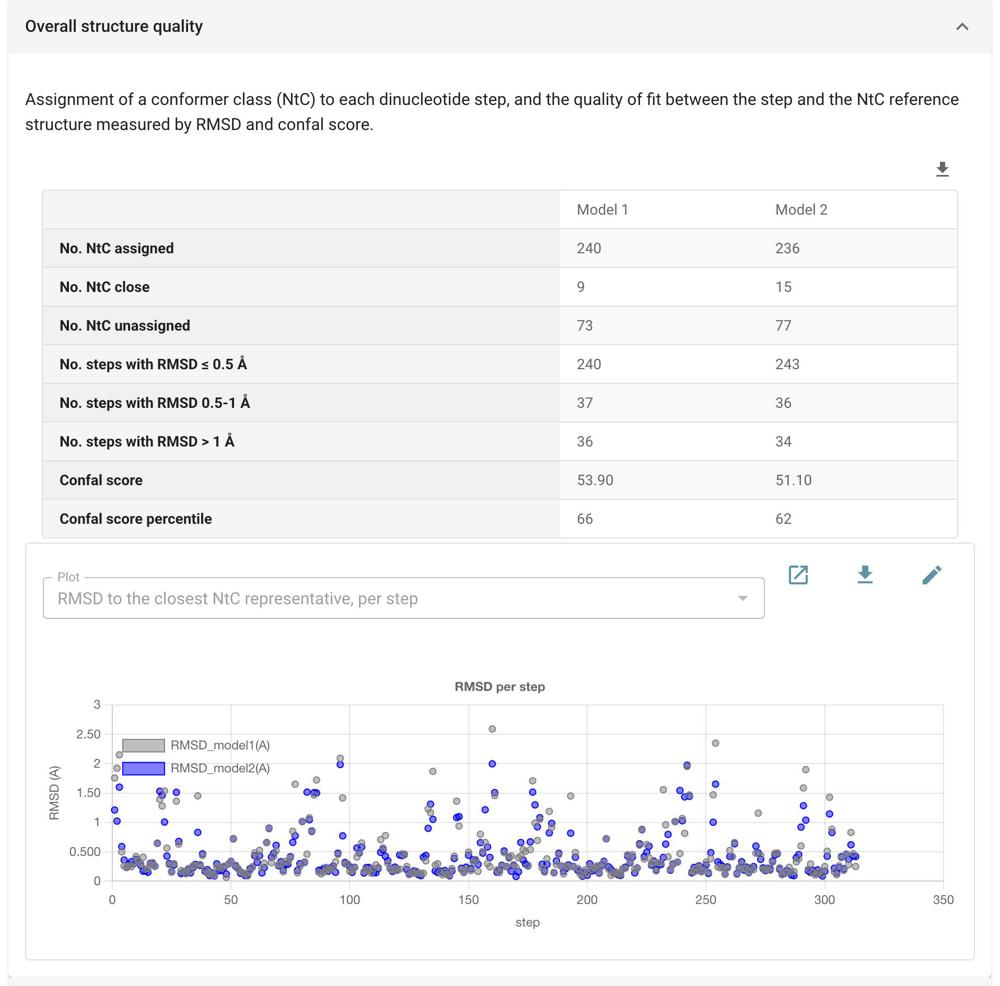
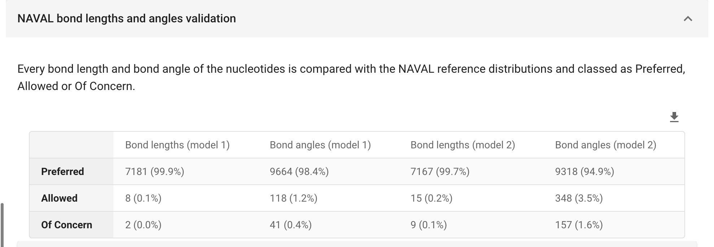

#############################################################
DNATCO: validate nucleic acid conformation, and restrain it
#############################################################

   DNATCO judges the backbone of a DNA or RNA model the way Ramachandran
   statistics judge a protein's. It cuts the model into dinucleotide steps
   and asks of each whether it matches one of the known conformer classes,
   the *NtC* classes, a "dinucleotide alphabet" describing both RNA and DNA. A step that matches none is an outlier: a
   place where the backbone has been built, or refined, into a shape the
   reference structures do not show. DNATCO also checks every bond length
   and angle against the NAVAL reference distributions. It can give the
   conformer classes back as external restraints for the next round of
   refinement.

   Use it on a nucleic acid model after building or refinement, to find
   the steps worth a second look; or on the same structure before and
   after a refinement, to see whether the backbone got better or worse.
   For protein models use :doc:`../validate_protein/index`. DNATCO needs at
   least one nucleic acid residue in each model, and says so before the
   job starts when there is none.

   The pictures on this page come from the P4-P6 domain of the
   *Tetrahymena* group I intron RNA (PDB entry 1hr2). Model 1 is the
   deposited structure; model 2 is its PDB-REDO re-refinement
   (``1hr2_final.pdb``).

.. note::

   This page is a draft, written from the task's interface, parameters
   and code and from one run. It has not yet been reviewed by the
   developers of DNATCO.

Input
=====

   Figure 1: DNATCO input

The model to validate **(1)**. To set two models side by side, switch on
*Compare with another structure model* **(2)**: the field for the second
model **(3)** appears only then. Typically the second is the same
structure after refinement or rebuilding, so the report shows what the
refinement did.

*Generate NtC restraints for refinement* **(4)** is off by default. When
on, two more parameters appear: the *maximum allowed NtC RMSD* (default
0.5 Å), beyond which a step is too far from every NtC class to be
restrained, and the *restraints sigma factor* (default 1.0), which
multiplies the sigma of every restraint, so a larger value gives weaker
restraints. When two models are compared the restraints are made from the
second one, the model about to be refined further.

Results
=======

DNATCO's report has two parts. The first folds open by default.

   Figure 2: Overall structure quality

**Overall structure quality.** For each model: how many dinucleotide
steps were assigned an NtC class, how many were left unassigned but were
*close* (within 0.5 Å RMSD of a class, so likely to be improvable by
refinement), how many were unassigned, and the steps binned by their RMSD
to the closest NtC reference. The *confal score* and its percentile
summarise the fit of the whole model to the reference structures; the
percentile is as the report prints it, and DNATCO's own documentation
defines it.

Below it, the *Dinucleotide outliers* table lists every unassigned
step with the NtC class it comes closest to and its RMSD, and *Improvable
dinucleotide outliers* the subset within 0.5 Å. Those are the first steps
to rebuild or to restrain. An *All dinucleotides* fold, closed by default,
lists every step. DNATCO's web server (linked in the report) gives a more
detailed analysis of a step.

   Figure 3: NAVAL bond lengths and angles

**NAVAL bond lengths and angles.** Each bond length and bond angle is
classed Preferred, Allowed or Of Concern against the NAVAL reference
distributions, with the counts and percentages per model. The terms of
concern are listed below, up to 100 each of bond lengths and bond
angles, sorted by tier and then by ProSco, a probability score for which
lower means less likely. With two models, only the second is listed.

What came out for 1hr2
----------------------

By DNATCO the re-refined model is slightly *worse* than the deposited
one:

* confal score 53.9 (66th percentile) for the deposited model, 51.1 (62nd
  percentile) for the re-refined one;
* 240 of 313 steps assigned an NtC class in model 1, 236 in model 2;
  73 outliers against 77, and 9 improvable outliers against 15;
* NAVAL bond angles of concern: 41 (0.4%) against 157 (1.6%); bond
  lengths of concern 2 against 9.

That is what this comparison found, not a general claim about PDB-REDO.
It does show that a refinement that improves R-free need not improve the
conformation of a nucleic acid backbone, which is why this check is worth
making. A difference of a few steps out of 313 is small; the NAVAL angle
counts, a four-fold rise, are the clearer signal.

Outputs
-------

Per model, the job writes the model as mmCIF with the NtC assignments
added (*Model 1 / Model 2 with DNATCO NtC assignments*) and the NAVAL
validation as JSON. With restraints requested it also writes one
restraints file, annotated *DNATCO NtC restraints for Refmac/Servalcat*
(and, when comparing, which model they come from). This run did not
request restraints, so that file is not shown here. The *What next*
suggestion at the foot of the report is the Servalcat refinement task.
This page does not describe how to hand the restraints file to a
refinement: no input for it was found in the Servalcat task's interface
when this page was written.

**Reference**

`Černý, J., Božíková, P., Svoboda, J. & Schneider, B. (2020). A unified
dinucleotide alphabet describing both RNA and DNA structures. Nucleic
Acids Res. 48, 6367-6381. <https://doi.org/10.1093/nar/gkaa383>`_
