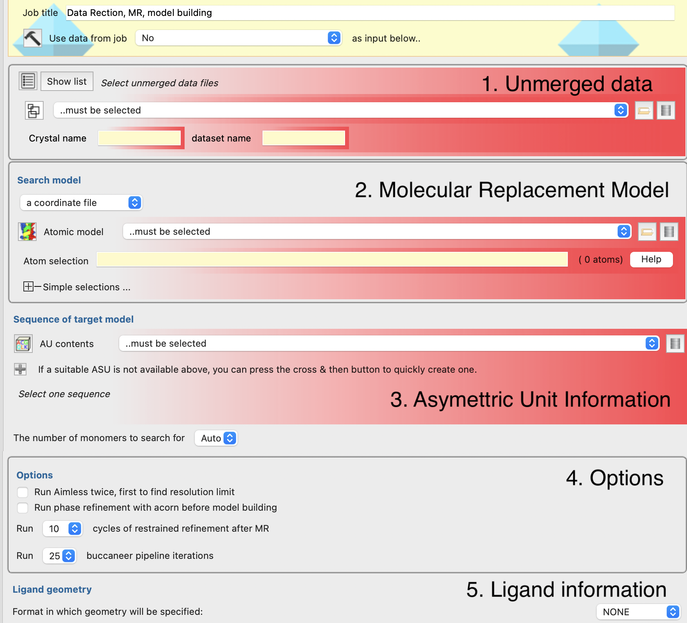
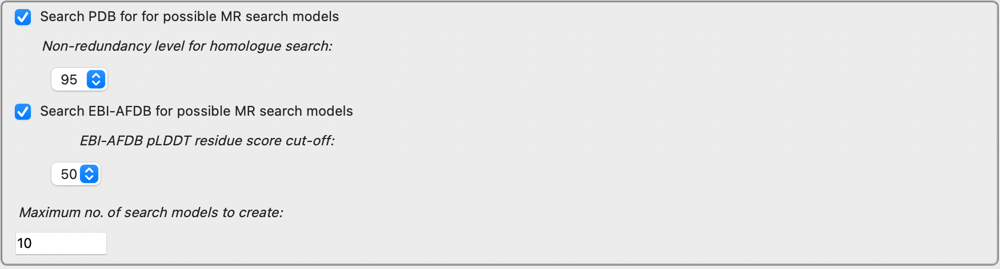
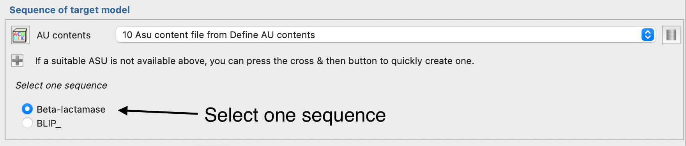
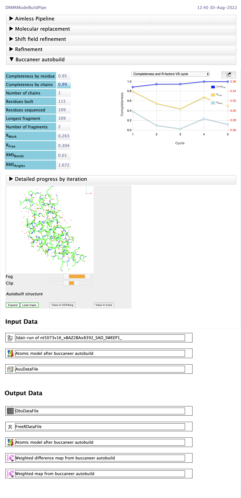

##########
Data reduction, molecular replacement and model building pipeline
##########

This is a pipeline for building a structure starting from unmerged data, an asymmetric unit
description (set of sequences), and optionally a molecular replacement search model and ligand
dictionary. It is intended for simple cases where manual intervention or specifying less common
options is not necessary for structure solution. The pipeline will run in both hands of enantiomorphic
space groups and choose the better of the 2 solutions from model building.

The pipeline performs the following steps:

#. Data reduction using the `AIMLESS data reduction pipeline <../aimless_pipe/aimless_pipe.html>`_ .
#. Molecular replacement using `MOLREP <../molrep_pipe/index.html>`_ either using a model provided by the user, or a model obtained from the model preparation steps of MrBUMP or MrParse.
#. Model building with the `BUCCANEER pipeline <../buccaneer_build_refine_mr/index.html>`_ .
#. Optional ligand fitting with COOT. The ligand description may be provided as a REFMAC5 dictionary or generated using ACEDRG from a variety of inputs (including SMILES string).

Input options
=============
|input_options|

The input options are in 5 categories:

1. **The unmerged data**: This is the same as the input option in the `AIMLESS pipeline <../aimless_pipe/aimless_pipe.html>`_. Typically the user would provide an input file, but it is also possible to select unmerged data that was input to another task.
2. **The molecular replacement search model**: This can be a user-supplied file from any source, including but not limited to input/output from other jobs. If the "Search model" dropdown menu is changed to "MrBump model search", then one of the sequences specified in the Asymmetric Unit in Section 3 will be used as input to the model preparation steps of MrBUMP; MrBUMP can search both the AlphaFold and EBI databases for homologues of the chosen sequence. Consult the MrBUMP documentation for explanation of the "Non-redundancy level for homologue search" and "EBI-AFDB pLDDT residue score cut off" options. If the "Search model" dropdown menu is changed to "MrParse model search", then MrPARSE is used to search for a homologue, there are no options passed to MrPARSE at present.
3. **Sequence of target**: This is specified as one sequence from an asymmetric unit description. Use a "Define AU contents" job to create an ASU description and then specify one of the sequences in the ASU.
4. **Options**: There are options on: whether or not to run AIMLESS twice to find better resolution limit; whether or not to phase refinment with ACORN post-MR; refinement cycles post-MR and iterations of the `BUCCANEER pipeline <../buccaneer_build_refine_mr/index.html>`_.
5. **Ligand information**: Here the user can specify a ligand description in the same was as in the "Make Ligand - AceDRG" task.

|mrmumb_options|
Appearance of the Molecular Replacement section when MrBUMP is used to prepare model.

|mrparse_target|
Appearance of the Molecular Replacement section when MrParse is used to prepare model.

|pick_sequence|
Picking a single sequence from more than one in asymmetric unit contents.

Results
=======
|results|
As each step of the pipeline progresses the report page show the report for the current step (up to model building).
At the end the model building with BUCCANEER report is shown. There are collapsed folds above containing the AIMLESS, MOLREP, Shift field
refinement and REFMAC5 reports. These are explained in the documentation of the `AIMLESS pipeline <../aimless_pipe/aimless_pipe.html>`_ , `MOLREP <../molrep_pipe/index.html>`_ and `BUCCANEER pipeline <../buccaneer_build_refine_mr/index.html>`_.
documentation.

Reference
=========

| How good are my data and what is the resolution?  
| Evans, P. R.  and Murshudov, G. N. *Acta Cryst. D* **69** (2013)
| `https://doi.org/10.1107/S0907444913000061 <https://10.1107/S0907444913000061>`_

| An introduction to data reduction: space-group determination, scaling and intensity statistics.
| Evans, P. R. *Acta Cryst. D* **67** (2011)
| `https://doi.org/10.1107/S090744491003982X <https://10.1107/S090744491003982X>`_

| Measuring and using information gained by observing diffraction data.
| Read, R. J. and Oeffner, R. D.  and McCoy, A. J.  *Acta Cryst. D* **67** (2011)
| `https://doi.org/10.1107/S2059798320001588 <10.1107/S2059798320001588>`_

| Molecular replacement with MOLREP.
| Vagin, A. and Teplyakov, A. *Acta Cryst. D* **66** (2010)
| `https://doi.org/10.1107/S0907444909042589 <https://10.1107/S0907444909042589>`_

| Model preparation in MOLREP and examples of model improvement using X-ray data.
| Lebedev, A. A, and  Vagin, A. and Murshudov, G, N. *Acta Cryst. D* **64** (2008)
| `https://doi.org/10.1107/S0907444907049839 <10.1107/S0907444907049839>`_

| Completion of autobuilt protein models using a database of protein fragments.
| Cowtan, K. *Acta Cryst. D* **68** (2012)
| `https://doi.org/10.1107/S0907444911039655 <https://10.1107/S0907444911039655>`_

| The Buccaneer software for automated model building. 1. Tracing protein chains.
| Cowtan, K. *Acta Cryst. D* **62** (2006)
| `https://doi.org/10.1107/S0907444906022116 <https://10.1107/S0907444906022116>`_

| Overview of refinement procedures within REFMAC5: utilizing data from different sources.
| Kovalevskiy, O. and Nicholls, R. A. and Long, F. and Carlon, A. and Murshudov, G. N. *Acta Cryst. D* **74** (2018)
| `https://doi.org/10.1107/S2059798318000979 <https://10.1107/S2059798318000979>`_

| REFMAC5 for the refinement of macromolecular crystal structures.
| Murshudov, G. N. and Skubák, P. and Lebedev, A. A.and Pannu, N. S. and Steiner, R. A. and Nicholls, R. A. and Winn, M. D. and Long, F. and Vagin, A. A. *Acta Cryst. D* **67** (2011)
| `https://doi.org/10.1107/S0907444911001314 <https://10.1107/S0907444911001314>`_

| Refinement of macromolecular structures by the maximum-likelihood method.
| Murshudov, G. N. and Vagin A. A. and Dodson, E. J. *Acta Cryst. D* **53** (1997)
| `https://doi.org/10.1107/S0907444996012255 <https://10.1107/S0907444996012255>`_

| Low-resolution refinement tools in REFMAC5.
| Nicholls, R. A. and Long, F. and Murshudov, G. N. *Acta Cryst. D* **68** (2012)
| `https://doi.org/10.1107/S090744491105606X <https://10.1107/S090744491105606X>`_

| REFMAC5 dictionary: organization of prior chemical knowledge and guidelines for its use.
| Vagin, A. A. and Steiner, R. A. and Lebedev, A. A. and Potterton, L. and McNicholas, S. and Long, F. and Murshudov, G. N. *Acta Cryst. D* **60** (2004)
| `https://doi.org/10.1107/S0907444904023510 <https://10.1107/S0907444904023510>`_

| Efficient anisotropic refinement of macromolecular structures using FFT.
| Murshudov, G. N. and Vagin A. A. and Lebedev A. and Wilson, K. S. and Dodson, E J. *Acta Cryst. D* **55** (1999)
| `https://doi.org/10.1107/S090744499801405X <https://10.1107/S090744499801405X>`_

| Macromolecular TLS refinement in REFMAC at moderate resolutions.
| Winn, M. D and Murshudov, G. N. and Papiz, M. Z. *Methods in enzymology* **374** (2003)
| `https://doi.org/10.1016/S0076-6879(03)74014-2 <https://10.1107/10.1016/S0076-6879(03)74014-2>`_

| MrBUMP: an automated pipeline for molecular replacement.
| Keegan, R. M and Winn, M. D. *Acta Cryst. D* **64** (2008)
| `https://doi.org/10.1107/S0907444907037195 <https://10.1107/S0907444907037195>`_

| Features and development of Coot.
| Emsley P. and Lohkamp, B. and Scott, W. G. and Cowtan, K. *Acta Cryst. D* **66** (2010)
| `https://doi.org/10.1107/S0907444910007493 <https://10.1107/S0907444910007493>`_

| Handling ligands with Coot.
| Debreczeni, J. É. and Emsley, P. *Acta Cryst. D* **68** (2012)
| `https://doi.org/10.1107/S0907444912000200 <https://10.1107/S0907444912000200>`_

| AceDRG: a stereochemical description generator for ligands.
| Long, F., Nicholls, R. A., Emsley, Graǽulis, P. S. and Merkys A., Vaitkus A. and Murshudov, G. N. *Acta Cryst. D* **73** (2017)
| `https://doi.org/10.1107/S2059798317000067 <https://10.1107/S2059798317000067>`_
