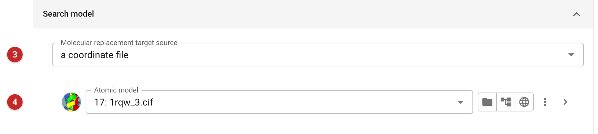
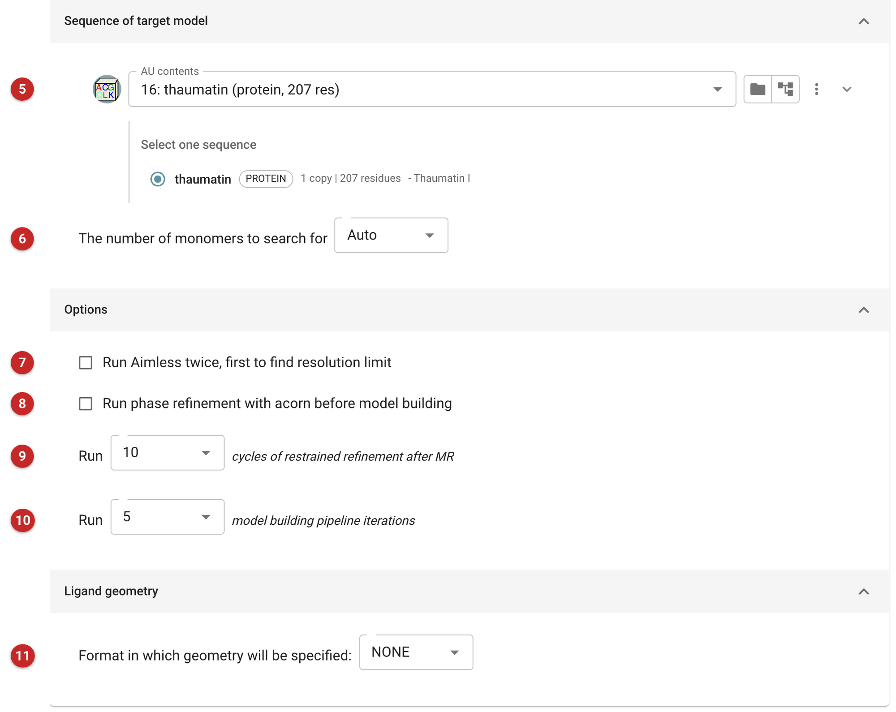
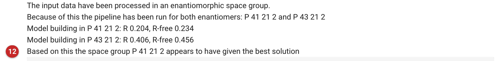

#################################################################
Data reduction, molecular replacement and model building pipeline
#################################################################

This pipeline takes a structure from reflections to a built model in one
job: it scales the data, places a search model by molecular replacement,
refines, and rebuilds with ModelCraft. It is for the straightforward case,
where you have the data, the sequence of what crystallised and a model (or
a way to find one) and want no decisions in between. Its distinctive
service is the enantiomorphic space groups: when the data cannot say which
hand of the space group is right (P 4\ :sub:`1`\ 2\ :sub:`1`\ 2 or
P 4\ :sub:`3`\ 2\ :sub:`1`\ 2, say), it runs the whole route in both and
keeps the one that builds and refines better.

Use the separate tasks instead when you need control: a particular space
group or resolution cutoff, several search models compared, a search model
placed in more than one copy with care, or a model you intend to rebuild by
hand. Everything the pipeline does is also in the job's sub-jobs, which can
be read (and their reports opened) from the job's directory.

The pipeline performs the following steps:

#. Data reduction of unmerged data with the :doc:`AIMLESS pipeline
   <../aimless_pipe/aimless_pipe>` (or, for merged data, the data are used as
   they come).
#. Molecular replacement with MOLREP, using the model you provide or one
   prepared by MrBUMP or MrParse.
#. Coordinate-shift refinement with Sheetbend, then
   restrained refinement with REFMAC5.
#. Optionally, phase refinement with ACORN.
#. Model building and refinement with :doc:`ModelCraft <../modelcraft/index>`.
#. Optionally, ligand fitting with Coot, using a restraint dictionary you
   provide or one made by AceDRG.

The pictures on this page come from the Thaumatin project of the data
reduction route. The data are the 300 integrated images of a thaumatin
crystal from the :doc:`xia2 with DIALS <../xia2_dials/index>` job; the
model is thaumatin itself (PDB 1rqw), which is an easy case chosen to show
the whole route working. With a distant homologue the molecular replacement
and the build would have more to do, and the numbers below would be poorer.

Input
=====

   Figure 1: the input data

**The data.** The *Input data type* menu **(1)** chooses what you have, and
each choice shows its own fields:

- *Unmerged data (aimless pipeline)*: one or more unmerged reflection files
  **(2)**, as in the :doc:`AIMLESS pipeline <../aimless_pipe/aimless_pipe>`.
  This is the choice that lets the pipeline decide the space group, and the
  only one that does the enantiomorph test. Here the file is the integrated,
  unmerged output of the xia2 job.
- *Merged data (from 'import merged' job)*: the observations and the
  free-R set from an earlier import job.
- *Import merged*: a merged reflection file, imported by the pipeline
  itself.

   Figure 2: the search model

**The search model.** *Molecular replacement target source* **(3)** has
three choices:

- *a coordinate file*: the model you give **(4)**, from any source,
  including the output of another job. Use this when you already have a
  model. Here it is the thaumatin structure itself.
- *MrBUMP model search*: the pipeline passes the sequence you choose below
  to MrBUMP's model preparation, which finds homologues, trims and prepares
  them, and offers searches of the PDB and of the AlphaFold models in the
  EBI database (each can be switched off). The options are the
  non-redundancy level of the homologue search, the pLDDT cut-off for the
  AlphaFold models, and the largest number of search models to create. The
  pipeline uses the model MrBUMP lists first; see the MrBUMP documentation
  for what the levels mean.
- *MrParse model search*: MrParse looks for homologues of the sequence; it
  has no options here. The pipeline uses the first model MrParse lists.

   Figure 3: the sequence, the options and the ligand

**The sequence.** *AU contents* **(5)** is a "Define AU contents" job. If it
holds several sequences, pick the one to search with (this is also the one
given to MrBUMP or MrParse); ModelCraft is given the whole contents, so it can
build every chain. *The number of monomers to search for* **(6)** is left at
*Auto* unless you know it.

**Options.**

- *Run Aimless twice* **(7)**: the first run finds the resolution limit and
  the second uses it. Leave it off when you have already chosen a cutoff.
- *Run phase refinement with acorn* **(8)**: phases from the refined model
  are improved by ACORN before building. It is off by default.
- *Cycles of restrained refinement after MR* **(9)**: the number of REFMAC5
  cycles (10 by default).
- *Model building pipeline iterations* **(10)**: the number of ModelCraft
  cycles. The default is 25; the demonstration used 5, enough for a model
  that is already close. In the run shown the best cycle was
  the fourth of five.

**Ligand geometry** **(11)**. Leave it at *NONE* if there is no ligand, and no
ligand is fitted. Otherwise say how the ligand is described: an MDL Mol
file, a REFMAC dictionary, a SMILES string, or a LIDIA sketch. Unless you
give a dictionary, AceDRG makes one (with the three-letter code DRG). After
the build, Coot searches the map for the ligand and adds what it finds to
the model. Check the result by eye: it is an automatic fit.

The *Advanced options* tab only notes that model building uses the ModelCraft
pipeline.

Results
=======

The report shows each step as it finishes, and the sub-jobs' own reports
are folded above the final one. They are explained on the pages for
:doc:`AIMLESS <../aimless_pipe/aimless_pipe>`, :doc:`MOLREP <../molrep_pipe/index>`,
REFMAC5 and :doc:`ModelCraft <../modelcraft/index>`.

**What the thaumatin run did.** AIMLESS scaled the data (to 1.17 Å) and
POINTLESS found the space group P 4\ :sub:`1`\ 2\ :sub:`1`\ 2 with its
enantiomorph, P 4\ :sub:`3`\ 2\ :sub:`1`\ 2, equally likely, a warning that
"you will have to resolve the enantiomorphic ambiguity later". So the
pipeline did molecular replacement, Sheetbend and REFMAC5 in each, and then
ModelCraft in each:

.. list-table::
   :header-rows: 1

   * -
     - P 4\ :sub:`1`\ 2\ :sub:`1`\ 2
     - P 4\ :sub:`3`\ 2\ :sub:`1`\ 2
   * - REFMAC5 R-free after MR
     - 0.332 to 0.281
     - stays at 0.46
   * - ModelCraft R / R-free
     - 0.204 / 0.234
     - 0.406 / 0.456
   * - ModelCraft residues, waters
     - 207, 145
     - 207, 106

The report opens with this comparison **(12)**, and the line marked 12 names
the hand the pipeline kept.

   Figure 4: the choice of space group, at the top of the report

The two hands are easy to tell apart: in the right hand R-free falls and the
model builds to a working structure, while in the wrong hand it never leaves
0.46, a model that has not found the structure. The pipeline chooses by the R-free of the ModelCraft models, so it
chose P 4\ :sub:`1`\ 2\ :sub:`1`\ 2.

**The outputs.** Everything for the chosen hand is marked BEST in its
annotation: the observations and free-R set (*Observations in spacegroup
P 41 21 2 BEST*), the atomic model, and the weighted and difference maps
from ModelCraft. The observations and free-R set for the other hand are kept
too, labelled with its space group, so you can tell which is which when you
carry on. The model and both maps are in the chosen space group, and the
observations and free set can go straight into refinement or rebuilding with
them. When the data have no enantiomorph there is a single route and no
BEST label.

**What to do next.** Look at the model and the difference map, then continue
with refinement (REFMAC5 or Servalcat) and rebuilding in Coot or Moorhen for
what ModelCraft left unbuilt.

Reference
=========

| How good are my data and what is the resolution?  
| Evans, P. R.  and Murshudov, G. N. *Acta Cryst. D* **69** (2013)
| `https://doi.org/10.1107/S0907444913000061 <https://10.1107/S0907444913000061>`_

| An introduction to data reduction: space-group determination, scaling and intensity statistics.
| Evans, P. R. *Acta Cryst. D* **67** (2011)
| `https://doi.org/10.1107/S090744491003982X <https://10.1107/S090744491003982X>`_

| Measuring and using information gained by observing diffraction data.
| Read, R. J. and Oeffner, R. D.  and McCoy, A. J.  *Acta Cryst. D* **67** (2011)
| `https://doi.org/10.1107/S2059798320001588 <10.1107/S2059798320001588>`_

| Molecular replacement with MOLREP.
| Vagin, A. and Teplyakov, A. *Acta Cryst. D* **66** (2010)
| `https://doi.org/10.1107/S0907444909042589 <https://10.1107/S0907444909042589>`_

| Model preparation in MOLREP and examples of model improvement using X-ray data.
| Lebedev, A. A, and  Vagin, A. and Murshudov, G, N. *Acta Cryst. D* **64** (2008)
| `https://doi.org/10.1107/S0907444907049839 <10.1107/S0907444907049839>`_

| Overview of refinement procedures within REFMAC5: utilizing data from different sources.
| Kovalevskiy, O. and Nicholls, R. A. and Long, F. and Carlon, A. and Murshudov, G. N. *Acta Cryst. D* **74** (2018)
| `https://doi.org/10.1107/S2059798318000979 <https://10.1107/S2059798318000979>`_

| REFMAC5 for the refinement of macromolecular crystal structures.
| Murshudov, G. N. and Skubák, P. and Lebedev, A. A.and Pannu, N. S. and Steiner, R. A. and Nicholls, R. A. and Winn, M. D. and Long, F. and Vagin, A. A. *Acta Cryst. D* **67** (2011)
| `https://doi.org/10.1107/S0907444911001314 <https://10.1107/S0907444911001314>`_

| Refinement of macromolecular structures by the maximum-likelihood method.
| Murshudov, G. N. and Vagin A. A. and Dodson, E. J. *Acta Cryst. D* **53** (1997)
| `https://doi.org/10.1107/S0907444996012255 <https://10.1107/S0907444996012255>`_

| Low-resolution refinement tools in REFMAC5.
| Nicholls, R. A. and Long, F. and Murshudov, G. N. *Acta Cryst. D* **68** (2012)
| `https://doi.org/10.1107/S090744491105606X <https://10.1107/S090744491105606X>`_

| REFMAC5 dictionary: organization of prior chemical knowledge and guidelines for its use.
| Vagin, A. A. and Steiner, R. A. and Lebedev, A. A. and Potterton, L. and McNicholas, S. and Long, F. and Murshudov, G. N. *Acta Cryst. D* **60** (2004)
| `https://doi.org/10.1107/S0907444904023510 <https://10.1107/S0907444904023510>`_

| Efficient anisotropic refinement of macromolecular structures using FFT.
| Murshudov, G. N. and Vagin A. A. and Lebedev A. and Wilson, K. S. and Dodson, E J. *Acta Cryst. D* **55** (1999)
| `https://doi.org/10.1107/S090744499801405X <https://10.1107/S090744499801405X>`_

| Macromolecular TLS refinement in REFMAC at moderate resolutions.
| Winn, M. D and Murshudov, G. N. and Papiz, M. Z. *Methods in enzymology* **374** (2003)
| `https://doi.org/10.1016/S0076-6879(03)74014-2 <https://10.1107/10.1016/S0076-6879(03)74014-2>`_

| MrBUMP: an automated pipeline for molecular replacement.
| Keegan, R. M and Winn, M. D. *Acta Cryst. D* **64** (2008)
| `https://doi.org/10.1107/S0907444907037195 <https://10.1107/S0907444907037195>`_

| Features and development of Coot.
| Emsley P. and Lohkamp, B. and Scott, W. G. and Cowtan, K. *Acta Cryst. D* **66** (2010)
| `https://doi.org/10.1107/S0907444910007493 <https://10.1107/S0907444910007493>`_

| Handling ligands with Coot.
| Debreczeni, J. É. and Emsley, P. *Acta Cryst. D* **68** (2012)
| `https://doi.org/10.1107/S0907444912000200 <https://10.1107/S0907444912000200>`_

| AceDRG: a stereochemical description generator for ligands.
| Long, F., Nicholls, R. A., Emsley, Graǽulis, P. S. and Merkys A., Vaitkus A. and Murshudov, G. N. *Acta Cryst. D* **73** (2017)
| `https://doi.org/10.1107/S2059798317000067 <https://10.1107/S2059798317000067>`_
