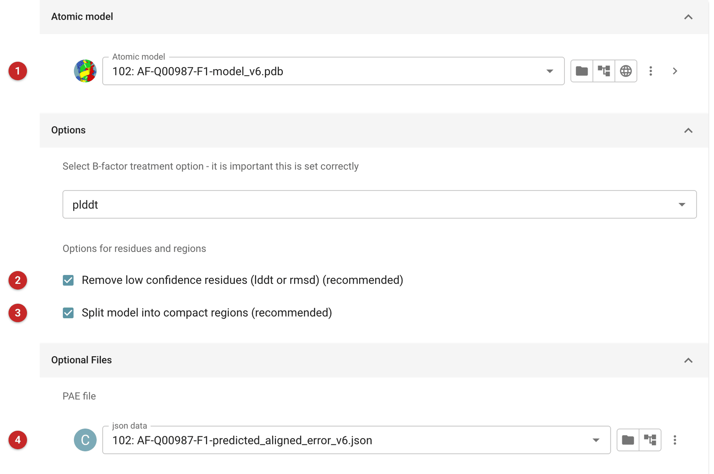
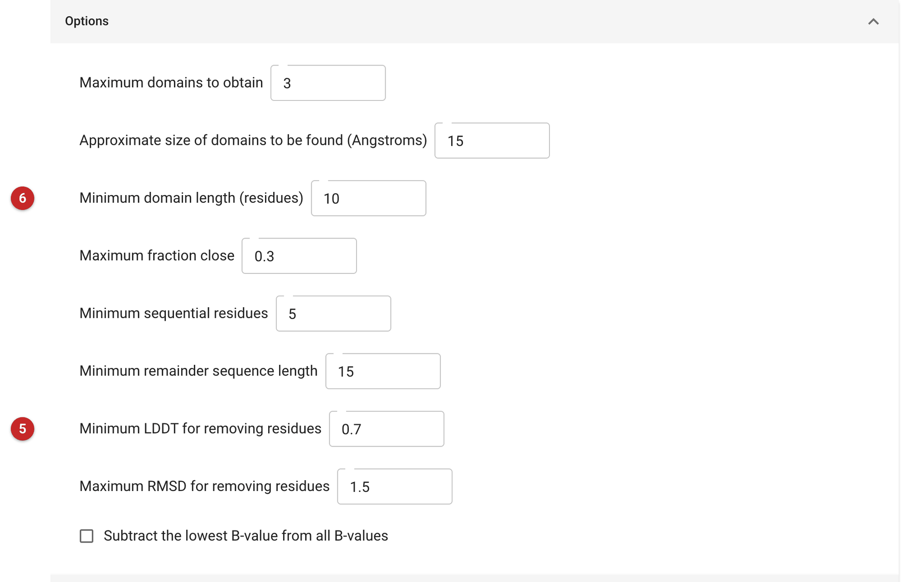
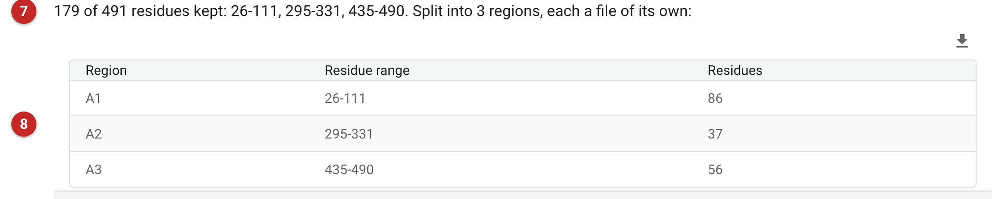

########################
Process Predicted Models
########################

A model from AlphaFold or RoseTTAFold is rarely fit to go straight into
molecular replacement. Its B-factor column does not hold B-factors: it
holds the program's confidence (pLDDT for AlphaFold, an estimated error for
RoseTTAFold), and much of a typical model is predicted with low confidence
and in no reliable position relative to the rest. This task turns the
confidence into estimated B-factors, removes the residues that were
predicted badly, and splits what is left into compact regions, each written
as a file of its own. The methods are those of the CCTBX library, which i2
uses.

Use it when you have a predicted model and want to choose what to search
with. It does not use your data or your crystal, so it cannot say which
region will be found: that is for the molecular-replacement task that
follows (:doc:`../phaser_mr_phil/index`). To edit a *homologue's*
model by an alignment (not a predicted model by its confidence) use
Sculptor or Chainsaw. SliceNDice does this preparation itself and then runs
Phaser with each of the pieces; use this task when you want to see and
choose the pieces yourself.

The pictures on this page come from the MDM2 project. The model is the
AlphaFold DB entry for human MDM2 (UniProt Q00987, file
``AF-Q00987-F1-model_v6.pdb``), all 491 residues, with its PAE file
(``AF-Q00987-F1-predicted_aligned_error_v6.json``). The crystal in that
project (4HG7) holds only the N-terminal domain of MDM2.

Input
=====

   Figure 1: Process Predicted Models input

The model **(1)** in Figure 1 will typically have been produced by AlphaFold or
RoseTTAFold; import it first. If a file holds several models, the first in
the file (by convention the best estimate) is used.

Under *Options*, the menu beneath "Select B-factor treatment option" says
what the B-factor column of the file holds: ``plddt`` for AlphaFold,
``rmsd`` for RoseTTAFold, or ``b_value`` for a file that already has real
B-factors, which you can still use to remove low-confidence regions and/or
split the model. It is very important that this is right: if it is set
incorrectly for the file the conversion will not work, and an error
reported may be the reason. Here it is ``plddt``.

Two options say what is done to the model. *Remove low confidence
residues* **(2)** deletes the poorly predicted residues, and *Split model
into compact regions* **(3)** divides what is left into regions. Both are
on by default and recommended; turn either off to keep the whole model or
to remove residues without splitting.

Under *Optional Files*, a PAE file **(4)** (predicted aligned error) gives,
for each pair of residues, the error in the position of one when the model
is aligned on the other. Give it when you have it: AlphaFold DB supplies
one with every model, and the splitting then uses it. A *distance model*
may also be given; if so, switch on weighting by C-alpha distance in the
additional settings.

Additional settings
-------------------

   Figure 2: Additional settings

These (Figure 2) tune the removal of residues and the splitting: the maximum
number of domains, the approximate size of a domain (in Angstroms) and its
minimum length in residues, and the confidence limits for removing residues,
the minimum LDDT **(5)** for pLDDT input and the maximum RMSD for RoseTTAFold
input. Short stretches shorter than the *Minimum domain length* **(6)** are
discarded. Further down are boxes of settings used only when a PAE file
(power, cutoff and graph resolution) or a distance model is given. The
defaults are a good place to start; change them if the model is being
split into pieces that are too small or too many.

Results
=======

   Figure 3: Process Predicted Models report

The report (Figure 3) begins with how much of the model was kept **(7)**: here
179 of the 491 residues, in the ranges 26-111, 295-331 and 435-490. Below it is
a table of the regions **(8)**, one row each, with its residue range and
number of residues. The log from CCTBX is in a fold below it.

The outputs are PDB files: the *processed model* (all the residues kept,
split into chains A1, A2 and so on) and one file for each region
(``converted_model_chainA1.pdb`` and so on). They are annotated in the
output list, for example "Processed model: 179 of 491 residues kept" and
"Domain A1: residues 26-111 (86 residues)". There can be several files,
depending on the settings and how the model was split.

What to do with them
--------------------

Most of the residues were not kept: here 312 of the 491, those predicted
with low confidence and some short stray segments.
The three regions that remain are, in UniProt's annotation of Q00987, its
SWIB/MDM2 domain (26-109), a RanBP2-type zinc finger (299-328) and a
RING-type zinc finger (438-479). The prediction can place a domain
accurately and still be wrong about where it sits relative to the others,
which is what the splitting by PAE guards against.

Choose the region by what is in your crystal, not by taking the whole
processed model. The crystal here holds the N-terminal domain, so region
A1 (residues 26-111) is the search model to take into molecular
replacement. The whole processed model, with the other two domains in
their predicted positions, would put into the search the parts of the
structure that are not in the crystal. Give the chosen file to Phaser as
its model.

**Reference**

The methodology used to convert the pLDDT and rmsd values (output by
AlphaFold 2 and RoseTTAFold) into B-factors for use in MR is described in
the `RoseTTAFold paper
<https://www.ipd.uw.edu/2021/07/rosettafold-accurate-protein-structure-prediction-accessible-to-all/>`__.

1. Accurate prediction of protein structures and interactions using a
   3-track network., Baek M., et al., Science, Vol.373, Issue 6557,
   pp871-876 (2021).
