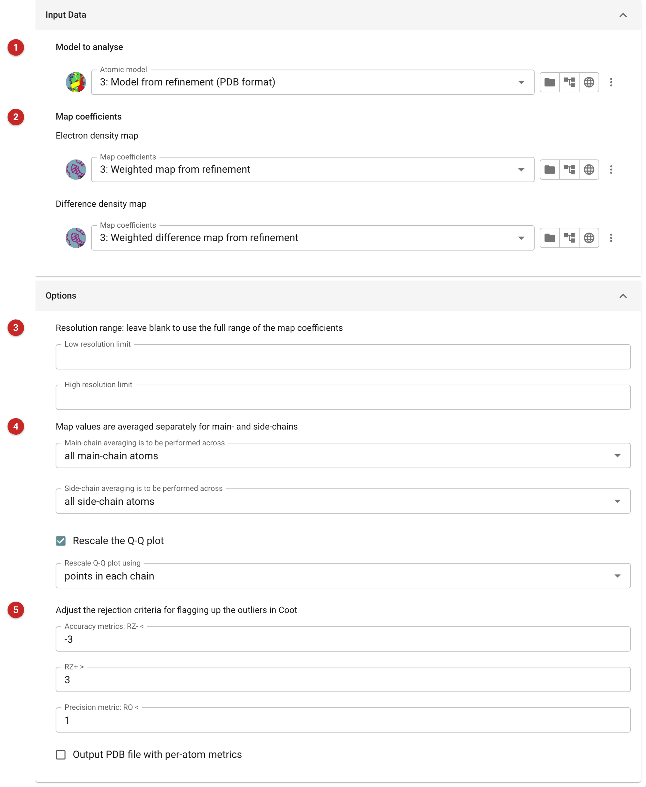
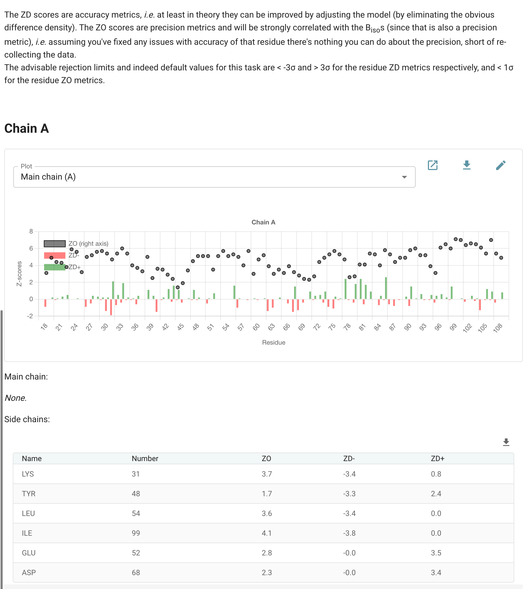
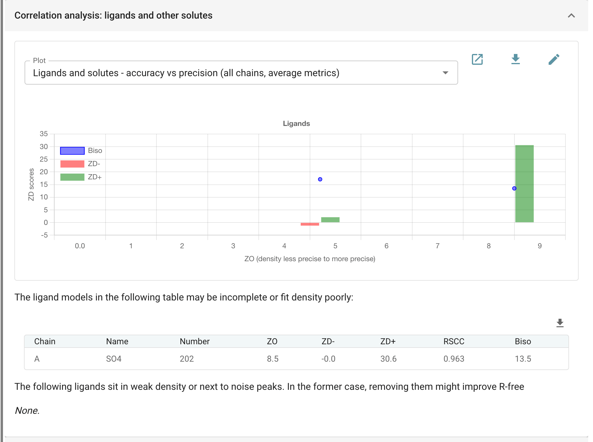

#####################################################
Analyse agreement between model and density (edstats)
#####################################################

*EDSTATS* measures, residue by residue, how well a model agrees with its
electron density. For each residue (main chain and side chain separately)
it calculates:

- **ZD-** and **ZD+**, accuracy metrics from the difference map: large
  negative values mean density the model claims but the data do not
  support; large positive values mean density the model does not explain.
  These can in principle be fixed, by rebuilding the model.
- **ZO**, a precision metric from the 2mFo-DFc map: how well defined the
  density is. It is strongly correlated with the B-factors, and short of
  better data there is nothing to be done about it.

Residues whose metrics fall outside the chosen limits are flagged, and
can be sent to Coot or Moorhen as a list of places to look.

The pictures on this page analyse MDM2 with Nutlin-3a after refinement
(see the *Refinement* page), from the Ligand Tutorial data that comes with
CCP4i2.

Input
=====

   Figure 1: Input and options

The task needs the model to analyse **(1)** and the two sets of map
coefficients from the same refinement **(2)**: the 2mFo-DFc
(electron density) and mFo-DFc (difference density) maps. Following a
refinement job, all three are filled in from it.

The resolution range **(3)** is by default that of the map coefficients;
set limits here to analyse a narrower range.

Map values are averaged separately over the main chain and the side
chains of each residue **(4)**, by default over all their atoms. The
Q-Q plot, from which the Z-scores are derived, can be rescaled over the
points in each chain (the default) or over all points.

The rejection limits **(5)** decide which residues are flagged as
outliers: by default ZD- below -3σ or ZD+ above 3σ (accuracy), and ZO
below 1σ (precision). The metrics can also be written per atom to a PDB
file, in the B-factor column, for colouring the model by them.

Results
=======

   Figure 2: Per-residue metrics for chain A

For each protein chain the report plots the metrics along the sequence:
ZO as points (on the right-hand axis), ZD- and ZD+ as bars, for the main
chain and, from the menu, the side chains. Below the plot the residues
outside the rejection limits are listed, main chain and side chains
separately. For MDM2, no main-chain density is out of line; four side
chains have negative difference density (ZD- below -3), which usually
means a side chain that is partly disordered or placed wrongly, and two
have positive density that the model does not explain, often an
alternative conformation.

   Figure 3: Ligands and other solutes

Waters and ligands have folds of their own. The plot sets the accuracy of
each (ZD- and ZD+ bars) against its precision (ZO), and the tables list
those that may be incomplete or fit their density poorly (large ZD+), and
those that sit in weak density or next to noise peaks (large negative
ZD-), which might be better removed. Here Nutlin-3a fits its density
well, but the sulphate A202 has a great deal of unexplained positive
density beside it (ZD+ 30.6), although the sulphate itself fits well
(RSCC 0.96): something else is bound there, or the sulphate has a second
position. It is worth a look in Coot or Moorhen, which the *Manual model
building* follow-on task opens with the flagged residues listed.
