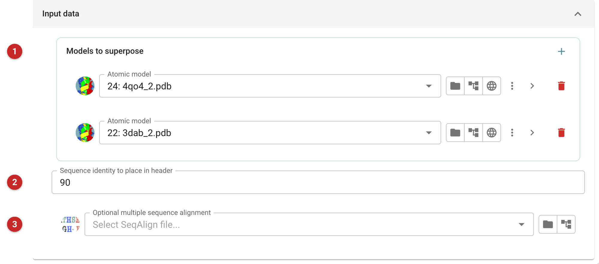
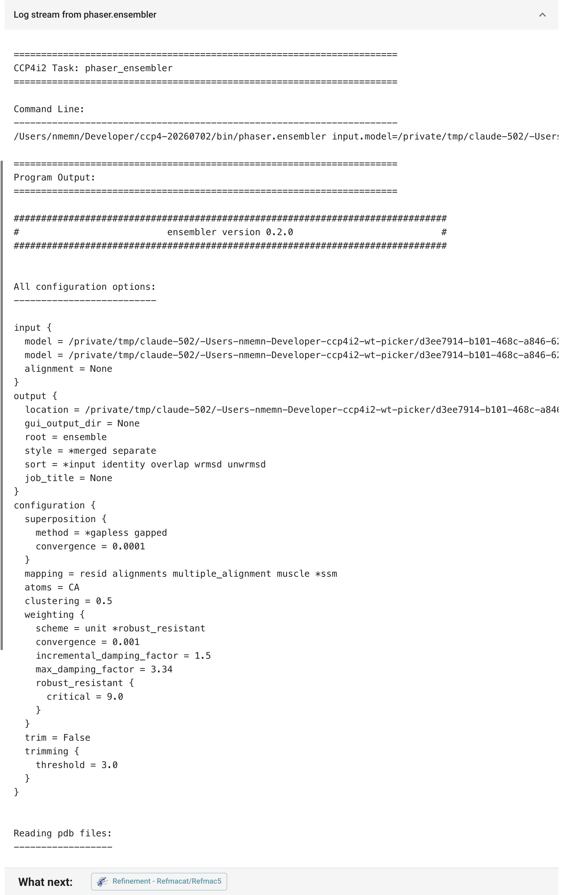

============================
Build an ensemble for Phaser
============================

Phaser must be given the models it will use for molecular replacement.
An *ensemble* is a set of superposed, sufficiently similar models used
together as one search model. Where several homologues are known, an
ensemble of them usually succeeds more often than any one of them: the
regions they agree on are weighted up, and those where they differ, which
are least likely to match the target, are weighted down.

An ensemble is a unit of structure that can be placed as a rigid body in
molecular replacement: a domain, or a whole molecule. Define an ensemble
once, however many copies of it the asymmetric unit may hold.

If a model was made by homology modelling, the error to expect is that of
the template it was built from: give the sequence identity of the
template, not of the model.

Read more on the `Phaser wiki <https://www.phaser.cimr.cam.ac.uk/index.php/Molecular_Replacement#How_to_Define_Models>`_
and in the `Phaser keywords <https://www.phaser.cimr.cam.ac.uk/index.php/Keywords#ENSEMBLE>`_.

The pictures on this page superpose MDM2 (PDB 4qo4) and its homologue MDMX
(PDB 3dab).

Input
=====

   Figure 1: Phaser ensembler input

The models to superpose **(1)**: two or more, adding one row per model with
**+**. Each model's atom selection (the arrow at the end of its row)
chooses the chains to use. The sequence identity **(2)** is written into
the ensemble's header for Phaser, which uses it to estimate the model's
error; give the identity of the models to the target. An alignment of the
models' sequences **(3)** is optional: without it the superposition
matches residues structurally.

Results
=======

   Figure 2: Phaser ensembler log

The report shows the program's log: the chains found and how they were
superposed. The superposed ensemble is the output, for Phaser's expert
molecular replacement (*Phaser pipeline*), which takes ensembles as
search models.
