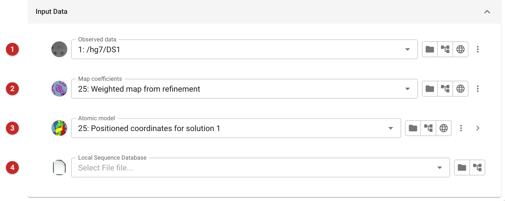

##############
FindMySequence
##############

FindMySequence identifies which protein a model belongs to when you do not
know its sequence. It looks at the shape of the electron density around the
main chain of a model, uses a neural network to say which amino acid each
residue most probably is, and searches a sequence database for the sequence
that best fits. It is aimed at X-ray and cryo-EM models of unknown proteins
(see the reference below).

Use it when you have a model (a poly-alanine trace, say, or a model built
into a map of a protein you could not name) and a map for it, and want a
candidate sequence. If you already know the sequence, do not use it: give
the sequence to the project with :doc:`../ProvideSequence/index` or
:doc:`../ProvideAsuContents/index`, which is what the building and
refinement tasks need. Once a sequence is known, building can go on with
:doc:`../modelcraft/index`, which is where this task's own *what next* menu
points.

.. note::

   The ``findmysequence`` program is not installed in the CCP4 build used
   to prepare this page, so the task was set up here but not run, and the
   page shows the interface only. What it says about the output comes from
   the task's code, not from a run.

Input
=====

   Figure 1: FindMySequence input

The task (Figure 1) needs three files from the project, each chosen from the
jobs that made them. The example is the MDM2 project: the observed data of the
first job **(1)**, and the map coefficients **(2)** and the placed model
**(3)** from the Phaser job that positioned a model of the related protein MDMX
in the MDM2 data.

* **Observed data (1).** The reflections, as intensities or as amplitudes.
  The task joins them with the map coefficients into one reflection file
  before the program runs.
* **Map coefficients (2).** Amplitudes and phases for the map in which the
  model is to be read; for example the weighted map from a refinement of
  that model. The program is told to use the columns ``F`` and ``PHI`` of
  the joined file.
* **Atomic model (3).** The coordinates to identify. A selection can be
  made from the arrow at the end of the row, to give the program only part
  of the model; it is the selected atoms that are read. Only the main chain
  is used (the code notes that side chains are not used), so a model with
  the wrong side chains, or none, is fine.
* **Local Sequence Database (4).** Optional: a database file of your own to
  search. When it is set, the task gives it to the program with ``--db``;
  when it is empty the task gives the program no database at all and the
  program's own default applies. What the program then searches, or whether
  it needs a network, is a matter for FindMySequence's own documentation
  (linked below), which the field's tooltip also points to; the task itself
  starts no download and contacts no outside service.

Results
=======

The task writes one sequence file, **SEQOUT**, in FASTA format and records it
in the project, annotated "Best sequence file from FindMySequence". The
program reports its candidates with an E-value each; the task keeps the one
with the lowest E-value. Treat it as a candidate to check, not an answer:
look at the E-value in the program's log and at how far it is below the
runners-up, and check the candidate against what you know of the
protein and its source. If the program finds nothing, there is no output
sequence.

The job's report says that the program completed and has a fold holding the
program's log, which is where the candidates and their E-values are listed.

The sequence can be exported as for any data file (right-click its icon and
choose export), or used straight away as the sequence for building and
refinement, for example by importing it into the project's contents with
:doc:`../ProvideSequence/index`.

**Further information**

`FindMySequence Home Page <https://gitlab.com/gchojnowski/findmysequence>`__

**Reference**

`G. Chojnowski, A.J. Simpkin, D.A. Leonardo, W. Seifert-Davila, D.E. Vivas-Ruiz, R.M. Keegan & D.J. Rigden. "FindMySequence: a neural-network-based approach for identification of unknown proteins in X-ray crystallography and cryo-EM". IUCr.J (2022). 9(I), 86-97 <https://journals.iucr.org/m/issues/2022/01/00/pw5018/>`_
