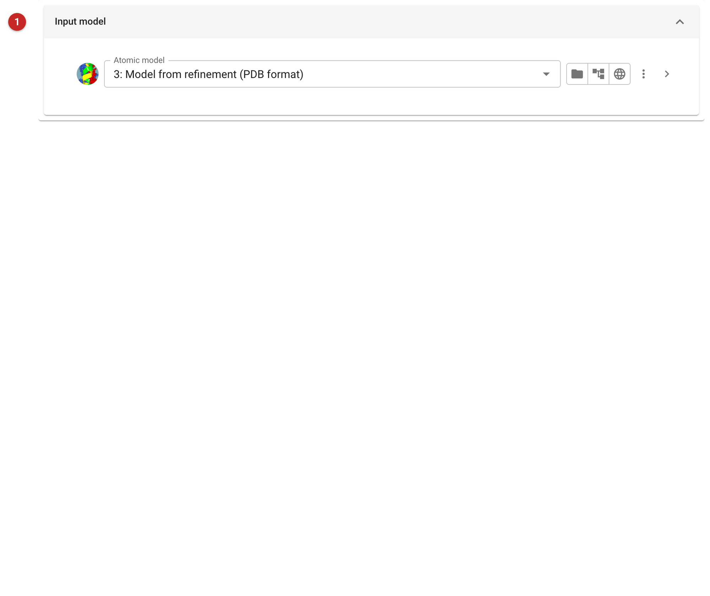
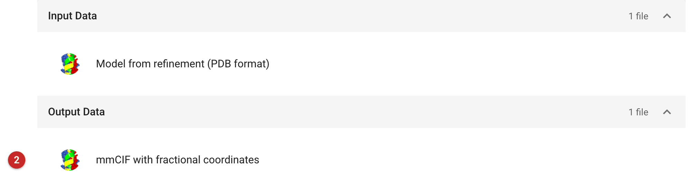

##########################
Add Fractional Coordinates
##########################

This task writes a model as mmCIF with each atom's fractional coordinates
added (the ``_atom_site.fract_x``, ``fract_y`` and ``fract_z`` items)
alongside its Cartesian ones.

Fractional coordinates give a position as fractions of the unit cell
edges a, b and c. Symmetry operators act on them simply, and special
positions are recognisable at a glance (an atom at x = ½ on a two-fold
axis along b, say), so they are the natural coordinates for comparing
symmetry-related positions, for small-molecule style analyses, and for
programs that expect them. Values outside 0–1 are normal: the model need
not sit in the first unit cell.

The pictures on this page come from the MDM2 project of the refinement
route.

Input
=====

   Figure 1: Add fractional coordinates input

The model **(1)**. An atom selection writes only part of it.

Results
=======

   Figure 2: Add fractional coordinates report

The output **(2)** is the mmCIF file, "mmCIF with fractional coordinates".
The report has nothing else to show: open the file, or use it as the input
to the next task.
