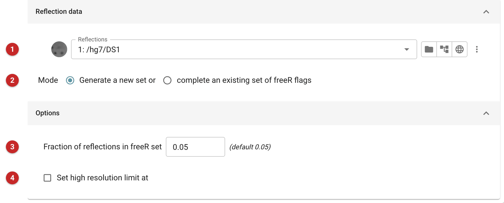
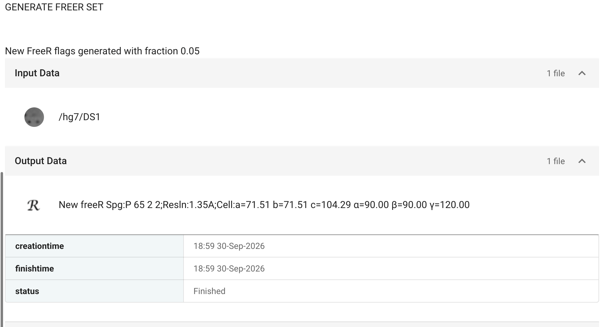

#####################
Generate a Free R set
#####################

A set of Free-R reflections may be selected at random for a given set of
observations. The proportion of the reflections assigned to the Free-R
set defaults to 5%, but can be altered. Reflections related by the point
group, and by any twin law the lattice allows (merohedral, or
pseudo-merohedral within 5 degrees), get the same flag: so if the space
group was wrongly determined, or the crystal is twinned, no reflection in
the Free-R set has a partner in the working set. Extending an existing set
keeps its flags as they are. The Free-R set is
described by a data object containing flags which identify which
reflections belong to it.

Data reduction (*Aimless*) and *Import merged data* make a Free-R set
already, so this task is needed only for data that arrived without one,
or to extend an existing set to new data.

Input
=====

   Figure 1: Generate a Free R set input

To generate a Free-R set for a set of observations (Figure 1), all that is
required is the reflection data object for those observations **(1)**.

Sometimes it is necessary to extend an existing set of Free-R flags to
cover additional reflections, for example if a new set of observations is
available at a higher resolution. In that case the same Free-R set should
be kept for the existing reflections, to avoid biasing the Free-R factor:
choose *complete an existing set of freeR flags* **(2)** and select the
existing Free-R set.

The proportion of the data in the Free-R set **(3)** is 5% by default (a
value of 0.05). For very small structures a larger value may be needed, to
give enough Free-R reflections in each resolution shell. The set can also
be limited to a high resolution **(4)**.

Results
=======

   Figure 2: Generate a Free R set report

The report (Figure 2) says what was done, and the new Free-R set is listed
among the outputs with its space group, resolution and cell, which identify the
data it belongs with.
