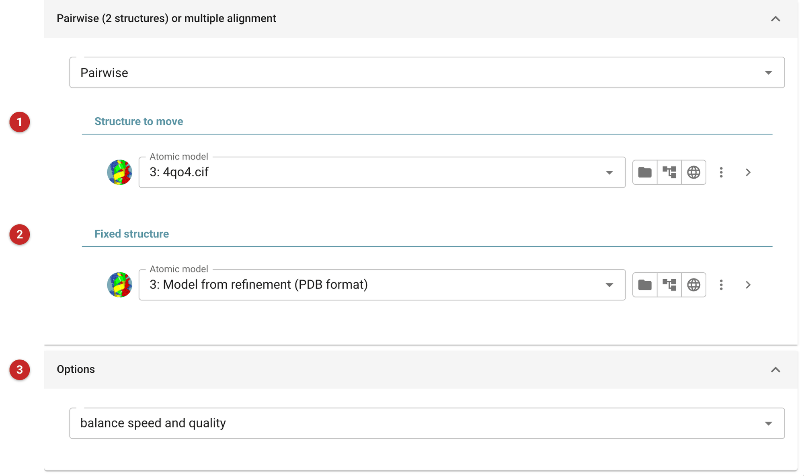
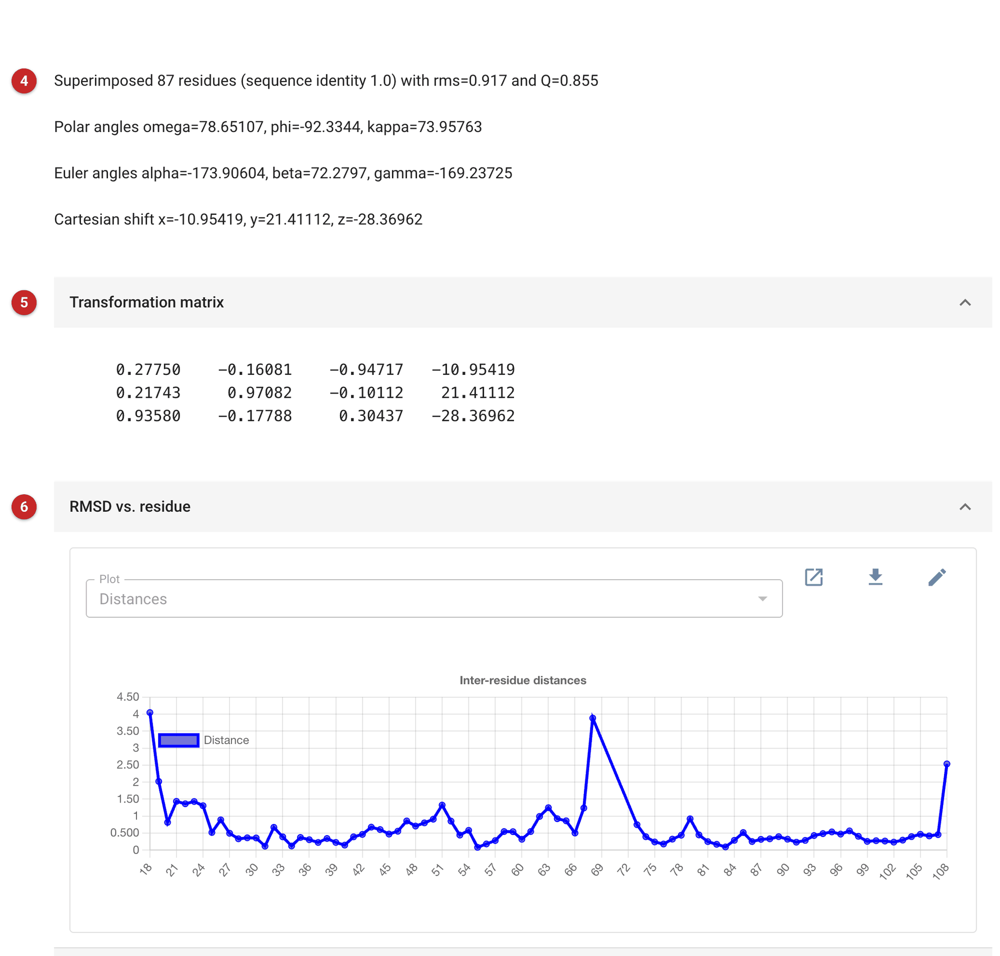

################################
Structure alignment using gesamt
################################

*Gesamt* aligns two or more structures using the algorithm of efficient
clustering of short fragments, where the fragments are made from
adjacent protein backbone C-alpha atoms, followed by an iterative
three-dimensional refinement based on a dynamic programming procedure.

Gesamt uses the pairwise alignment algorithm when comparing two
structures. When more than two structures are given, it uses the
multiple alignment algorithm. Note that multiple alignment does not
reduce to a set of pairwise alignments; it is useful for identifying
common structural motifs in whole protein families.

The pictures on this page superpose 4qo4, an independent MDM2 structure,
on the MDM2 model refined from the Ligand Tutorial data that comes with
CCP4i2.

Input
=====

   Figure 1: Gesamt input

For a pairwise superposition (Figure 1), the first model **(1)** is the one to
be moved: it is rotated and translated onto the second, fixed, model
**(2)**. In each case a coordinate selection may be given (the arrow at
the end of the model's row) to use part of a model.

The option **(3)** sets how the matching is done. The default balances the
quality of the alignment and speed, and is recommended for most uses. In
high quality mode Gesamt tries for the best alignment regardless of time:
it is about 10 times slower, and improves the result in a few percent of
cases.

Results
=======

   Figure 2: Gesamt report

The report of Figure 2 opens with the result **(4)**: the number of residues
superposed, their sequence identity, the RMS deviation and the Q-score (1
for identical structures), and the rotation as polar and Euler angles and
the translation. The transformation matrix follows **(5)**, and a graph of
the distance between aligned residues along the sequence **(6)**, then a
residue-by-residue listing of the alignment, with the secondary structure
of both models. Here 87 residues superpose with an RMS deviation of
0.92 Å. The largest differences are at the chain ends and around residue
68, beside a stretch that is missing from one of the models (the graph
joins across the gap).

The superposed model is an output: open it with the fixed one in Coot or
Moorhen to see the differences.
