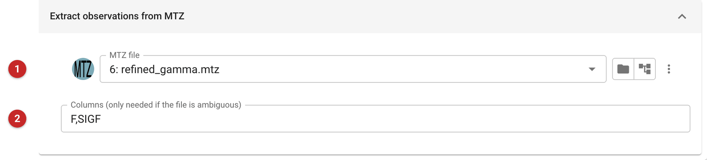
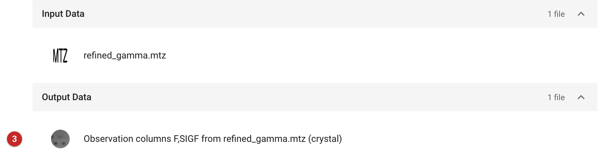
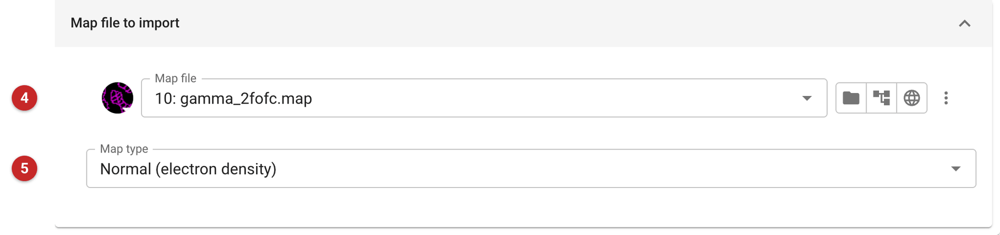

############################
Import single files
############################

CCP4i2 keeps every file a project uses in the project, each with a type:
observed data, a free R set, map coefficients, phases, a model, a
sequence and so on. Most files come in on their own. Pick a file with the
folder button in any task's file field and it is imported for that task,
and output files are already the project's. The import tasks do the same
job as tasks of their own. Use one when:

- **the file should be in the project before any task needs it**, so the
  next tasks can simply choose it from the project;
- **one file holds several kinds of data**. A full MTZ from another program
  (a refinement output, say) has amplitudes, a free R set, map coefficients
  and phases side by side. CCP4i2 keeps each kind as a small typed file of
  its own, so each is imported separately;
- **the file needs a type the task cannot guess**, such as a map that is a
  difference map, a mask or a half map.

For merged reflection data in any of the usual formats, with a free R set
checked or made at the same time, use :doc:`../import_merged/index`
instead. For the contents of the asymmetric unit, use
:doc:`../ProvideAsuContents/index` to define them from sequences, or
import an existing definition here.

=====================  ==============================  =========================
Task                   Takes                           Makes
=====================  ==============================  =========================
Import coordinates     PDB or mmCIF model              a model
Import sequence        FASTA, PIR or plain sequence    a sequence
Import ASU contents    an ``.asu.xml`` definition      AU contents
Import dictionary      a restraint dictionary (CIF)    a dictionary
Import unmerged        MTZ, XDS, Scalepack or mmCIF    unmerged data
Import observations    columns of an MTZ file          observed data
Import free-R          a column of an MTZ file         a free R set
Import map coeffs.     columns of an MTZ file          map coefficients
Import phases          columns of an MTZ file          phases (HL or φ/FOM)
Import map             a CCP4 or MRC map               a map, of a stated kind
=====================  ==============================  =========================

The pictures on this page come from a project built with the gamma demo
data that comes with CCP4i2, and a full MTZ file: the complete output of a
refinement of gamma, as another program might have given it.

Importing from an MTZ file
==========================

   Figure 1: Import observations input

The MTZ file **(1)** and, if it is needed, the columns to take **(2)**.
Leave the columns blank and the task finds them itself when the file has
only one group of the kind wanted. When it has several (a refinement
output has two sets of map coefficients, FWT/PHWT and DELFWT/PHDELWT),
the job cannot be run until you choose: the field is marked in red, with
the groups the file offers. Name the ones you want, as here: ``F,SIGF``.

   Figure 2: Import observations report

The report lists the file read and the file made **(3)**. The new file is
annotated with the columns it came from and the file they were in, so it
can be told apart from other data in the project's file menus.

Importing a map
===============

   Figure 3: Import map input

The map file **(4)** and what kind of map it is **(5)**: an ordinary
electron density map, a difference map, an anomalous difference map, a
mask, or one of a pair of half maps. The kind decides which tasks offer
the map. Half maps, for example, are what cross-validated cryo-EM
refinement and the cryo-EM placement task ask for.
