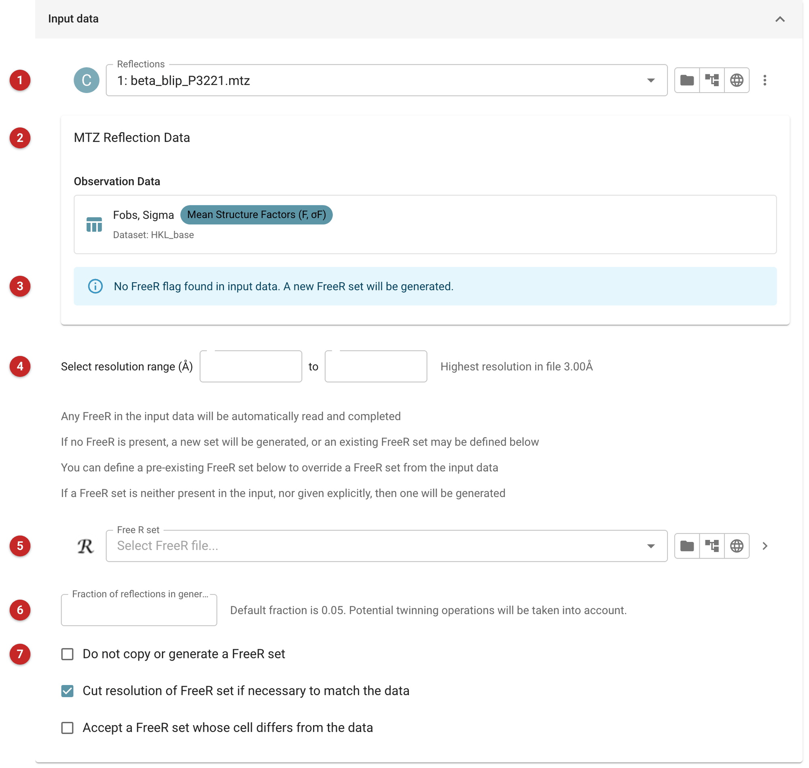
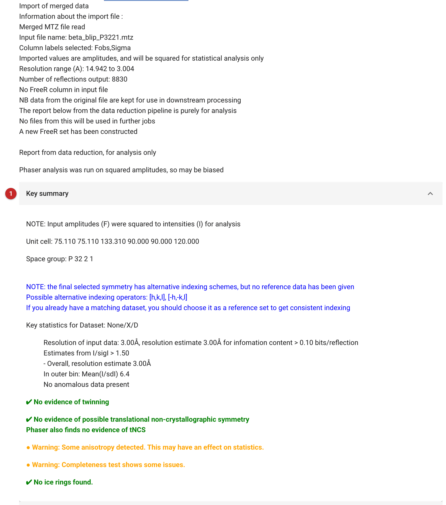

#############################
Import merged reflection data
#############################

   You will usually start a project with unmerged data, or with images,
   and reduce them within CCP4i2. When your data are already merged, this
   task brings them in: it reads the file, makes the reflection data object
   later tasks use, makes or completes a Free R set, and runs the data
   reduction analysis on the data so you can judge their quality.

   It reads MTZ, mmCIF (the structure-factor files the PDB distributes,
   ``xxxx-sf.cif``), Scalepack, SHELX ``.hkl`` and merged XDS_ASCII files,
   telling them apart by their contents rather than their names. Unmerged
   data belong in the data reduction tasks instead: this task recognises
   them and says so.

   The pictures on this page come from the demo data that ships with
   CCP4i2: the merged amplitudes of the beta-lactamase / BLIP complex at
   3.0 Å.

Input
=====

   |input|

   Choose the file **(1)**. What the task shows next depends on what the
   file holds **(2)**:

   - An **MTZ** file may hold several sets of observations, for example
     mean and anomalous intensities; each is listed with its columns and
     kind, and you pick the one to import. Map coefficients, phases and
     Free R flags are not observations and are not offered.
   - An **mmCIF** file may hold several reflection blocks; pick one, then
     the kind of data in it.
   - **Scalepack**, **SHELX** and **XDS** files carry less about the
     crystal, so the task asks for what they lack: the space group, the
     cell, the crystal and dataset names and the wavelength (and, for
     SHELX, whether the file holds intensities or amplitudes). Scalepack
     files give the space group and cell but not the wavelength.

   The task also says what it found about Free R flags **(3)**: a valid set
   in the file, one that may be invalid, or none, in which case a new set
   is made. You can restrict the resolution range imported **(4)**; the
   highest resolution in the file is shown beside it.

The Free R set
--------------

   Any Free R set in the file is read and completed: reflections flagged
   free stay free, none used in refinement becomes free, and reflections
   with no flag are partitioned at the usual fraction. To use a set from
   elsewhere, for example the parent structure's in a series of complexes,
   give it as the Free R set **(5)**; it overrides one in the file. If
   there is neither, a new set is made, with 5% of the reflections unless
   you give another fraction **(6)**; possible twinning operators are taken
   into account.

   Tick *Do not copy or generate a FreeR set* **(7)** to keep the file's
   own free set exactly as it is: it is copied, not completed or remade,
   and none is made if the file has none. The interface ticks this for
   StarAniso output, whose free set must be kept as StarAniso made it; a
   job set up any other way (i2run, the API) must set it itself. By default a Free R set is cut to the
   resolution of the data, and one whose cell differs from the data's is
   replaced by a new set unless you accept it.

Results
=======

   |report|

   The report first says what was imported: the file, the columns and
   whether they are intensities or amplitudes, and what happened to the
   Free R set. The data from the file are what later tasks use.

   The rest is a data reduction report on the imported data, for analysis
   only: nothing from it is used later. *Key summary* **(1)** gives the
   resolution estimates and headline statistics, *Overall summary* the
   statistics as a function of resolution and the Wilson plot, and further
   sections the analyses of twinning, translational NCS and anisotropy.
   Look at these before going further: a twinned or anisotropic data set
   changes what to do next.

