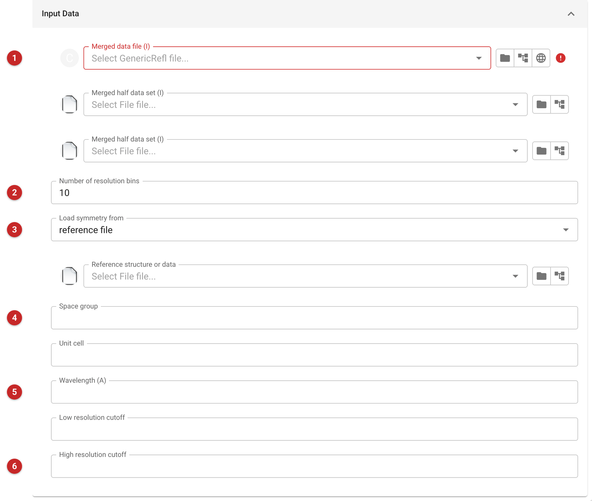

import_serial
=============

.. note::

   This page is a draft written from the task's interface and source code. The
   task was not run for it: the help's demonstration projects hold no CrystFEL
   data, so there is no report picture and no result quoted here. A
   crystallographer who has used the task should read it.

Import Serial Data brings merged intensities from serial crystallography into
the project as an ordinary merged-intensity file that later tasks can use. Use
it when your data were merged outside CCP4 by **CrystFEL** (a ``.hkl`` file,
which carries no cell, space group or wavelength of its own), or when you have
a merged MTZ from **xia2.ssx**. For merged MTZ files from anywhere else, with
a free R set checked or made, use :doc:`../import_merged/index`; for data
processed by xia2.ssx inside CCP4i2, see the xia2.ssx reduce task.

What it does
============

The task runs in two steps, as one job:

1. the ``import_serial`` program converts the merged file to MTZ, giving it the
   space group, unit cell and wavelength you supply (or find in a reference
   file), applies the resolution limits and calculates data-quality statistics;
2. the result is passed through Aimless in merge-only mode, with no scaling and
   the error model fixed, so that Aimless's data analysis is reported on the
   imported file.

The output is one file, **Merged intensities**, saved in the project as merged
intensities. It is meant to be used in the CCP4 tasks as merged data would be;
the task makes no free R set, so add one as you would for any other merged data
(the import merged task does this).

The input
=========

   Figure 1: Import Serial Data input

**Merged data file (1).** Required. The ``.hkl`` file from CrystFEL, or the
merged MTZ from xia2.ssx.

**Merged half data set.** Two fields, for the two half data sets CrystFEL
writes (usually ``.hkl1`` and ``.hkl2``). They are used only when both are
given. They are what allows CC1/2 and Rsplit to be calculated, so give them for
CrystFEL data. They are not needed for xia2.ssx data, which come as one MTZ.

**Number of resolution bins (2).** The number of shells for the statistics
(default 10).

**Load symmetry from (3).** A CrystFEL ``.hkl`` file does not say what its
space group and cell are. The menu chooses where they come from:

- *reference file*: a PDB, mmCIF or MTZ file of the same crystal form
  (field *Reference structure or data*);
- *CrystFEL cell file*: the cell file used with CrystFEL (field *Cell file from
  CrystFEL*);
- *or calculate from CrystFEL stream file*: the stream file (field *Stream file
  from CrystFEL*);
- *or enter manually*: type them in *Space group* **(4)** and *Unit cell*.

Only the file of the kind chosen is used. The space group and unit cell fields
can also be filled in whatever the menu says; they are passed to the program
when set. The space group is also what the Aimless step is told to use, so
**fill in Space group (4) yourself whenever you know it**, as the pipeline
passes that field, and nothing read from a reference, cell or stream file, on to
Aimless.

**Wavelength (5).** In angstroms. It is needed for CrystFEL data, which do not
record it, and not for xia2.ssx data.

**Low and high resolution cutoffs (6).** Limits in angstroms. The old page
recommends adjusting the high-resolution limit: serial data are usually noisy
at the edge, so look at the statistics (CC1/2, Rsplit, mean I/sigma(I) by
shell) and rerun with a cutoff where they are still meaningful.

Results
=======

The report has an *Overall statistics* table (resolution limits, observed and
unique reflections, completeness, multiplicity, mean I and I/sigma(I), CC(1/2),
CC* and Rsplit) and *Statistics vs. resolution* graphs (multiplicity,
completeness, numbers of reflections, CC(1/2), mean I/sigma(I) and Rsplit by
shell). CC(1/2), CC* and Rsplit appear only when two half data sets were
given. These are the report sections the source defines; the report was not
seen running.

Follow the import with the import merged task if you want a free R set, then
use the data for molecular replacement or refinement as usual.

Command line
============

It is also possible to run this program in command line or CCP4Console. The obtained MTZ files are recommended to import in CCP4 using the import merged task.

.. code ::

   $ ccp4-python -m import_serial --hklin data.hkl --half-dataset data.hkl1 data.hkl2 --cellfile cell.cell --spacegroup P6222 --wavelength 1.13 --dmin 1.6
   $ ccp4-python -m import_serial --hklin merged.mtz --dmin 1.6

Test and example data are available in at https://github.com/MartinMalyMM/import_serial_test_data

List of all options in command line
-----------------------------------

.. code ::

   $ ccp4-python -m import_serial --help
   
   usage: import_serial [-h] --hklin HKLIN [--half-dataset HKL1 HKL2] [--wavelength WAVELENGTH] 
                        [--spacegroup SPACEGROUP] [--cell a b c alpha beta gamma] [--cellfile CELLFILE]
                        [--streamfile STREAMFILE] [--reference REFERENCE] [--dmin D_MIN] [--dmax D_MAX]
                        [--nbins N_BINS] [--project PROJECT] [--crystal CRYST] [--dataset DATASET] 
   
   Calculate statistics of serial MX data from xia2.ssx or CrystFEL and import them to CCP4
   
   optional arguments:
     -h, --help            show this help message and exit
     --hklin HKLIN, --HKLIN HKLIN
                           Specify merged mtz file from xia2.ssx or merged hkl file from CrystFEL
     --half-dataset HKL1 HKL2
                           CrystFEL only: two half-data-set merge files (usually .hkl1 and .hkl2)
     --wavelength WAVELENGTH, -w WAVELENGTH
                           Wavelength (only for data from CrystFEL)
     --spacegroup SPACEGROUP
                           Space group
     --cell a b c alpha beta gamma
                           Unit cell parameters divided by spaces, e.g. 60 50 40 90 90 90
     --cellfile CELLFILE   Cell file from CrystFEL
     --streamfile STREAMFILE
                           Stream file from CrystFEL
     --reference REFERENCE, --ref REFERENCE, --pdb REFERENCE, --cif REFERENCE, --mmcif REFERENCE
                           Reference file (PDB, mmCIF or MTZ) to provide spacegroup and unit cell
     --dmin D_MIN, --highres D_MIN
                           High-resolution cutoff
     --dmax D_MAX, --lowres D_MAX
                           Low-resolution cutoff
     --nbins N_BINS, --nshells N_BINS
                           Number of resolution bins
     --project PROJECT     Project name
     --crystal CRYST       Crystal name
     --dataset DATASET     Dataset name

This program has been developed by Martin Malý, University of Southampton, `martin.maly@soton.ac.uk <mailto:martin.maly@soton.ac.uk>`_
