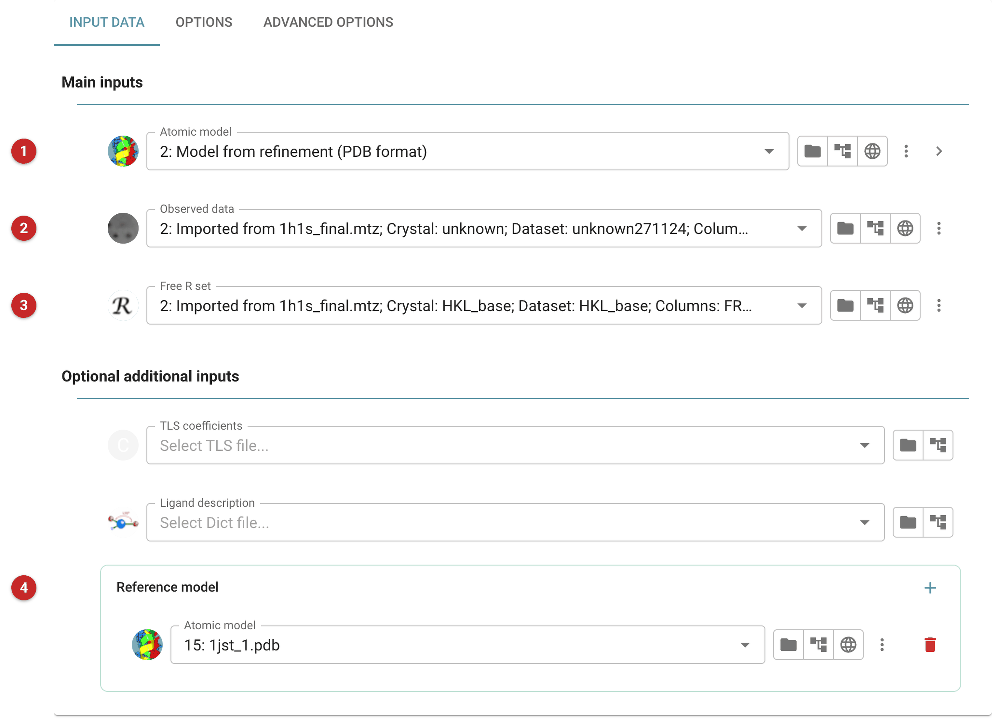
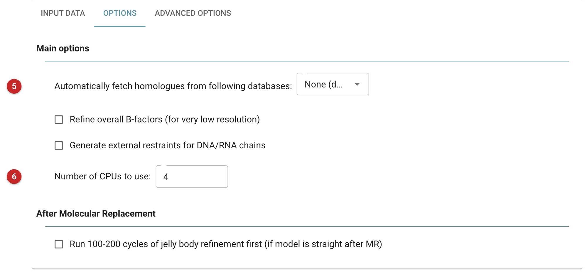
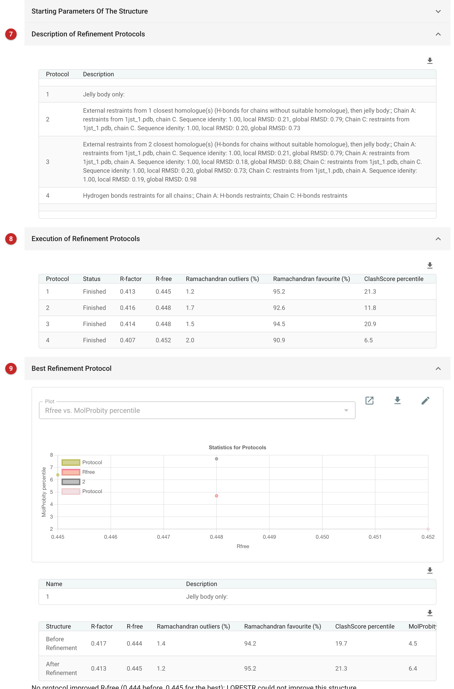

############################################
Low Resolution Structure Refinement Pipeline
############################################

LORESTR refines a model against low-resolution data by trying several
restraint schemes and keeping the best. At low resolution (worse than
about 3 Å) the data alone do not fix the geometry, so extra information
helps: LORESTR takes it from homologous structures, which it turns into
external restraints with ProSMART, and from generic hydrogen-bond and
jelly-body restraints. It runs one or more REFMAC5 refinements for each
scheme (a *protocol*), compares them, and reports the best.

Use it when the data are poor and a better-determined homologue exists
(or is likely to), and ordinary refinement leaves a high R-free or poor
geometry. Do not expect it to help at good resolution, or when the model
is incomplete: restraints cannot supply what is not in the model. In that
case it says so rather than claiming a gain, as in the example below.
If you already know which homologue to use and want to control the
restraints yourself, use ProSMART with REFMAC5 by hand
(:doc:`../prosmart_refmac/index`). For ordinary resolutions use
:doc:`../servalcat_pipe/index` or REFMAC5.

How it works
============

LORESTR first analyses the data: it checks for twinning (and enables
REFMAC5's twin handling if found), tries standard and least-squares
scaling and keeps the one giving the lower R-free, and chooses solvent
parameters. It records the starting R-factors, Ramachandran statistics
and MolProbity percentiles.

It then compares the model with each supplied or fetched homologue,
rejecting chains that are too different (the log gives RMSD, coverage and
sequence identity for each rejection), and builds the protocols. Without
usable homologues it tries only the two protocols that need none:
hydrogen-bond restraints and jelly-body restraints. With homologues it
adds protocols using external restraints from 1, 2, ... of the closest
homologous chains per chain of the model (up to the number set in the
Advanced options). For these, one round of REFMAC5 uses the external
restraints, then a second round with jelly-body restraints alone lets the
structure relax into its new conformation. Protocols run in parallel on
as many CPUs as you give it.

Finally LORESTR picks the protocol with the best quality indicator, which
combines R-free and the MolProbity score percentile
(Kovalevskiy et al., 2016), and compares the result with the starting
model.

The example on this page
------------------------

The pictures come from the CDK2/cyclin A project of the refinement
route. The model is the CDK2-only partial model of 1h1s refined earlier:
two CDK2 chains, with the two cyclins missing, so about half of the
asymmetric unit is absent. The data reach 2.2 Å. The reference model is
1jst, CDK2/cyclin A from another crystal, supplied as a local file;
automatic fetching was switched off and four CPUs were used. This is not
a low-resolution problem, so it shows what LORESTR does when there is
nothing for it to gain.

Input
=====

   Figure 1: LORESTR input

The model to refine **(1)**, the reflection data **(2)** and the free-R
set **(3)** are required. Optional: TLS coefficients, a ligand
description, and any number of homologous structures as the *Reference
model* list **(4)**, to which more are added with the plus button. Models
you supply are used alongside any fetched automatically, so you can offer
unpublished structures of your own protein as well as PDB entries.

Here the reference is 1jst. Its cyclin chains were rejected (about 6%
sequence identity to the chains of the model, which has no cyclin), and
its two CDK2 chains were kept as sources of restraint.

Options
=======

   Figure 2: LORESTR options

**Automatically fetch homologues from following databases (5):** the
choices are *PDB and AlphaFold*, *PDB only*, *AlphaFold only* and *None
(do not fetch)*. When on, LORESTR sends the sequence of each chain to the
chosen databases to search for homologues, and needs an internet
connection; that means your sequence leaves your machine. It was off in
the example, so only the supplied reference was used.

**Refine overall B-factors:** forces overall B-factor refinement, for very
low resolution.

**Generate external restraints for DNA/RNA chains:** tick it if the model
contains nucleic acid.

**Number of CPUs to use (6):** protocols run in parallel, so more CPUs
shorten the run when there are several protocols.

**Run 100-200 cycles of jelly body refinement first:** for a model
straight from molecular replacement that has not been refined; this can
take hours.

**Advanced options** (normally leave alone): *Save disk space by removing
excessive ProSMART output* (on by default; ProSMART output can reach
hundreds of megabytes per protocol); *Download and use homologues with
resolution better than* (3.5 Å) which limits what is fetched
automatically; *Use up to* 5 homologues for restraints; and *Use up to* 3
chains to generate restraints, which sets how many protocols are tried.
More homologues or chains is not better: the defaults performed best in
the authors' tests.

Results
=======

   Figure 3: LORESTR report

The report starts with the structure's starting parameters (twinning,
scaling method, solvent parameters). *Description of refinement
protocols* **(7)** lists the protocols with, for each chain, the homologue
chain used and its sequence identity and local and global RMSD to the
model. Here there were four: 1, jelly body only; 2, restraints from the
closest homologue chain; 3, restraints from the two closest; 4, hydrogen
bonds for all chains. *Execution of refinement protocols* **(8)** gives
R-factor, R-free, Ramachandran outliers and favoured, ClashScore
percentile and MolProbity percentile for each.
*Best refinement protocol* **(9)** plots R-free against the MolProbity
percentile for every protocol and compares the chosen one with the
starting model.

The numbers in the example:

======== ======= ======= ========================
Protocol R       R-free  MolProbity percentile
======== ======= ======= ========================
start    0.417   0.444   4.5
1        0.413   0.445   6.4
2        0.416   0.448   4.7
3        0.414   0.448   7.7
4        0.407   0.452   2.0
======== ======= ======= ========================

Protocol 1 (jelly body only) was chosen, and the report says that no
protocol improved R-free (the log: "Sorry, this program failed to improve
Rfree value for your structure."). R-free went
from 0.444 to 0.445, R from 0.417 to 0.413. That is the honest result.
The external restraints did not help (R-free 0.448), and the
hydrogen-bond protocol lowered R but raised R-free and damaged the
geometry: its Ramachandran favoured fell to 90.9% and its MolProbity
percentile to 2.0. Restraints from a homologue add information only when
the data are weak enough to need it; at 2.2 Å, with half the asymmetric
unit missing, the missing chains are the problem and no restraint scheme
helps. What this model needs is the cyclins built in (the
:doc:`../parrot/index` page recovers their density from this same
start).

Read the result this way: a protocol that lowers R-free by a clear margin
and does not worsen the geometry is a gain. Changes of a thousandth or
two in R-free, as here, are noise. When LORESTR reports a failure to
improve, keep your starting model.

Below these, the report shows validation of the refined model: *B-factor
analysis* (mean, standard deviation and counts for the whole model and for
each chain, by kind of atom), *Ramachandran plots* (non-proline, proline
and glycine, with a table of outliers) and *MolProbity analysis*
(a summary with the Ramachandran, rotamer and C\ β figures, then
the outlying residues, suggested side-chain flips and atomic clashes).
The refined model, and the maps after refinement (weighted and
difference), are the outputs.

**Reference**

Kovalevskiy, O., Nicholls, R. A. & Murshudov, G. N. (2016). Automated
refinement of macromolecular structures at low resolution using
prior information. Acta Cryst. D72, 1149-1161.
