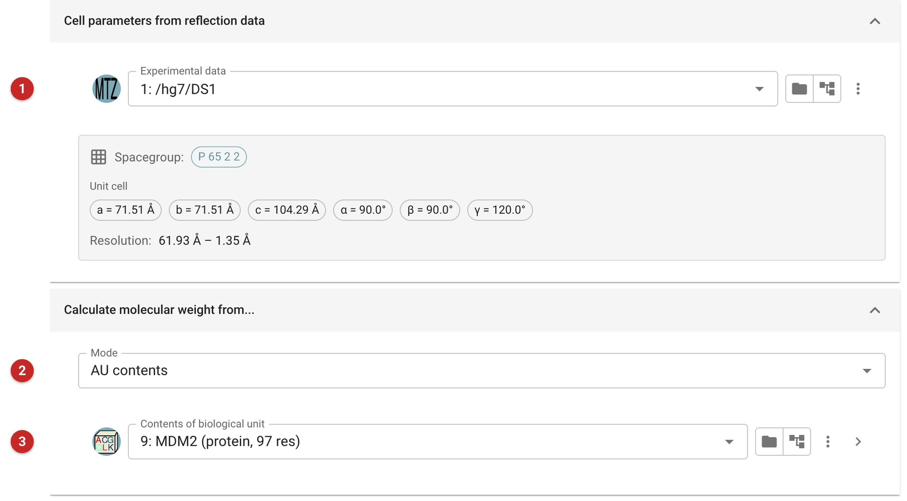
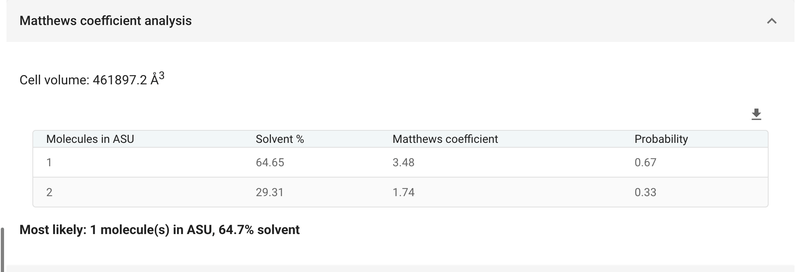

###################
Estimate AU content
###################

This task estimates the number of copies of a structure in the asymmetric
unit from the volume of the cell and the molecular weight of the
structure. It reports, for each possible number of copies, the solvent
content that number implies, the Matthews coefficient (the crystal volume
per unit of molecular weight, in Å\ :sup:`3`/Da) and how probable that
value is among known crystal structures at the resolution of the data.
The estimated number of copies is useful guidance for molecular
replacement.

The pictures on this page follow MDM2 with Nutlin-3a, from the Ligand
Tutorial data that comes with CCP4i2.

Input
=====

   Figure 1: Estimate AU content input

The task needs experimental data **(1)**, from which it reads the cell and
space group (shown below the data, with the resolution) and so the cell
volume. The expected contents can be given **(2)** as an *AU contents*
object, the list of sequences made by *Define AU contents* **(3)**, or as
a number of amino acid residues, or as a molecular weight.

Results
=======

   Figure 2: Matthews coefficient analysis

The report gives the cell volume and, for each number of copies that fits
in the cell, the solvent content, the Matthews coefficient and its
probability, and names the most likely. For MDM2, one copy of the
97-residue construct gives 65% solvent (probability 0.67) and two give
29% (0.33). One copy is what the structure has: a high solvent content is
common for small proteins in large cells, and the probabilities are a
guide, not a decision.
